---
title: 'Object-Oriented Programming and Design Patterns'
...

-   [Object-Oriented Design](#object-oriented-design)
    -   [Classes, Objects and
        Interfaces](#classes-objects-and-interfaces)
    -   [Polymorphism](#polymorphism)
    -   [Inheritence](#inheritence)
    -   [Interfaces](#interfaces)
    -   [Composition](#composition)
    -   [Delegation](#delegation)
    -   [Parameterized Types](#parameterized-types)
    -   [Run-Time and Compile-Time
        Structures](#run-time-and-compile-time-structures)
-   [Design Patterns](#design-patterns)
    -   [Creational Patterns](#creational-patterns)
        -   [Abstract Factory \*](#abstract-factory)
        -   [Builder](#builder)
        -   [Factory Method \*](#factory-method)
        -   [Prototype](#prototype)
        -   [Singleton](#singleton)
    -   [Structural Patterns](#structural-patterns)
        -   [Adapter \*](#adapter)
        -   [Bridge](#bridge)
        -   [Composite \*](#composite)
        -   [Decorator \*](#decorator)
        -   [Facade](#facade)
        -   [Flyweight](#flyweight)
        -   [Proxy](#proxy)
    -   [Behavioural Patterns](#behavioural-patterns)
        -   [Chain of Responsibility](#chain-of-responsibility)
        -   [Command](#command)
        -   [Interpreter](#interpreter)
        -   [Iterator](#iterator)
        -   [Mediator](#mediator)
        -   [Memento](#memento)
        -   [Observer \*](#observer)
        -   [State](#state)
        -   [Strategy \*](#strategy)
        -   [Template Method \*](#template-method)
        -   [Visitor](#visitor)

Object-Oriented Design
======================

Classes, Objects and Interfaces
-------------------------------

Object-oriented programs are made up of **objects**. An object packages
both data and the procedures that operate on that data. The procedures
are typically called **methods** or **operations**. An object performs
an operation when it receives a request (or message) from a client.

**Requests** are the only way to get an object to execute an operation.
Operations are the only way to change an object’s internal data. Because
of these restrictions, the object’s internal state is said to be
**encapsulated**; it cannot be accessed directly, and its representation
is invisible from outside the object.

Every operation declared by an object specifies the operation’s name,
the objects it takes as parameters, and the operation’s return value.
This is known as the operation’s **signature**. The set of all
signatures defined by an object’s operations is called the **interface**
to the object. An object’s interface characterizes the complete set of
requests that can be sent to the object. Any request that matches a
signature in the object’s interface may be sent to the object.

A **type** is a name used to denote a particular interface. An object
may have many types, and widely different objects can share a type. The
class defines the object’s internal state and the implementation of its
operations. In contrast, an object’s type only refers to its interface —
the set of requests to which it can respond. Part of an object’s
interface may be characterized by one type, and other parts by other
types. Two objects of the same type need only share parts of their
interfaces. Interfaces can contain other interfaces as subsets. We say
that a type is a subtype of another if its interface contains the
interface of its supertype. Often we speak of a subtype inheriting the
interface of its supertype.

Objects are created by instantiating a **class**. The object is said to
be an **instance** of the class. The process of instantiating a class
allocates storage for the object’s internal data (made up of instance
variables) and associates the operations with these data. Many similar
instances of an object can be created by instantiating a class.

A useful analogy is as follows: A blueprint for a house design is like a
class description. All the houses built from that blueprint are objects
of that class. A given house is an instance.

Polymorphism
------------

The run-time association of a request to an object and one of its
operations is known as **dynamic binding**, which means that issuing a
request doesn’t commit you to a particular implementation until
run-time. Consequently, you can write programs that expect an object
with a particular interface, knowing that any object that has the
correct interface will accept the request. Moreover, dynamic binding
lets you substitute objects that have identical interfaces for each
other at run-time. This substitutability is known as **polymorphism**,
and it’s a key concept in object-oriented systems. It lets a client
object make few assumptions about other objects beyond supporting a
particular interface. Polymorphism simplifies the definitions of
clients, decouples objects from each other, and lets them vary their
relationships to each other at run-time.

Inheritence
-----------

New classes can be defined in terms of existing classes using class
**inheritance**. Class inheritance is basically just a mechanism for
extending an application’s functionality by reusing functionality in
parent classes. When a subclass inherits from a parent class, it
includes the definitions of all the data and operations that the parent
class defines. Objects that are instances of the subclass will contain
all data defined by the subclass and its parent classes, and they’ll be
able to perform all operations defined by this subclass and its parents.
Inheritance’s ability to define families of objects with identical
interfaces (usually by inheriting from an abstract class) is what allows
polymorphism to work.

Implementation dependencies can cause problems when you’re trying to
reuse a subclass. Should any aspect of the inherited implementation not
be appropriate for new problem domains, the parent class must be
rewritten or replaced by something more appropriate. This dependency
limits flexibility and ultimately reusability. One cure for this is to
inherit only from abstract classes, since they usually provide little or
no implementation.

An **abstract class** is one whose main purpose is to define a common
interface for its subclasses. An abstract class will defer some or all
of its implementation to operations defined in subclasses; hence an
abstract class cannot be instantiated. The operations that an abstract
class declares but doesn’t implement are called abstract operations.
Classes that aren’t abstract are called **concrete classes**.

Subclasses can refine and redefine behaviors of their parent classes.
More specifically, a class may override an operation defined by its
parent class. **Overriding** gives subclasses a chance to handle
requests instead of their parent classes.

Class inheritance lets you define classes simply by extending other
classes, making it easy to define families of objects having related
functionality. In contrast to class inheritance, interface inheritance
or **subtyping** describes when an object can be used in place of
another.

A **mixin class** is a class that’s intended to provide an optional
interface or methods to other classes without having to be the parent
class of those other classes. It’s similar to an abstract class in that
it’s not intended to be instantiated. Mixin classes require multiple
inheritance.

Interfaces
----------

**Program to an interface, not an implementation**

This principle of object-oriented design has two main benefits:

1.  Clients remain unaware of the specific types of objects they use, as
    long as the objects adhere to the interface that clients expect.

2.  Clients remain unaware of the classes that implement these objects.
    Clients only know about the abstract classes defining the interface.
    This greatly reduces implementation dependencies between subsystems

Don’t declare variables to be instances of particular concrete classes.
Instead, commit only to an interface defined by an abstract class.
Though you will need to instantiate concrete classes in order to specify
a particular implementation somewhere in your system – the creational
patterns ensure that your system is written in terms of interfaces, not
implementations.

Composition
-----------

**Favor object composition over class inheritance.**

The two most common techniques for reusing functionality in
object-oriented systems are class inheritance and object composition.
Reuse by subclassing is often referred to as **white-box reuse**. The
term “white-box" refers to visibility: With inheritance, the internals
of parent classes are often visible to subclasses.

Object composition is an alternative to class inheritance. Here, new
functionality is obtained by assembling or composing objects to get more
complex functionality. Object composition requires that the objects
being composed have well-defined interfaces. This style of reuse is
called **black-box reuse**, because no internal details of objects are
visible. Objects appear only as “black boxes."

Because objects are accessed solely through their interfaces, we don’t
break encapsulation. Any object can be replaced at run-time by another
as long as it has the same type. Moreover, because an object’s
implementation will be written in terms of object interfaces, there are
substantially fewer implementation dependencies.

Additionally, favoring object composition over class inheritance helps
you keep each class encapsulated and focused on one task. Your classes
and class hierarchies will remain small and will be less likely to grow
into unmanageable monsters. On the other hand, a design based on object
composition will have more objects (if fewer classes), and the system’s
behavior will depend on their inter relationships instead of being
defined in one class.

Delegation
----------

Delegation is a way of making composition as powerful for reuse as
inheritance. In delegation, two objects are involved in handling a
request: a receiving object delegates operations to its delegate. This
is analogous to subclasses deferring requests to parent classes.
Delegation is an extreme example of object composition. It shows that
you can always replace inheritance with object composition as a
mechanism for code reuse.

For example, instead of making class Window a subclass of Rectangle
(because windows happen to be rectangular), the Window class might reuse
the behavior of Rectangle by keeping a Rectangle instance variable and
delegating Rectangle-specific behavior to it. In other words, instead of
a Window being a Rectangle, it would have a Rectangle and may call the
Area method.

The main advantage of delegation is that it makes it easy to compose
behaviors at run-time and to change the way they’re composed. Our window
can become circular at run-time simply by replacing its Rectangle
instance with a Circle instance, assuming Rectangle and Circle have the
same type.

Delegation has a disadvantage it shares with other techniques that make
software more flexible through object composition: Dynamic, highly
parameterized software is harder to understand than more static
software.There are also run-time inefficiencies, but the human
inefficiencies are more important in the long run. Delegation is a good
design choice only when it simplifies more than it complicates.

Parameterized Types
-------------------

Parameterized types give us a third way (in addition to class
inheritance and object composition) to compose behavior in
object-oriented systems. This technique lets you define a type without
specifying all the other types it uses. The unspecified types are
supplied as parameters at the point of use. For example, a List class is
parameterized by the type of elements it contains.

Run-Time and Compile-Time Structures
------------------------------------

Object composition lets you change the behavior being composed at
run-time, but it also requires indirection and can be less efficient.
Inheritance lets you provide default implementations for operations and
lets subclasses override them. Parameterized types let you change the
types that a class can use. But neither inheritance nor parameterized
types can change at run-time.

Many design patterns (in particular those that have object scope)
capture the distinction between compile-time and run-time structures
explicitly. Composite and Decorator patterns are especially useful for
building complex run-time structures. Observer involves run-time
structures that are often hard to understand unless you know the
pattern. Chain of Responsibility also results in communication patterns
that inheritance doesn’t reveal. In general, the run-time structures
aren’t clear from the code until you understand the patterns.

Design Patterns
===============

We classify design patterns by two criteria. The first criterion, called
**purpose**, reflects what a pattern does. Patterns can have either
**creational**, **structural**, or **behavioral** purpose. Creational
patterns concern the process of object creation. Structural patterns
deal with the composition of classes or objects. Behavioral patterns
characterize the ways in which classes or objects interact and
distribute responsibility.

The second criterion, called **scope**, specifies whether the pattern
applies primarily to classes or to objects. Class patterns deal with
relationships between classes and their subclasses. These relationships
are established through inheritance, so they are static — fixed at
compile-time. Object patterns deal with object relationships, which can
be changed at run-time and are more dynamic. Almost all patterns use
inheritance to some extent. So the only patterns labeled “class
patterns" are those that focus on class relationships. Note that most
patterns are in the Object scope.

Creational class patterns defer some part of object creation to
subclasses, while Creational object patterns defer it to another object.
The Structural class patterns use inheritance to compose classes, while
the Structural object patterns describe ways to assemble objects. The
Behavioral class patterns use inheritance to describe algorithms and
flow of control, whereas the Behavioral object patterns describe how a
group of objects cooperate to perform a task that no single object can
carry out alone

Each design pattern lets some aspect of a system’s structure vary
independently of other aspects, thereby making a system more robust to a
particular kind of change.

1.  **Creating an object by specifying a class explicitly**

    Avoid with: Abstract Factory, Factory Method, Prototype.

2.  **Dependence on specific operations.**

    Avoid with: Chain of Responsibility, Command.

3.  **Dependence on hardware and software platform.**

    Avoid with: Abstract Factory, Bridge.

4.  **Dependence on object representations or implementations.**

    Avoid with: Abstract Factory, Bridge, Memento, Proxy.

5.  **Algorithmic dependencies**

    Avoid with: Builder, Iterator, Strategy, Template Method , Visitor.

6.  **Tight coupling**

    Avoid with: Abstract Factory, Bridge, Chain of Responsibility,
    Command, Facade, Mediator, Observer.

7.  **Extending functionality by subclassing.**

    Avoid with: Bridge, Chain of Responsibility, Composite, Decorator,
    Observer, Strategy.

8.  **Inability to alter classes conveniently.**

    Avoid with: Adapter, Decorator, Visitor.

{width="400pt"}

Creational Patterns
-------------------

### Abstract Factory \*

Provide an interface for creating families of related or dependent
objects without specifying their concrete classes.

**Applicability**

Use the Abstract Factory pattern when

-   a system should be independent of how its products are created,
    composed, and represented.

-   a system should be configured with one of multiple families
    of products.

-   a family of related product objects is designed to be used together,
    and you need to enforce this constraint.

-   you want to provide a class library of products, and you want to
    reveal just their interfaces, not their implementations.

**Consequences**

The Abstract Factory pattern has the following benefits and liabilities:

-   It isolates concrete classes.

-   It makes exchanging product families easy.

-   It promotes consistency among products.

-   Supporting new kinds of products is difficult.

{width="14cm"}

### Builder

Separate the construction of a complex object from its representation so
that the same construction process can create different representations.

**Applicability**

Use the Builder pattern when

-   the algorithm for creating a complex object should be independent of
    the parts that make up the object and how they’re assembled.

-   the construction process must allow different representations for
    the object that’s constructed.

**Consequences**

-   It lets you vary a product’s internal representation.

-   It isolates code for construction and representation.

-   It gives you finer control over the construction process.

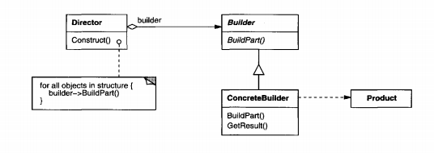{width="14cm"}

### Factory Method \*

Define an interface for creating an object, but let subclasses decide
which class to instantiate. Factory Method lets a class defer
instantiation to subclasses.

**Applicability**

Use the Factory Method pattern when

-   a class can’t anticipate the class of objects it must create.

-   a class wants its subclasses to specify the objects it creates.

-   classes delegate responsibility to one of several helper subclasses,
    and you want to localize the knowledge of which helper subclass is
    the delegate.

**Consequences**

Factory methods eliminate the need to bind application-specific classes
into your code. The code only deals with the Product interface;
therefore it can work with any user-defined ConcreteProduct classes.

A potential disadvantage of factory methods is that clients might have
to subclass the Creator class just to create a particular
ConcreteProduct object. Subclassing is fine when the client has to
subclass the Creator class anyway, but otherwise the client now must
deal with another point of evolution.

Factory Method has the additional consequences:

-   Provides hooks for subclasses.

-   Connects parallel class hierarchies.

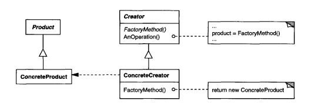{width="14cm"}

### Prototype

Specify the kinds of objects to create using a prototypical instance,
and create new objects by copying this prototype.

**Applicability**

Use the Prototype pattern

-   when a system should be independent of how its products are created,
    composed, and represented

-   when the classes to instantiate are specified at run-time, for
    example, by dynamic loading.

-   to avoid building a class hierarchy of factories that parallels the
    class hierarchy of products.

-   when instances of a class can have one of only a few different
    combinations of state.

**Consequences**

Prototype has many of the same consequences that Abstract Factory and
Builder have: It hides the concrete product classes from the client,
thereby reducing the number of names clients know about. Moreover, these
patterns let a client work with application-specific classes without
modification.

Additional benefits of the Prototype pattern include

-   Adding and removing products at run-time.

-   Specifying new objects by varying values

-   Specifying new objects by varying structure.

-   Reduced subclassing.

-   Configuring an application with classes dynamically.

{width="14cm"}

### Singleton

Ensure a class only has one instance, and provide a global point of
access to it.

**Applicability**

Use the Singleton pattern when

-   there must be exactly one instance of a class, and it must be
    accessible to clients from a well-known access point.

-   when the sole instance should be extensible by subclassing, and
    clients should be able to use an extended instance without modifying
    their code.

**Consequences**

The Singleton pattern has several benefits:

-   Controlled access to sole instance.

-   Reduced name space.

-   Permits refinement of operations and representation.

-   Permits a variable number of instances.

-   More flexible than class operations.

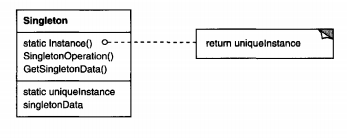{width="10cm"}

Structural Patterns
-------------------

### Adapter \*

Convert the interface of a class into another interface clients expect.
Adapter lets classes work together that couldn’t otherwise because of
incompatible interfaces.

**Applicability**

Use the Adapter pattern when

-   you want to use an existing class, and its interface does not match
    the one you need.

-   you want to create a reusable class that cooperates with unrelated
    or unforeseen classes, that is, classes that don’t necessarily have
    compatible interfaces.

-   (object adapter only) you need to use several existing subclasses,
    but it’s unpractical to adapt their interface by subclassing
    every one. An object adapter can adapt the interface of its parent
    class

**Consequences**

Class and object adapters have different trade-offs. A class adapter

-   adapts Adaptee to Target by committing to a concrete Adaptee class.

-   lets Adapter override some ofAdaptee’sbehavior, since Adapter is a
    subclass of Adaptee.

-   introduces only one object, no additional pointer indirection is
    needed for the adaptee

An object adapter

-   lets a single Adapter work with many Adaptees

-   makes it harder to override Adaptee behavior

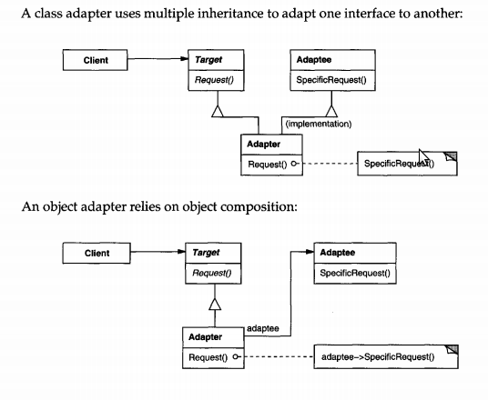{width="10cm"}

### Bridge

Decouple an abstraction from its implementation so that the two can vary
independently.

**Applicability**

Use the Bridge pattern when

-   you want to avoid a permanent binding between an abstraction and
    its implementation.

-   both the abstractions and their implementations should be extensible
    by subclassing.

-   changes in the implementation of an abstraction should have no
    impact on clients; that is, their code should not have to
    be recompiled.

-   you have a proliferation of hierarchical classes
    (“nested generalizations")

-   you want to share an implementation among multiple objects, and this
    fact should be hidden from the client.

**Consequences**

The Bridge pattern has the following consequences:

-   Decoupling interface and implementation.

-   Improved extensibility.

-   Hiding implementation details from clients.

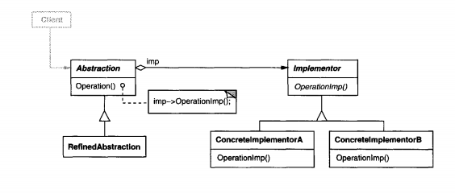{width="14cm"}

### Composite \*

Compose objects into tree structures to represent part-whole
hierarchies. Composite lets clients treat individual objects and
compositions of objects uniformly.

**Applicability**

Use the Composite pattern when

-   you want to represent part-whole hierarchies of objects.

-   you want clients to be able to ignore the difference between
    compositions of objects and individual objects

**Consequences**

The Composite pattern

-   defines class hierarchies consisting of primitive objects and
    composite objects

-   makes the client simple.

-   makes it easier to add new kinds of components.

-   can make your design overly general.

{width="14cm"}

### Decorator \*

Attach additional responsibilities to an object dynamically. Decorators
provide a flexible alternative to subclassing for extending
functionality.

**Applicability**

Use Decorator

-   to add responsibilities to individual objects dynamically and
    transparently, that is, without affecting other objects.

-   for responsibilities that can be withdrawn.

-   when extension by subclassing is impractical.

**Consequences**

The Decorator pattern has at least two key benefits and two liabilities:

-   More flexibility than static inheritance.

-   Avoids feature-laden classes high up in the hierarchy.

-   A decorator and its component aren’t identical.

-   Lots of little objects.

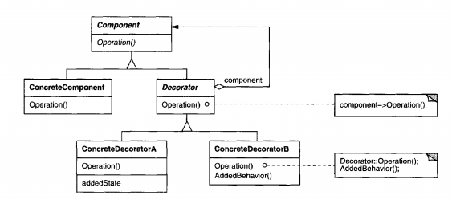{width="14cm"}

### Facade

Provide a unified interface to a set of interfaces in a subsystem.
Facade defines a higher-level interface that makes the subsystem easier
to use.

**Applicability**

Use the Facade pattern when

-   you want to provide a simple interface to a complex subsystem

-   there are many dependencies between clients and the implementation
    classes of an abstraction

-   you want to layer your subsystems.

**Consequences**

The Facade pattern offers the following benefits:

-   It shields clients from subsystem components, thereby reducing the
    number of objects that clients deal with and making the subsystem
    easier to use.

-   It promotes weak coupling between the subsystem and its clients.

-   It doesn’t prevent applications from using subsystem classes if they
    need to. Thus you can choose between ease of use and generality

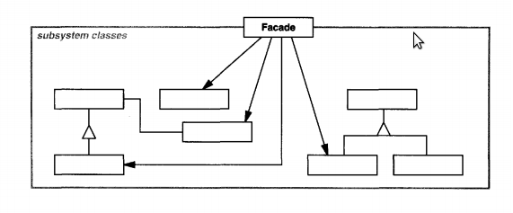{width="14cm"}

### Flyweight

Use sharing to support large numbers of fine-grained objects
efficiently.

**Applicability**

The Flyweight pattern’s effectiveness depends heavily on how and where
it’s used. Apply the Flyweight pattern when all of the following are
true:

-   An application uses a large number of objects

-   Storage costs are high because of the sheer quantity of objects.

-   Most object state can be made extrinsic.

-   Many groups of objects may be replaced by relatively few shared
    objects once extrinsic state is removed.

-   The application doesn’t depend on object identity. Since flyweight
    objects may be shared, identity tests will return true for
    conceptually distinct objects.

**Consequences**

Flyweights may introduce run-time costs associated with transferring,
finding, and/or computing extrinsic state. However, such costs are
offset by space savings, which increase as more flyweights are shared.

{width="14cm"}

### Proxy

Provide a surrogate or placeholder for another object to control access
to it.

**Applicability**

Proxy is applicable whenever there is a need for a more versatile or
sophisticated reference to an object than a simple pointer. Here are
several common situations in which the Proxy pattern is applicable:

-   A remote proxy provides a local representative for an object in a
    different address space.

-   A virtual proxy creates expensive objects on demand.

-   A protection proxy controls access to the original object.
    Protection proxies are useful when objects should have different
    access rights.

-   A smart reference is a replacement for a bare pointer that performs
    additional actions when an object is accessed.

**Consequences**

The Proxy pattern introduces a level of indirection when accessing an
object. The additional indirection has many uses, depending on the kind
of proxy:

-   A remote proxy can hide the fact that an object resides in a
    different address space.

-   A virtual proxy can perform optimizations such as creating an object
    on demand.

-   Both protection proxies and smart references allow additional
    housekeeping tasks when an object is accessed

{width="14cm"}

Behavioural Patterns
--------------------

### Chain of Responsibility

Avoid coupling the sender of a request to its receiver by giving more
than one object a chance to handle the request. Chain the receiving
objects and pass the request along the chain until an object handles it.

**Applicability**

Use Chain of Responsibility when

-   more than one object may handle a request, and the handler isn’t
    known a priori.

-   you want to issue a request to one ofseveral objects without
    specifying the receiver explicitly.

-   the set of objects that can handle a request should be
    specified dynamically.

**Consequences**

Chain of Responsibility has the following benefits and liabilities:

-   Reduced coupling.

-   Added flexibility in assigning responsibilities to objects

-   Receipt isn’t guaranteed.

{width="14cm"}

### Command

Encapsulate a request as an object, thereby letting you parameterize
clients with different requests, queue or log requests, and support
undo-able operations.

**Applicability**

Use the Command pattern when you want to

-   parameterize objects by an action to perform.

-   specify, queue, and execute requests at different times.

-   support undo.

-   support logging changes so that they can be reapplied in case of a
    system crash.

-   structure a system around high-level operations built on
    primitives operations.

**Consequences**

The Command pattern has the following consequences:

-   Command decouples the object that invokes the operation from the one
    that knows how to perform it.

-   Commands are first-class objects. They can be manipulated and
    extended like any other object.

-   You can assemble commands into a composite command.

-   It’s easy to add new Commands, because you don’t have to change
    existing classes.

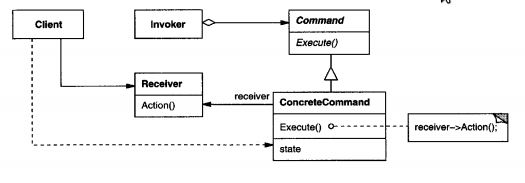{width="14cm"}

### Interpreter

Use the Interpreter pattern when there is a language to interpret, and
you can represent statements in the language as abstract syntax trees.
The Interpreter pattern works best when

**Applicability**

Use the Command pattern when you want to

-   the grammar is simple. For complex grammars, the class hierarchy for
    the grammar becomes large and unmanageable.

-   efficiency is not a critical concern. The most efficient
    interpreters are usually not implemented by interpreting parse trees
    directly but by first translating them into another form.

**Consequences**

The Interpreter pattern has the following benefits and liabilities:

-   It’s easy to change and extend the grammar

-   Implementing the grammar is easy.

-   Complex grammars are hard to maintain.

-   Easier to add new ways to interpret expressions.

{width="11cm"}

### Iterator

Provide a way to access the elements of an aggregate object sequentially
without exposing its underlying representation.

**Applicability**

Use the Iterator pattern

-   to access an aggregate object’s contents without exposing its
    internal representation (i.e. a list).

-   to support multiple traversals of aggregate objects.

-   to provide a uniform interface for traversing different aggregate
    structures (that is, to support polymorphic iteration)

**Consequences**

The Iterator pattern has three important consequences:

-   It supports variations in the traversal of an aggregate

-   Iterators simplify the Aggregate interface.

-   More than one traversal can be pending on an aggregate.

{width="14cm"}

### Mediator

Define an object that encapsulates how a set of objects interact.
Mediator promotes loose coupling by keeping objects from referring to
each other explicitly, and it lets you vary their interaction
independently.

**Applicability**

Use the Mediator pattern when

-   a set of objects communicate in well-defined but complex ways.The
    resulting interdependencies are unstructured and difficult
    to understand.

-   reusing an object is difficult because it refers to and communicates
    with many other objects.

-   a behavior that’s distributed between several classes should be
    customizable without a lot of subclassing

**Consequences**

The Mediator pattern has the following benefits and drawbacks:

-   It limits subclassing.

-   It decouples colleagues.

-   It simplifies object protocols.

-   It abstracts how objects cooperate.

-   It centralizes control.

{width="10cm"}

### Memento

Without violating encapsulation, capture and externalize an object’s
internal state so that the object can be restored to this state later.

**Applicability**

Use the Memento pattern when

-   a snapshot of (some portion of) an object’s state must be saved so
    that it can be restored to that state later.

-   a direct interface to obtaining the state would expose
    implementation details and break the object’s encapsulation.

**Consequences**

The Memento pattern has several consequences:

-   Preserving encapsulation boundaries.

-   It simplifies Originator.

-   Using mementos might be expensive.

-   Defining narrow and wide interfaces.

-   Hidden costs in caring for mementos.

{width="14cm"}

### Observer \*

Define a one-to-many dependency between objects so that when one object
changes state, all its dependents are notified and updated
automatically.

**Applicability**

Use the Observer pattern in any of the following situations:

-   When an abstraction has two aspects, one dependent on the other.
    Encapsulating these aspects in separate objects lets you vary and
    reuse them independently.

-   When a change to one object requires changing others, and you don’t
    know how many objects need to be changed.

-   When an object should be able to notify other objects without making
    assumptions about who these objects are.In other words, you don’t
    want these objects tightly coupled.

**Consequences**

The Observer pattern lets you vary subjects and observers independently.
Further benefits and liabilities of the Observer pattern include the
following:

-   Abstract coupling between Subject and Observer.

-   Support for broadcast communication.

-   Unexpected updates.

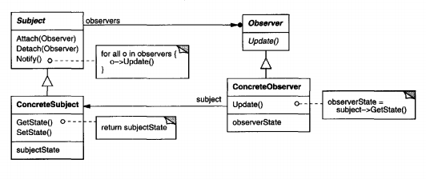{width="14cm"}

### State

Allow an object to alter its behavior when its internal state changes.
The object will appear to change its class.

**Applicability**

Use the State pattern in either of the following cases:

-   An object’s behavior depends on its state, and it must change its
    behavior at run-time depending on that state.

-   Operations have large, multipart conditional statements that depend
    on the object’s state.

**Consequences**

The State pattern has the following consequences:

-   It localizes state-specific behavior and partitions behavior for
    different states.

-   It makes state transitions explicit.

-   State objects can be shared.

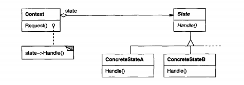{width="14cm"}

### Strategy \*

Define a family of algorithms, encapsulate each one, and make them
interchangeable. Strategy lets the algorithm vary independently from
clients that use it.

**Applicability**

Use the Strategy pattern when

-   many related classes differ only in their behavior. Strategies
    provide a way to configure a class with one of many behaviors.

-   you need different variants of an algorithm.

-   an algorithm uses data that clients shouldn’t know about.

-   a class defines many behaviors, and these appear as multiple
    conditional statements in its operations.

**Consequences**

The Strategy pattern has the following benefits and drawbacks:

-   Families of related algorithms.

-   An alternative to subclassing.

-   Strategies eliminate conditional statements.

-   A choice of implementations.

-   Clients must be aware of different Strategies.

-   Communication overhead between Strategy and Context.

-   Increased number of objects.

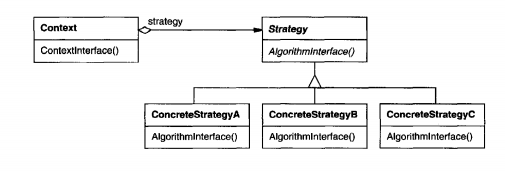{width="14cm"}

### Template Method \*

Define the skeleton of an algorithm in an operation, deferring some
steps to subclasses. Template Method lets subclasses redefine certain
steps of an algorithm without changing the algorithm’s structure.

**Applicability**

The Template Method pattern should be used

-   to implement the invariant parts of an algorithm once and leave it
    up to subclasses to implement the behavior that can vary.

-   when common behavior among subclasses should be factored and
    localized in a common class to avoid code duplication.

-   to control subclasses extensions.

**Consequences**

Template methods are a fundamental technique for code reuse. Template
methods lead to an inverted control structure. This refers to how a
parent class calls the operations of a subclass and not the other way
around.

Template methods call the following kinds of operations:

-   concrete operations (either on the ConcreteClass or on
    client classes)

-   concrete AbstractClass operations (i.e., operations that are
    generally useful to subclasses)

-   primitive operations (i.e., abstract operations)

-   factory methods

-   hook operations, which provide default behavior that subclasses can
    extend if necessary. A hook operation often does nothing by default.

{width="10cm"}

### Visitor

Represent an operation to be performed on the elements of an object
structure. Visitor lets you define a new operation without changing the
classes of the elements on which it operates.

**Applicability**

Use the Visitor pattern when

-   an object structure contains many classes of objects with differing
    interfaces, and you want to perform operations on these objects that
    depend on their concrete classes.

-   many distinct and unrelated operations need to be performed on
    objects in an object structure, and you want to avoid “polluting"
    their classes with these operations.

-   the classes defining the object structure rarely change, but you
    often want to define new operations over the structure.

**Consequences**

Some of the benefits and liabilities of the Visitor pattern are as
follows:

-   Visitor makes adding new operations easy.

-   A visitor gathers related operations and separates unrelated ones.

-   Adding new ConcreteElement classes is hard.

-   Visiting across class hierarchies.

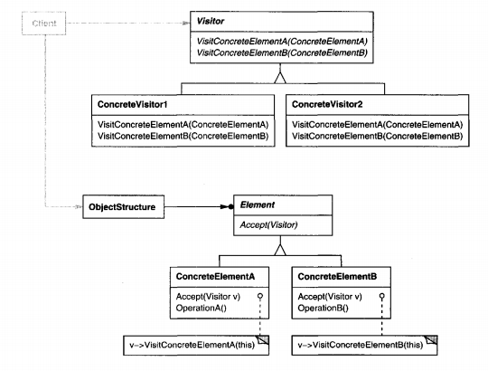{width="11cm"}

Gamma, E., Helm, R., Johnson, R.,, Vlissides, J. M. (1994). Design
Patterns: Elements of Reusable Object-Oriented Software. Addison-Wesley
Professional. ISBN: 0201633612
