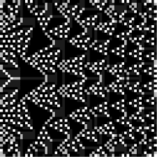

---
author:
- 'Luke J. Pereira'
title: Experiments with Chaos
...

Prigogine’s Goggles
===================

Suppose that while clearing out the desk of the late physical chemist
and Nobel laureate, Ilya Prigogine, we find a pair of strange looking
goggles. On them, we see two dials which can be turned either left or
right, with one having labels reading “order” and “chaos” on either
side, while the labels of the other dial read “simplicity” and
“complexity”. An instruction manual beside the goggles tells us that
when we put them on and turn the dials, we’ll be able to change the
parameters of any chunk of a dynamical system we’re looking at, with the
exception that the artificial changes we make will only be temporary
before they return to their original state. We should ask ourselves:
with full control of these parameters, what is it that we want to get
out of our experiment? Perhaps we want to attempt to create novel tools
or ideas in the field we’re working in so that we can later write a
paper about them and claim they were a product of our own imaginative
genius. Or maybe we want to temporarily simplify some incomprehensibly
complex phenomena, like the weather or stock markets, so that we can try
to generate better predictions about them. What if we wanted to devise a
clever way to modify a small part of a larger system so that our
temporal changes propagate throughout the entire system making
long-lasting changes?

Creativity at the Edge of Chaos
===============================

On a nearby shelf in the office, we find a microscope with a petri dish
beneath the lens and decide that it’s a safe place to conduct our first
experiment – we want to create an organism that has never existed
before. We reason that we will need the system to send typically
disparate parts into collisions with each other and maybe one of the
combinations will produce something that’s both novel and useful. To
encourage this creativity, we turn the dials to their highest chaotic
and complexity settings, but we soon see that the organic system is
generating very large amounts of random and nonsensical combinations,
preventing us from finding or preserving what might be valuable. To
combat this mess, we turn the dials in their opposite directions,
towards order and simplicity and see that our new system is now
producing structural order with basic fractal, self-similar patterns.
Increasing complexity makes the structure denser and more repetitive but
unfortunately, its novelty is limited and the system appears neither
particularly useful nor shows the ability to produce more sophisticated
organisms @eoc.

It appears that for a complex structure to develop, we need some amount
of order to build up form, but too much order will create repetition and
stagnation. On the other hand, too much chaos appears to destroy the
ability for any forms to evolve in a non-random and stable manner. We
note that the chaotic system has two distinct properties: it often sends
parts that were initially close together into distant regions
(*expansivity*), and it appears to ensure that points from one
neighborhood will eventually be smeared through any other neighborhood
(*transitivity*). Both of these properties make the chaotic systems
highly unpredictable, but interestingly we found that the optimal
creative settings arose right at *the edge of chaos*, a finely tuned
parameterization which offers a trade-off between stability and
evolvability. With this newfound insight we’ve gained from observing and
taking measurements of a microscopic system, we begin to wonder if we
can apply our findings to systems of macroscopic or much larger global
scales.

Ergodicity and Predictability
=============================

This strategy of developing a belief about the entirety of a system by
examining the measurements of one of its parts for a sufficiently large
amount of time is closely related to a concept known as *ergodicity*.
Ergodic processes and systems have a property in which the averages
measured for a subunit, known as its ensemble averages, are equivalent
to the averages of the entire system, known as its time averages. This
property is somewhat analogous to the self-similar geometry that can be
found in fractals, but instead of involving structure, ergodic systems
exhibit self-similarity of averaged measurements of processes. In our
society, we often assume that our past localized measurements can be
used to make predictions about future measurements which are actually
dependent on a much larger global system of interactions. Although it
can be useful and our models of the world tend to be fairly accurate at
making short-term predictions, this is not generally how many of the
dynamical systems around us truly behave. The states of these systems
don’t always change in the smooth and gradual ways which our short-term
predictions suggest, but instead are prone to change in catastrophic
ways. The *avalanches* in the system are not properties of the local
interactions but can only be seen when viewing the system holistically.

Avalanches and Self-organization
================================

r0.5

{width="43.00000%"}

In the corner of the office, we see two piles of crumpled up balls of
white papers on the ground, presumably containing the failed and
abandoned ideas of Dr Prigogine. We can see that the piles are somewhat
stable, so using our goggles we’d like to see how they respond to small
fluctuations. We step back and look at the whole of one of the piles and
slowly increase the complexity parameter until we see that the pile
reaches a critical point where it loses all of its stability and
collapses onto the floor. Next, we turn our sights to the second pile
and move close enough to it so that we’re focusing on a single ball of
crumpled paper amongst the pile. Again, we introduce small fluctuations
in the paper which pushes around other nearby crumpled papers. Not long
after these small interactions, we see the same results as before, the
pile as a whole loses its stability and crashes to the floor.

Earlier, we saw how predictions about future local states are often
fallible because of their dependence on the interactions of the system
as a whole. We’re now seeing an alternative perspective of this fact:
the small interactions of parts of a system can cause large changes and
disruptions to the system as whole. These same findings were put forward
by a group of three physicists in what’s known as a *Bak–Tang–Wiesenfeld
model*@btw, metaphorically explained as a sandpile with new grains of
sand being randomly added until the slope exceeds a given threshold
which will then cause an avalanche. Just as our experiment had shown,
their model demonstrated how the emergence of complexity from simple
local interactions could explain spontaneous natural complexity rather
than something only possible in artificial situations where control
parameters of the entire system are tuned to precise critical values.
The general behaviour was named *self-organized critically* and
contributed to the theory of self-organization, which refers to any
process where some form of overall order or pattern arises from local
interactions between the parts of an initially chaotic system. A classic
example of self-organization is the swarm behaviour displayed in a large
flock of birds.

Dissapative Structures Outside the Office
=========================================

Standing in his office, we’re immediately reminded of the work of Illya
Prigogine. In the 1960s, Prigogine conducted research in dynamical
systems, mainly in the physical science of thermodynamics.
Thermodynamics involves heat and its transformation into other forms of
energy using statistical descriptions of atomic and molecular movements.
Prigogine became interested in an unpopular area of irreversible
thermodynamics, which analyses processes where it is impossible to
restore an environment back to its initial conditions after their
occurrence, causing entropy and disorder. All sufficiently complex
natural processes are considered irreversible, usually as a result of
*dissipation* or loss of energy which can occur when heat is transferred
through thermal resistance or during some other atomic or molecular
transformation.

His Nobel prize-winning theory had its origins in the realization that
long before a state of balance is reached, irreversible processes could
drive systems which were in thermal chaos to orderly and stable
states@ds. This change could occur by artificially amplified
fluctuations, similar to the effect of the goggles in our own
experiments. Prigogine called these fluctuations *dissipative
structures* to emphasize the constructive role of these irreversible
processes. Dissipation, which was previously considered a nuisance
because of its creation of disorder was now causing self-organization,
which we’ve learned creates a form of overall order in a chaotic system.
Prigogine posited that this theory captured the key to understanding the
origin of order and creativity we see in nature. The societal
implications of the underlying philosophy of his experiments are
expressed in his work Order out of Chaos@oooc

The threat lies in the realization that in our universe the security of
stable, permanent rules are gone forever. We are living in a dangerous
and uncertain world that inspires no blind confidence. Our hope arises
from the knowledge that even small fluctuations may grow and change the
overall structure. As a result, individual activity is not doomed to
insignificance

We’ve learned a great deal from the experiments we’ve performed in the
confines of Illya Prigogine’s office, and now we feel ready to run an
experiment outside in the real world. As we leave the office, we look
out into nature and society through Prigogine’s goggles and see a vast
array of chaotic systems. Some of them destructive, others
unsustainable, and yet others in a perfect balance. Again, we stop for a
moment to ask ourselves: with our newfound knowledge, what do we want to
get out of our next experiment?

4

Ranjit Kumar Upadhyay (2009). “Dynamics of an ecological model living on
the edge of chaos”. Applied Mathematics and Computation.

Bak, P.; Tang, C.; Wiesenfeld, K. (1987). “Self-organized criticality:
an explanation of $1/f$ noise”. Physical Review Letters.

Prigogine, I. (1978). Time, Structure, and Fluctuations. Science,
201(4358), 777-785. Retrieved March 22, 2020, from
www.jstor.org/stable/1746122

Prigogine, I., Stengers, I., (1984). Order out of chaos: Man’s new
dialogue with nature. Boulder, CO: New Science Library.
