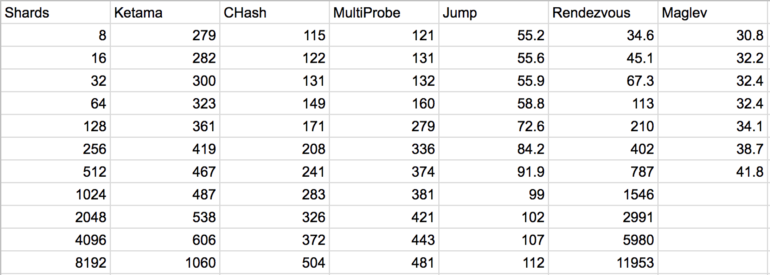

-   [Databases](#databases)
    -   [Data Models and Query
        Languages](#data-models-and-query-languages)
    -   [Storage and Retrieval ](#storage-and-retrieval)
        -   [Online Transactional
            Processing](#online-transactional-processing)
        -   [Online Analytical
            Processing](#online-analytical-processing)
    -   [Concepts](#concepts)
        -   [CAP Theorem](#cap-theorem)
        -   [Online analytic processing
            (OLAP)](#online-analytic-processing-olap)
        -   [Online transaction processing
            (OLTP)](#online-transaction-processing-oltp)
        -   [ACID (SQL)](#acid-sql)
        -   [Primary and Foreign Keys](#primary-and-foreign-keys)
        -   [Normalized Data](#normalized-data)
        -   [Derived Data, Joins, Materialized
            Views](#derived-data-joins-materialized-views)
        -   [Index and Secondary Index](#index-and-secondary-index)
        -   [BASE (NoSQL)](#base-nosql)
        -   [Types of NoSQL](#types-of-nosql)
        -   [Denormalized Data](#denormalized-data)
        -   [Row Store vs. Column Store](#row-store-vs.-column-store)
        -   [Data Warehouse](#data-warehouse)
        -   [Extract--Transform--Load](#extracttransformload)
        -   [Stored Procedure](#stored-procedure)
-   [Concurrency](#concurrency)
    -   [Transactions](#transactions)
    -   [Concepts](#concepts-1)
        -   [Concurrency](#concurrency-1)
        -   [Transactions](#transactions-1)
        -   [Multi-Processing and
            Multi-Threading](#multi-processing-and-multi-threading)
        -   [Locks/Mutex](#locksmutex)
        -   [Deadlocks](#deadlocks)
        -   [Optimistic and Pessimistic
            Locking](#optimistic-and-pessimistic-locking)
        -   [Operational transformation](#operational-transformation)
        -   [Commit log](#commit-log)
        -   [Idempotent](#idempotent)
        -   [Atomic](#atomic)
        -   [Linearizable](#linearizable)
        -   [Serializable](#serializable)
        -   [Isolation](#isolation)
        -   [Synchronization](#synchronization)
        -   [CAS](#cas)
        -   [Two-phase locking (2PL)](#two-phase-locking-2pl)
        -   [Two-phase commit (2PC)](#two-phase-commit-2pc)
        -   [Total order](#total-order)
        -   [Lamport Timestamps and Vector
            Clock](#lamport-timestamps-and-vector-clock)
        -   [Skew](#skew)
-   [Distributed Computing](#distributed-computing)
    -   [Replication](#replication)
    -   [Partitioning Data](#partitioning-data)
    -   [Fault Tolerance ](#fault-tolerance)
    -   [Consistency and Consensus ](#consistency-and-consensus)
    -   [Concepts](#concepts-2)
        -   [Distributed](#distributed)
        -   [Fallacies of Distributed
            Computing](#fallacies-of-distributed-computing)
        -   [Partitioning](#partitioning)
        -   [Hot-spots](#hot-spots)
        -   [Rebalance](#rebalance)
        -   [Horizontal and Vertical
            Scaling](#horizontal-and-vertical-scaling)
        -   [Replication](#replication-1)
        -   [Leader](#leader)
        -   [Follower](#follower)
        -   [Split Brain](#split-brain)
        -   [Consensus](#consensus)
        -   [Quorum](#quorum)
        -   [Paxos](#paxos)
        -   [Strong and Eventual
            Consistency](#strong-and-eventual-consistency)
        -   [Failover](#failover)
        -   [High Availability](#high-availability)
        -   [Partial Availability](#partial-availability)
        -   [Byzantine fault](#byzantine-fault)
        -   [MTBF](#mtbf)
        -   [GFS](#gfs)
        -   [Peer-to-peer](#peer-to-peer)
        -   [Shared-nothing](#shared-nothing)
-   [Application Design and Data
    Processing](#application-design-and-data-processing)
    -   [Encoding and Evolution](#encoding-and-evolution)
    -   [Rolling Upgrades](#rolling-upgrades)
    -   [Batch Processing and
        MapReduce](#batch-processing-and-mapreduce)
    -   [Stream Processing ](#stream-processing)
    -   [Data Flow Applications and Systems of Record
        ](#data-flow-applications-and-systems-of-record)
    -   [Architectural Patterns](#architectural-patterns)
    -   [Concepts](#concepts-3)
        -   [Batch Process](#batch-process)
        -   [Stream Process](#stream-process)
        -   [MapReduce](#mapreduce)
        -   [Fan-out](#fan-out)
        -   [Systems of Record](#systems-of-record)
        -   [Hash Functions](#hash-functions)
        -   [Consistent Hashing](#consistent-hashing)
        -   [Probabilistic Data
            Structures](#probabilistic-data-structures)
        -   [Design Patterns and OOP](#design-patterns-and-oop)
        -   [Protocol Buffers](#protocol-buffers)
        -   [Logs](#logs)
        -   [Multitier Architecture](#multitier-architecture)
        -   [Services](#services)
        -   [Back of the Envelope
            Calculations](#back-of-the-envelope-calculations)
        -   [Canary Deployments](#canary-deployments)
        -   [Feature Flags](#feature-flags)
-   [Networks](#networks)
    -   [Concepts](#concepts-4)
        -   [Caching](#caching)
        -   [LRU Cache](#lru-cache)
        -   [Request Protocols](#request-protocols)
        -   [TCP and UDP](#tcp-and-udp)
        -   [IPv4 and IPV6](#ipv4-and-ipv6)
        -   [DNS Lookup](#dns-lookup)
        -   [HTTPS and TLS](#https-and-tls)
        -   [Symmetric and Asymetric
            Encryption](#symmetric-and-asymetric-encryption)
        -   [Internet Protocol Suite and
            OSI](#internet-protocol-suite-and-osi)
        -   [L4 and L7 Load Balancers](#l4-and-l7-load-balancers)
        -   [CDN and Edge Computing](#cdn-and-edge-computing)
        -   [Locality](#locality)
        -   [Percentiles](#percentiles)
        -   [Metrics](#metrics)
        -   [Backpressure](#backpressure)
        -   [The Two Generals and Byzantine Generals
            Problem](#the-two-generals-and-byzantine-generals-problem)
-   [System Design Interview](#system-design-interview)
    -   [Outline](#outline)
    -   [Process](#process)

Databases
=========

Data Models and Query Languages
-------------------------------

Historically, data started out being represented as one big tree (the
hierarchical model), but that wasn't good for representing many-to-many
relationships, so the **relational** SQL datastore model was invented to
solve that problem. More recently, developers found that some
applications don't fit well in the relational model either. New
nonrelational NoSQL datastores have diverged in two main directions:

i.  **Document databases** target use cases where data comes in
    self-contained documents and relationships between one document and
    another are rare.

ii. **Graph databases** go in the opposite direction, targeting use
    cases where anything is potentially related to everything.

All three models (document, relational, and graph) are widely used
today, and each is good in its respective domain. One model can be
emulated in terms of another model ---for example, graph data can be
represented in a relational database---but the result is often awkward.
That's why we have different systems for different purposes, not a
single one-size-fits-all solution.

One thing that document and graph databases have in common is that they
typically don't enforce a schema for the data they store, which can make
it easier to adapt applications to changing requirements. However, your
application most likely still assumes that data has a certain structure;
it's just a question of whether the schema is explicit (enforced on
write) or implicit (handled on read).

Each data model comes with its own query language or framework, i.e.
SQL, MapReduce, MongoDB's aggregation pipeline, Cypher, SPARQL, or
Datalog.

Storage and Retrieval 
---------------------

On a high level, storage engines fall into two broad categories:

i.  those optimized for transaction processing (OLTP) and

ii. those optimized for analytics (OLAP).

There are major differences between the access patterns in those use
cases.

### Online Transactional Processing

Online Transactional Processing (OLTP) systems are typically
user-facing, which means that they may see a huge volume of requests. In
order to handle the load, applications usually only touch a small number
of records in each query. The application requests records using some
kind of key, and the storage engine uses an index to find the data for
the requested key. Disk seek time is often the bottleneck here

On the OLTP side, storage engines from two main schools of thought:

i.  The **log-structured** school, which only permits appending to files
    and deleting obsolete files, but never updates a file that has been
    written. Bitcask, SSTables, LSM-trees, LevelDB, Cassandra, HBase,
    Lucene, and others belong to this group.

    Log-structured storage engines are a comparatively recent
    development. Their key idea is that they systematically turn
    random-access writes into sequential writes on disk, which enables
    higher write throughput due to the performance characteristics of
    hard drives and SSDs.

ii. The **update-in-place** school, which treats the disk as a set of
    fixed-size pages that can be overwritten. **B-trees** are the
    biggest example of this philosophy, being used in all major
    relational databases and also many nonrelational ones.

### Online Analytical Processing

Online Analytical Processing (OLAP) is the technology behind many
Business Intelligence (BI) applications. OLAP is a powerful technology
for data discovery, including capabilities for limitless report viewing,
complex analytical calculations, and predictive "what if" scenario
(budget, forecast) planning.

**Data warehouses** and similar analytic systems are less well known,
because they are primarily used by business analysts, not by end users.
They handle a much lower volume of queries than OLTP systems, but each
query is typically very demanding, requiring many millions of records to
be scanned in a short time. Disk bandwidth (not seek time) is often the
bottleneck here, and column-oriented storage is an increasingly popular
solution for this kind of workload.

This background illustrated why analytic workloads are so different from
OLTP: when your queries require sequentially scanning across a large
number of rows, indexes are much less relevant. Instead it becomes
important to encode data very compactly, to minimize the amount of data
that the query needs to read from disk. Column-oriented storage helps
achieve this goal.

Concepts
--------

### CAP Theorem

The CAP theorem (Brewer's theorem) implies that in the presence of a
network partition, one has to choose between consistency and
availability. It is impossible for a distributed data store to
simultaneously provide more than two out of the following three
guarantees:

i.  **Consistency** -- Every read receives the most recent write or an
    error.

ii. **Availability** -- Every request receives a (non-error) response,
    without the guarantee that it contains the most recent write.

iii. **Partition tolerance** -- The system continues to operate despite
     an arbitrary number of messages being dropped (or delayed) by the
     network between nodes.

In a distributed system, selecting P (Partition tolerance) is mandatory,
that is, you can only choose AP or CP. For example: when a network
partition failure happens, should we decide to cancel the operation and
thus decrease the availability but ensure consistency, or proceed with
the operation and thus provide availability but risk inconsistency.

If a system chooses to provide Consistency over Availability in the
presence of partitions and moreover, failures, it will preserve the
guarantees of its atomic reads and writes by refusing to respond to some
requests. It may decide to shut down entirely (like the clients of a
single-node data store), refuse writes (like Two-Phase Commit), or only
respond to reads and writes for pieces of data whose "master" node is
inside the partition component (like Membase).

If a system chooses to provide Availability over Consistency in the
presence of partitions (i.e. failures), it will respond to all requests,
potentially returning stale reads and accepting conflicting writes.
These inconsistencies are often resolved via causal ordering mechanisms
like vector clocks and application-specific conflict resolution
procedures. (Dynamo systems usually offer both of these; Cassandra's
hard-coded Last-Writer-Wins conflict resolution being the main
exception.)

CAP theorem is well-suited for critiquing a distributed system design,
and understanding what trade-offs need to be made. Taking a system
design and iterating through the constraints CAP puts on its subsystems
will leave you with a better design at the end.

### Online analytic processing (OLAP)

Online analytic processing (OLAP) is an access pattern characterized by
aggregating (e.g., count, sum, average) over a large number of records.

### Online transaction processing (OLTP)

Online transaction processing (OLTP) is an access pattern characterized
by fast queries that read or write a small number of records, usually
indexed by key

### ACID (SQL)

i.  **Atomicity** -- All operations in a transaction succeed or every
    operation is rolled back.

ii. **Consistency** -- On the completion of a transaction, the database
    is structurally sound.

iii. **Isolation** -- Transactions do not contend with one another.
     Contentious access to data is moderated by the database so that
     transactions appear to run sequentially.

iv. **Durability** -- The results of applying a transaction are
    permanent, even in the presence of failures.

### Primary and Foreign Keys

A primary key is a value (typically a number or a string) that uniquely
identifies a record. In many applications, primary keys are generated by
the system when a record is created (e.g., sequentially or randomly);
they are not usually set by users.

A foreign key is a column or group of columns in a relational database
table that provides a link between data in two tables. It acts as a
cross-reference between tables because it references the primary key of
another table, thereby establishing a link between them

The more ids required to get to a piece of data, the more options you
have in partitioning the data. The fewer ids required to get a piece of
data, the easier it is to consume your system's output.

Watch out for what kind of information you encode in your ids,
explicitly and implicitly. Clients may use the structure of your ids to
de-anonymize private data, crawl your system in unexpected ways
(auto-incrementing ids are a typical sore point), or perform a host of
other attacks.

### Normalized Data

Normalized Data is structured in such a way that there is no redundancy
or duplication. In a normalized database, when some piece of data
changes, you only need to change it in one place, not many copies in
many different places.

### Derived Data, Joins, Materialized Views

A derived dataset is created from some other data through a repeatable
process, which you could run again if necessary. Usually, derived data
is needed to speed up a particular kind of read access to the data.
Indexes, caches, and materialized views are examples of derived data.

A join brings together records that have something in common. Most
commonly used in the case where one record has a reference to another (a
foreign key, a document reference, an edge in a graph) and a query needs
to get the record that the reference points to.

To materialize means to perform a computation preemptively and write out
its result, as opposed to calculating it on demand when requested.

### Index and Secondary Index

Indexing is a way to get an unordered table into an order that will
maximize the query's efficiency while searching. An index creates a data
structure, typically a B-tree, with values from a specific column. It
may then use a search algorithm, typically binary search, to find the
value and return a pointer to its true index in the unordered table.

A secondary index is an additional data structure that is maintained
alongside the primary data storage and which allows you to efficiently
search for records that match a certain kind of condition.

### BASE (NoSQL)

i.  **Basic availability** -- The database appears to work most of the
    time.

ii. **Soft-state** -- Stores don't have to be write-consistent, nor do
    different replicas have to be mutually consistent all the time.

iii. **Eventual consistency** -- Stores exhibit consistency at some
     later point (e.g., lazily at read time).

### Types of NoSQL

-   **Key-value** -- an in-memory hashtable

-   **Wide column** -- names and format of the columns can vary from row
    to row in the same table. ex: Cassandra.

-   **Document Based** -- relies on internal structure in the document
    in order to extract metadata for further optimization ex:
    ElasticSearch

-   **Graph Based** -- uses graph structures for semantic queries with
    nodes, edges, and properties to represent and store data. ex: Neo4j

### Denormalized Data

A denormalized dataset introduces some amount of redundancy or
duplication in a normalized dataset, typically in the form of a cache or
index, in order to speed up reads. A denormalized value is a kind of
precomputed query result, similar to a materialized view.

### Row Store vs. Column Store

A **row store** (or row-oriented database) stores a sequence of records
that contains the fields of one row in the table. In a **column store**,
the entries of a column are stored in contiguous memory locations. At a
basic level, row stores are great for transaction processing. Column
stores are great for highly analytical query models. Row stores have the
ability to write data very quickly, whereas a column store excel at
aggregating large volumes of data for a subset of columns. By storing
data in columns rather than rows, the database can more precisely access
the data it needs to answer a query rather than scanning and discarding
unwanted data in rows.

Column stores typically make use of Log-structured merge-tree
(LSM-Trees) which provide indexed access to files with high insert
volume. Row stores typically use B-Trees. Column-compression is a
column-level operation that reduces the size of data when it is stored.
Compression conserves storage space and reduces the size of data that is
read from storage, which reduces the amount of disk I/O and therefore
improves query performance.

### Data Warehouse

A database in which data from several different OLTP systems has been
combined and prepared to be used for analytics purposes, i.e. as an
OLAP.

### Extract--Transform--Load

Extract--Transform--Load (ETL) is the process of extracting data from a
source database, transforming it into a form that is more suitable for
analytic queries, and loading it into a data warehouse or batch
processing system.

### Stored Procedure

A way of encoding the logic of a transaction such that it can be
entirely executed on a database server, without communicating back and
forth with a client during the transaction.

Concurrency
===========

Transactions
------------

Transactions are an abstraction layer that allows an application to
pretend that certain concurrency problems and certain kinds of hardware
and software faults don't exist. A large class of errors is reduced down
to a simple transaction abort, and the application just needs to try
again.

Not all applications are susceptible to all those problems: an
application with very simple access patterns, such as reading and
writing only a single record, can probably manage without transactions.
However, for more complex access patterns, transactions can hugely
reduce the number of potential error cases you need to think about.

Without transactions, various error scenarios (processes crashing,
network interruptions, power outages, disk full, unexpected concurrency,
etc.) mean that data can become inconsistent in various ways. For
example, denormalized data can easily go out of sync with the source
data. Without transactions, it becomes very difficult to reason about
the effects that complex interacting accesses can have on the database.

In concurrency control there are several widely used isolation levels,
in particular read committed, snapshot isolation (sometimes called
repeatable read), and serializable. We can characterize those isolation
levels through various examples of race conditions:

i.  **Dirty reads** -- One client reads another client's writes before
    they have been committed. The read committed isolation level and
    stronger levels prevent dirty reads.

ii. **Dirty writes** -- One client overwrites data that another client
    has written, but not yet committed. Almost all transaction
    implementations prevent dirty writes.

iii. **Read skew (nonrepeatable reads)** -- A client sees different
     parts of the database at different points in time. This issue is
     most commonly prevented with snapshot isolation, which allows a
     transaction to read from a consistent snapshot at one point in
     time. It is usually implemented with multi-version concurrency
     control (MVCC).

iv. **Lost updates** -- Two clients concurrently perform a
    read-modify-write cycle. One overwrites the other's write without
    incorporating its changes, so data is lost. Some implementations of
    snapshot isolation prevent this anomaly automatically, while others
    require a manual lock (SELECT FOR UPDATE).

v.  **Write skew** -- A transaction reads something, makes a decision
    based on the value it saw, and writes the decision to the database.
    However, by the time the write is made, the premise of the decision
    is no longer true. Only serializable isolation prevents this
    anomaly.

vi. **Phantom reads** -- A transaction reads objects that match some
    search condition. Another client makes a write that affects the
    results of that search. Snapshot isolation prevents straightforward
    phantom reads, but phantoms in the context of write skew require
    special treatment, such as index-range locks.

Weak isolation levels protect against some of those anomalies but leave
you, the application developer, to handle others manually (e.g., using
explicit locking). Only serializable isolation protects against all of
these issues. There are three different approaches to implementing
serializable transactions:

i.  Literally executing transactions in a serial order -- If you can
    make each transaction very fast to execute, and the transaction
    throughput is low enough to process on a single CPU core, this is a
    simple and effective option.

ii. Two-phase locking (2PL) -- For decades this has been the standard
    way of implementing serializability, but many applications avoid
    using it because of its performance characteristics.

iii. Serializable snapshot isolation (SSI) -- A fairly new algorithm
     that avoids most of the downsides of the previous approaches. It
     uses an optimistic approach, allowing transactions to proceed
     without blocking. When a transaction wants to commit, it is
     checked, and it is aborted if the execution was not serializable.

Transactions are a valuable database feature, no matter which data model
is used. Transactions in distributed databases open a new set of
difficult challenges.

Concepts
--------

### Concurrency

Concurrency is the ability of different parts or units of a program,
algorithm, or problem to be executed out-of-order or in partial order,
without affecting the final outcome.

### Transactions

A transaction groups together several reads and writes into a logical
unit, in order to simplify error handling and concurrency issues.

### Multi-Processing and Multi-Threading

Multithreading is the ability of a central processing unit (CPU) (or a
single core in a multi-core processor) to provide multiple threads of
execution concurrently, supported by the operating system.

Where multiprocessing systems include multiple complete processing units
in one or more cores, multithreading aims to increase utilization of a
single core by using thread-level parallelism, as well as
instruction-level parallelism.

### Locks/Mutex

A lock or mutex (from mutual exclusion) is mechanism to ensure that only
one thread, node, or transaction can access something, and anyone else
who wants to access the same thing must wait until the lock is released.
A lock is useful in an environment where there are many threads of
execution.

### Deadlocks

A deadlock is a state in which each member of a group is waiting for
another member, including itself, to take action, such as sending a
message or more commonly releasing a lock.

### Optimistic and Pessimistic Locking

Optimistic Locking is a strategy where you read a record, take note of a
version number, date, timestamps or checksums/hashes and verify that the
version hasn't changed before writing the record back. If the record is
dirty (i.e. a different version than yours) you abort the transaction
and the user can re-start it. This strategy is most applicable to
high-volume systems and three-tier architectures where you do not
necessarily maintain a connection to the database for your session.

Pessimistic Locking is where you lock the record for your exclusive use
until you have finished with it. It has much better integrity than
optimistic locking but requires you to be careful with your application
design to avoid deadlocks. To use pessimistic locking you need either a
direct connection to the database (as would typically be the case in a
two tier client server application) or an externally available
transaction ID that can be used independently of the connection.

### Operational transformation

Operational transformation (OT) is a technology for supporting a range
of collaboration functionalities in advanced collaborative software
systems. OT was originally invented for consistency maintenance and
concurrency control in collaborative editing of plain text documents.
Its capabilities have been extended and its applications expanded to
include group undo, locking, conflict resolution, operation notification
and compression, group-awareness, HTML/XML and tree-structured document
editing, collaborative office productivity tools, application-sharing,
and collaborative computer-aided media design tools.

### Commit log

A commit log is a record of transactions. It's used to keep track of
what's happening, and help with disaster recovery. Generally, all
commits are written to the log before being applied, so transactions
that were in flight when the server went down can be recovered and
re-applied by checking the log. So when we want to update an entry in
machine A, it will first store this request in commit log. And then a
separate program will process all the commit logs in order (in a queue).
Whenever an operation fails, we can easily recover as we can lookup the
commit log.

### Idempotent

Describing an operation that can be safely retried; if it is executed
more than once, it has the same effect as if it was only executed once.

### Atomic

In the context of concurrent operations: describing an operation that
appears to take effect at a single point in time, so another concurrent
process can never encounter the operation in a "half-finished" state.

In the context of transactions: grouping together a set of writes that
must either all be committed or all be rolled back, even if faults
occur.

### Linearizable

Behaving as if there was only a single copy of data in the system, which
is updated by atomic operations.

### Serializable

A guarantee that if several transactions execute concurrently, they
behave the same as if they had executed one at a time, in some serial
order.

### Isolation

In the context of transactions, describing the degree to which
concurrently executing transactions can interfere with each other.
Serializable isolation provides the strongest guarantees, but weaker
isolation levels are also used.

Snapshot isolation is a guarantee that all reads made in a transaction
will see a consistent snapshot of the database, and the transaction
itself will successfully commit only if no updates it has made conflict
with any concurrent updates made since that snapshot.

### Synchronization

Process synchronization refers to the idea that multiple processes are
to join up or handshake at a certain point, in order to reach an
agreement or commit to a certain sequence of action. Data
synchronization refers to the idea of keeping multiple copies of a
dataset in coherence with one another, or to maintain data integrity.

### CAS

Compare-and-swap (CAS) is an atomic instruction used in multithreading
to achieve synchronization. It compares the contents of a memory
location with a given value and, only if they are the same, modifies the
contents of that memory location to a new given value.

### Two-phase locking (2PL)

An algorithm for achieving serializable isolation that works by a
transaction acquiring a lock on all data it reads or writes, and holding
the lock until the end of the transaction.

### Two-phase commit (2PC)

An algorithm to ensure that several database nodes either all commit or
all abort a transaction.

### Total order

A way of comparing things (e.g., time-stamps) that allows you to always
say which one of two things is greater and which one is lesser. An
ordering in which some things are incomparable (you cannot say which is
greater or smaller) is called a partial order.

### Lamport Timestamps and Vector Clock

The **Lamport timestamp** algorithm is a simple logical clock algorithm
used to determine the order of events in a distributed computer system.
Conceptually, this logical clock can be thought of as a clock that only
has meaning in relation to messages moving between processes. When a
process receives a message, it re-synchronizes its logical clock with
that sender.

A **vector clock** extends on Lamport timestamps and is used for
generating a partial ordering of events in a distributed system and
detecting causality violations.

-   Initially all clocks are zero.

-   Each time a process experiences an internal event, it increments its
    own logical clock in the vector by one.

-   Each time a process sends a message, it increments its own logical
    clock in the vector by one (but not twice for the same event) and
    then sends a copy of its own vector.

-   Each time a process receives a message, it increments its own
    logical clock in the vector by one and updates each element in its
    vector by taking the maximum of the value in its own vector clock
    and the value in the vector in the received message (for every
    element).

### Skew

A timing anomaly that causes events to appear in an unexpected,
nonsequential order.

Distributed Computing
=====================

Replication
-----------

Replication can serve several purposes:

i.  **High availability** -- Keeping the system running, even when one
    machine (or several machines, or an entire datacenter) goes down

ii. **Disconnected operation** -- Allowing an application to continue
    working when there is a network interruption

iii. **Latency** -- Placing data geographically close to users, so that
     users can interact with it faster

iv. **Scalability** -- Being able to handle a higher volume of reads
    than a single machine could handle, by performing reads on replicas

Despite being a simple goal---keeping a copy of the same data on several
machines -- replication turns out to be a remarkably tricky problem. It
requires carefully thinking about concurrency and about all the things
that can go wrong, and dealing with the consequences of those faults. At
a minimum, we need to deal with unavailable nodes and network
interruptions (and that's not even considering the more insidious kinds
of fault, such as silent data corruption due to software bugs).

Three main approaches to replication:

i.  **Single-leader replication** -- Clients send all writes to a single
    node (the leader), which sends a stream of data change events to the
    other replicas (followers). Reads can be performed on any replica,
    but reads from followers might be stale.

ii. **Multi-leader replication** -- Clients send each write to one of
    several leader nodes, any of which can accept writes. The leaders
    send streams of data change events to each other and to any follower
    nodes.

iii. **Leaderless replication** -- Clients send each write to several
     nodes, and read from several nodes in parallel in order to detect
     and correct nodes with stale data.

Each approach has advantages and disadvantages. Single-leader
replication is popular because it is fairly easy to understand and there
is no conflict resolution to worry about. Multi-leader and leaderless
replication can be more robust in the presence of faulty nodes, network
interruptions, and latency spikes---at the cost of being harder to
reason about and providing only very weak consistency guarantees.

Replication can be synchronous or asynchronous, which has a profound
effect on the system behavior when there is a fault. Although
asynchronous replication can be fast when the system is running
smoothly, it's important to figure out what happens when replication lag
increases and servers fail. If a leader fails and you promote an
asynchronously updated follower to be the new leader, recently committed
data may be lost.

Some strange effects that can be caused by **replication lag**, though
there exist a few consistency models which are helpful for deciding how
an application should behave under replication lag:

i.  **Read-after-write consistency** -- Users should always see data
    that they submitted themselves

ii. **Monotonic reads** -- After users have seen the data at one point
    in time, they shouldn't later see the data from some earlier point
    in time

There are concurrency issues that are inherent in multi-leader and
leaderless replication approaches. Because they allow multiple writes to
happen concurrently, conflicts may occur.

There exists algorithms that a database might use to determine whether
one operation happened before another, or whether they happened
concurrently. There also exist methods for resolving conflicts by
merging together concurrent updates

The counterpart of replication is splitting a large data-set into
partitions.

Partitioning Data
-----------------

Partitioning is necessary when you have so much data that storing and
processing it on a single machine is no longer feasible.

The goal of partitioning is to spread the data and query load evenly
across multiple machines, avoiding hot spots (nodes with
disproportionately high load). This requires choosing a partitioning
scheme that is appropriate to your data, and rebalancing the partitions
when nodes are added to or removed from the cluster

Two main approaches to partitioning:

i.  **Key range partitioning** -- where keys are sorted, and a partition
    owns all the keys from some minimum up to some maximum. Sorting has
    the advantage that efficient range queries are possible, but there
    is a risk of hot spots if the application often accesses keys that
    are close together in the sorted order

    In this approach, partitions are typically rebalanced dynamically by
    splitting the range into two subranges when a partition gets too big

ii. **Hash partitioning** -- where a hash function is applied to each
    key, and a partition owns a range of hashes. This method destroys
    the ordering of keys, making range queries inefficient, but may
    distribute load more evenly.

    When partitioning by hash, it is common to create a fixed number of
    partitions in advance, to assign several partitions to each node,
    and to move entire partitions from one node to another when nodes
    are added or removed. Dynamic partitioning can also be used.

Hybrid approaches are also possible, for example with a compound key:
using one part of the key to identify the partition and another part for
the sort order.

A secondary index also needs to be partitioned, and there are two
methods:

i.  **Document-partitioned indexes (local indexes)** -- where the
    secondary indexes are stored in the same partition as the primary
    key and value. This means that only a single partition needs to be
    updated on write, but a read of the secondary index requires a
    scatter/gather across all partitions.

ii. **Term-partitioned indexes (global indexes)** -- where the secondary
    indexes are partitioned separately, using the indexed values. An
    entry in the secondary index may include records from all partitions
    of the primary key. When a document is written, several partitions
    of the secondary index need to be updated; however, a read can be
    served from a single partition.

Techniques for routing queries to the appropriate partition, which range
from simple partition-aware load balancing to sophisticated parallel
query execution engines.

By design, every partition operates mostly independently---that's what
allows a partitioned database to scale to multiple machines. However,
operations that need to write to several partitions can be difficult to
reason about: for example, what happens if the write to one partition
succeeds, but another fails?

Fault Tolerance 
---------------

$$P(\text{any failure}) = 1- P(\text{individual node not failing})^{\text{number of nodes} }$$

If you can avoid opening Pandora's box and simply keep things on a
single machine, it is generally worth doing so. There are a wide range
of problems that can occur in distributed systems, including:

i.  Whenever you try to send a packet over the network, it may be lost
    or arbitrarily delayed. Likewise, the reply may be lost or delayed,
    so if you don't get a reply, you have no idea whether the message
    got through.

ii. A node's clock may be significantly out of sync with other nodes
    (despite your best efforts to set up NTP), it may suddenly jump
    forward or back in time, and relying on it is dangerous because you
    most likely don't have a good measure of your clock's error
    interval.

iii. A process may pause for a substantial amount of time at any point
     in its execution (perhaps due to a stop-the-world garbage
     collector), be declared dead by other nodes, and then come back to
     life again without realizing that it was paused.

The fact that such partial failures can occur is the defining
characteristic of distributed systems. Whenever software tries to do
anything involving other nodes, there is the possibility that it may
occasionally fail, or randomly go slow, or not respond at all (and
eventually time out). In distributed systems, we try to build tolerance
of partial failures into software, so that the system as a whole may
continue functioning even when some of its constituent parts are broken.

To tolerate faults, the first step is to detect them, but even that is
hard. Most systems don't have an accurate mechanism of detecting whether
a node has failed, so most distributed algorithms rely on timeouts to
determine whether a remote node is still available. However, timeouts
can't distinguish between network and node failures, and variable
network delay sometimes causes a node to be falsely suspected of
crashing. Moreover, sometimes a node can be in a degraded state: for
example, a Gigabit network interface could suddenly drop to 1 Kb/s
throughput due to a driver bug. Such a node that is "limping" but not
dead can be even more difficult to deal with than a cleanly failed node.

Once a fault is detected, making a system tolerate it is not easy
either: there is no global variable, no shared memory, no common
knowledge or any other kind of shared state between the machines. Nodes
can't even agree on what time it is, let alone on anything more
profound. The only way information can flow from one node to another is
by sending it over the unreliable network. Major decisions cannot be
safely made by a single node, so we require protocols that enlist help
from other nodes and try to get a quorum to agree.

Scalability is not the only reason for wanting to use a distributed
system. Fault tolerance and low latency (by placing data geographically
close to users) are equally important goals, and those things cannot be
achieved with a single node.

It is possible to give hard real-time response guarantees and bounded
delays in networks, but doing so is very expensive and results in lower
utilization of hardware resources. Most non-safety-critical systems
choose cheap and unreliable over expensive and reliable.

Consistency and Consensus 
-------------------------

**Linearizability** is a popular consistency model: its goal is to make
replicated data appear as though there were only a single copy, and to
make all operations act on it atomically. Although linearizability is
appealing because it is easy to understand -- it makes a database behave
like a variable in a single-threaded program -- it has the downside of
being slow, especially in environments with large network delays.

**Causality** imposes an ordering on events in a system (what happened
before what, based on cause and effect). Unlike linearizability, which
puts all operations in a single, totally ordered timeline, causality
provides us with a weaker consistency model: some things can be
concurrent, so the version history is like a timeline with branching and
merging. Causal consistency does not have the coordination overhead of
linearizability and is much less sensitive to network problems.

However, even if we capture the causal ordering (for example using
Lamport time-stamps), some things cannot be implemented this way: for
example, in ensuring that a username is unique and rejecting concurrent
registrations for the same username. If one node is going to accept a
registration, it needs to somehow know that another node isn't
concurrently in the process of registering the same name. This problem
led us toward consensus.

Achieving **consensus** means deciding something in such a way that all
nodes agree on what was decided, and such that the decision is
irrevocable. With some digging, it turns out that a wide range of
problems are actually reducible to consensus and are equivalent to each
other (in the sense that if you have a solution for one of them, you can
easily transform it into a solution for one of the others). Such
equivalent problems include:

i.  **Linearizable compare-and-set registers** -- The register needs to
    atomically decide whether to set its value, based on whether its
    current value equals the parameter given in the operation.

ii. **Atomic transaction commit** -- A database must decide whether to
    commit or abort a distributed transaction.

iii. **Total order broadcast** -- The messaging system must decide on
     the order in which to deliver messages.

iv. **Locks and leases** -- When several clients are racing to grab a
    lock or lease, the lock decides which one successfully acquired it.

v.  **Membership/coordination service** -- Given a failure detector
    (e.g., timeouts), the system must decide which nodes are alive, and
    which should be considered dead because their sessions timed out.

vi. **Uniqueness constraint** -- When several transactions concurrently
    try to create conflicting records with the same key, the constraint
    must decide which one to allow and which should fail with a
    constraint violation

All of these are straightforward if you only have a single node, or if
you are willing to assign the decision-making capability to a single
node. This is what happens in a **single-leader database**: all the
power to make decisions is vested in the leader, which is why such
databases are able to provide linearizable operations, uniqueness
constraints, a totally ordered replication log, and more.

However, if that single leader fails, or if a network interruption makes
the leader unreachable, such a system becomes unable to make any
progress. There are three ways of handling that situation:

i.  Wait for the leader to recover, and accept that the system will be
    blocked in the meantime. Many XA/JTA transaction coordinators choose
    this option. This approach does not fully solve consensus because it
    does not satisfy the termination property: if the leader does not
    recover, the system can be blocked forever.

ii. Manually fail over by getting humans to choose a new leader node and
    reconfigure the system to use it. Many relational databases take
    this approach. It is a kind of consensus by "act of God"---the human
    operator, outside of the computer system, makes the decision. The
    speed of failover is limited by the speed at which humans can act,
    which is generally slower than computers.

iii. Use an algorithm to automatically choose a new leader. This
     approach requires a consensus algorithm, and it is advisable to use
     a proven algorithm that correctly handles adverse network
     conditions

Although a single-leader database can provide linearizability without
executing a consensus algorithm on every write, it still requires
consensus to maintain its leadership and for leadership changes. Thus,
in some sense, having a leader only "kicks the can down the road":
consensus is still required, only in a different place, and less
frequently. The good news is that fault-tolerant algorithms and systems
for consensus exist. Tools like ZooKeeper play an important role in
providing an "outsourced" consensus, failure detection, and membership
service that applications can use.

Nevertheless, not every system necessarily requires consensus: for
example, leaderless and multi-leader replication systems typically do
not use global consensus. The conflicts that occur in these systems are
a consequence of not having consensus across different leaders, but
maybe that's okay: maybe we simply need to cope without linearizability
and learn to work better with data that has branching and merging
version histories.

Concepts
--------

### Distributed

Running on several nodes connected by a network. Characterized by
partial failures: some part of the system may be broken while other
parts are still working, and it is often impossible for the software to
know what exactly is broken.

### Fallacies of Distributed Computing

2

i.  The network is reliable

ii. Latency is zero

iii. Bandwidth is infinite

iv. The network is secure

v.  Topology doesn't change

vi. There is one administrator

vii. Transport cost is zero

viii. The network is homogeneous

### Partitioning

Partitioning involves splitting up a large dataset or computation that
is too big for a single machine into smaller parts and spreading them
across several machines. Also known as sharding.

A database shard is a horizontal partition of data in a database or
search engine. Horizontal partitioning is a database design principle
whereby rows of a database table are held separately, rather than being
split into columns (which is what normalization and vertical
partitioning do, to differing extents).

### Hot-spots

Imbalanced load across partitions, such that some partitions have lots
of requests or data, and others have much less. Also known as skew.

### Rebalance

To move data or services from one node to another in order to spread the
load fairly.

### Horizontal and Vertical Scaling

Horizontal scaling means that you scale by adding more machines into
your pool of resources whereas Vertical scaling means that you scale by
adding more power (CPU, RAM) to an existing machine

Benefits of Horizontal scaling include: no max threshold on memory, CPU,
and better availability. While vertical scaling avoids all the complex
challenges of distributed systems.

Coordinating machines should be avoided wherever possible. This is often
described as horizontal "scalability". The real trick of horizontal
scalability is independence - being able to get data to machines such
that communication and consensus between those machines is kept to a
minimum. Ensure your design works if scale changes by 10X or 20X but the
right solution for X is often not optimal for 100X.

### Replication

Keeping a copy of the same data on several nodes (replicas) so that it
remains accessible if a node becomes unreachable.

### Leader

When data or a service is replicated across several nodes, the leader is
the designated replica that is allowed to make changes. A leader may be
elected through some protocol, or manually chosen by an administrator.
Also known as the primary or master.

### Follower

A replica that does not directly accept any writes from clients, but
only processes data changes that it receives from a leader. Also known
as a secondary, slave, read replica, or hot standby.

### Split Brain

A scenario in which two nodes simultaneously believe themselves to be
the leader, and which may cause system guarantees to be violated.

### Consensus

A fundamental problem in distributed computing, concerning getting
several nodes to agree on something (for example, which node should be
the leader for a database cluster). The problem is much harder than it
seems at first glance.

### Quorum

The minimum number of nodes that need to vote on an operation before it
can be considered successful.

### Paxos

Paxos is a family of protocols for solving consensus in a network of
unreliable processors (that is, processors that may fail). Consensus is
the process of agreeing on one result among a group of participants.
This problem becomes difficult when the participants or their
communication medium may experience failures.

The Paxos family of protocols includes a spectrum of trade-offs between
the number of processors, number of message delays before learning the
agreed value, the activity level of individual participants, number of
messages sent, and types of failures.

### Strong and Eventual Consistency

Consistency here means that a read request for an entity made to any of
the nodes of the database should return the same data.

Eventual consistency makes sure that data of each node of the database
gets consistent eventually. Time taken by the nodes of the database to
get consistent may or may not be defined. Data getting consistent
eventually means it will take time for updates to reach other replicas.
Eventual consistency offers low latency at the risk of returning stale
data

Strong consistency says data will get passed on to all the replicas as
soon as a write request comes to one of the replicas of the database.
Strong Consistency offers up-to-date data but at the cost of high
latency.

### Failover

In systems that have a single leader, fail-over is the process of moving
the leadership role from one node to another.

In general, failover is switching to a redundant or standby computer
server, system, hardware component or network upon the failure or
abnormal termination of the previously active application, server,
system, hardware component, or network.

At the server level, failover automation usually uses a "heartbeat\"
system that connects two servers, either through using a separate cable
or a network connection.

### High Availability

Availability refers to the ability of a user to access a system. There
are three principles of systems design in reliability engineering which
can help achieve high availability.

i.  Elimination of single points of failure.

ii. Reliable crossover.

iii. Detection of failures as they occur.

A **service level agreement (SLA)** formalizes an organization's
availability objectives and requirements. Some relevant metrics include,
estimated time of repair (ETR), a.k.a recovery time objective (RTO)
which is the total time required to fully recover from a planned or
unplanned outage. Similarly, mean time to recovery (MTTR) captures the
averages over some period of time.

Percentages of a particular order of magnitude are sometimes referred to
by the number of **nines** or "class of nines\" in the digits.

  **Availability %**                    **Downtime per year**
  ------------------------------------- -----------------------
  90% (\"one nine\")                    36.53 days
  95% (\"one and a half nines\")        18.26 days
  97%                                   10.96 days
  98%                                   7.31 days
  99% (\"two nines\")                   3.65 days
  99.5% (\"two and a half nines\")      1.83 days
  99.8% 17.53 hours                     87.66 minutes
  99.9% (\"three nines\")               8.77 hours
  99.95% (\"three and a half nines\")   4.38 hours
  99.99% (\"four nines\")               52.60 minutes
  99.995% (\"four and a half nines\")   26.30 minutes
  99.999% (\"five nines\")              5.26 minutes
  99.9999% (\"six nines\")              31.56 seconds
  99.99999% (\"seven nines\")           3.16 seconds
  99.999999% (\"eight nines\")          315.58 milliseconds
  99.9999999% (\"nine nines\")          31.56 milliseconds

### Partial Availability

Partial availability is being able to return some results even when
parts of your system is failing. It's often better to give users limited
functionality than an error page.

A typical search system sets a time limit on how long it will search its
documents, and, if that time limit expires before all of its documents
are searched, it will return whatever results it has gathered. This
makes search easier to scale in the face of intermittent slowdowns, and
errors.

Failing out just a small fraction of the userbase is preferable to
missing data for a larger fraction. And, on top of that choice, we
probably don't want an unrelated feature to be affected because one
service is having a problem. How much work are we willing to do to keep
those failure domains separate? Being able to recognize these kinds of
trade-offs in partial availability is good to have in your toolbox.

### Byzantine fault

A node that behaves incorrectly in some arbitrary way, for example by
sending contradictory or malicious messages to other nodes.

### MTBF

Mean time between failures (MTBF) is a measure of how reliable a
hardware product or component is. For most components, the measure is
typically in thousands or even tens of thousands of hours between
failures. Assume you could start with super reliable servers (MTBF of 30
years). Building a computing system with 10 thousand of those means we
will see one fail per day.

### GFS

A global file system (GFS), in computer science, is cluster of files
that are shared between a number of computers and end systems from which
data or services are accessed, stored and fetched. The computer systems
may be physically distant or may be a part of same network.

### Peer-to-peer

**Peer-to-peer** (P2P) computing or networking is a distributed
application architecture that partitions tasks or workloads between
peers. Peers are equally privileged, equipotent participants in the
application. Peers make a portion of their resources, such as processing
power, disk storage or network bandwidth, directly available to other
network participants, without the need for central coordination by
servers or stable hosts.

In the **BitTorrent** file distribution system, a torrent file contains
metadata about files and folders to be distributed and a list of the
network locations of trackers and is signed using cryptographic hash
values for verifying file integrity. Trackers are computers that help
participants in the system find each other and form efficient
distribution groups called swarms. Each file to be distributed is
divided into small information chunks called pieces. Downloading peers
achieve high download speeds by requesting multiple pieces from
different computers simultaneously in the swarm. Once obtained, these
pieces are usually immediately made available for download by others in
the swarm.

### Shared-nothing

An architecture in which independent nodes -- each with their own CPUs,
memory, and disks -- are connected via a conventional network, in
contrast to shared-memory or shared-disk architectures.

Application Design and Data Processing
======================================

Encoding and Evolution
----------------------

There are several ways of turning data structures into bytes on the
network or bytes on disk. The details of these encodings affect not only
their efficiency, but more importantly they affect architecture of
applications and your options for deploying them.

i.  Programming language--specific encodings are restricted to a single
    programming language and often fail to provide forward and backward
    compatibility.

ii. Textual formats like JSON, XML, and CSV are widespread, and their
    compatibility depends on how you use them. They have optional schema
    languages, which are sometimes helpful and sometimes a hindrance.
    These formats are somewhat vague about datatypes, so you have to be
    careful with things like numbers and binary strings.

iii. Binary schema--driven formats like Thrift, Protocol Buffers, and
     Avro allow compact, efficient encoding with clearly defined forward
     and backward compatibility semantics. The schemas can be useful for
     documentation and code generation in statically typed languages.
     However, they have the downside that data needs to be decoded
     before it is human-readable.

Rolling Upgrades
----------------

Many services need to support rolling upgrades, where a new version of a
service is gradually deployed to a few nodes at a time, rather than
deploying to all nodes simultaneously. Rolling upgrades allow new
versions of a service to be released without downtime (thus encouraging
frequent small releases over rare big releases) and make deployments
less risky (allowing faulty releases to be detected and rolled back
before they affect a large number of users). These properties are hugely
beneficial for evolvability, the ease of making changes to an
application.

During rolling upgrades, or for various other reasons, we must assume
that different nodes are running the different versions of our
application's code. Thus, it is important that all data flowing around
the system is encoded in a way that provides **backward compatibility**
(new code can read old data) and forward compatibility (old code can
read new data).

Batch Processing and MapReduce
------------------------------

The design philosophy of Unix tools such as awk, grep, and sort, is
carried forward into MapReduce and more recent dataflow engines. Some of
those design principles are that inputs are immutable, outputs are
intended to become the input to another (as yet unknown) program, and
complex problems are solved by composing small tools that "do one thing
well."

In the Unix world, the uniform interface that allows one program to be
composed with another is files and pipes; in MapReduce, that interface
is a distributed filesystem. We saw that dataflow engines add their own
pipe-like data transport mechanisms to avoid materializing intermediate
state to the distributed filesystem, but the initial input and final
output of a job is still usually HDFS.

The two main problems that distributed batch processing frameworks need
to solve are:

i.  **Partitioning** -- In MapReduce, mappers are partitioned according
    to input file blocks. The output of mappers is repartitioned,
    sorted, and merged into a configurable number of reducer partitions.
    The purpose of this process is to bring all the related data --
    e.g., all the records with the same key - together in the same
    place.

    Post-MapReduce dataflow engines try to avoid sorting unless it is
    required, but they otherwise take a broadly similar approach to
    partitioning.

ii. **Fault tolerance** -- MapReduce frequently writes to disk, which
    makes it easy to recover from an individual failed task without
    restarting the entire job but slows down execution in the
    failure-free case. Dataflow engines perform less materialization of
    intermediate state and keep more in memory, which means that they
    need to recompute more data if a node fails. Deterministic operators
    reduce the amount of data that needs to be recomputed.

There are several join algorithms for MapReduce, most of which are also
internally used in MPP databases and dataflow engines. They also provide
a good illustration of how partitioned algorithms work:

i.  **Sort-merge joins** -- Each of the inputs being joined goes through
    a mapper that extracts the join key. By partitioning, sorting, and
    merging, all the records with the same key end up going to the same
    call of the reducer. This function can then output the joined
    records.

ii. **Broadcast hash joins** -- One of the two join inputs is small, so
    it is not partitioned and it can be entirely loaded into a hash
    table. Thus, you can start a mapper for each partition of the large
    join input, load the hash table for the small input into each
    mapper, and then scan over the large input one record at a time,
    querying the hash table for each record.

iii. **Partitioned hash joins** -- If the two join inputs are
     partitioned in the same way (using the same key, same hash
     function, and same number of partitions), then the hash table
     approach can be used independently for each partition.

Distributed batch processing engines have a deliberately restricted
programming model: callback functions (such as mappers and reducers) are
assumed to be stateless and to have no externally visible side effects
besides their designated output. This restriction allows the framework
to hide some of the hard distributed systems problems behind its
abstraction: in the face of crashes and network issues, tasks can be
retried safely, and the output from any failed tasks is discarded. If
several tasks for a partition succeed, only one of them actually makes
its output visible.

Thanks to the framework, your code in a batch processing job does not
need to worry about implementing fault-tolerance mechanisms: the
framework can guarantee that the final output of a job is the same as if
no faults had occurred, even though in reality various tasks perhaps had
to be retried. These reliable semantics are much stronger than what you
usually have in online services that handle user requests and that write
to databases as a side effect of processing a request.

The distinguishing feature of a batch processing job is that it reads
some input data and produces some output data, without modifying the
input---in other words, the output is derived from the input. Crucially,
the input data is bounded: it has a known, fixed size (for example, it
consists of a set of log files at some point in time, or a snapshot of a
database's contents). Because it is bounded, a job knows when it has
finished reading the entire input, and so a job eventually completes
when it is done.

Stream Processing 
-----------------

In stream processing the input is unbounded --- that is, you still have
a job, but its inputs are never-ending streams of data. In this case, a
job is never complete, because at any time there may still be more work
coming in. We shall see that stream and batch processing are similar in
some respects, but the assumption of unbounded streams also changes a
lot about how we build systems.

In some ways, stream processing is very much like the batch processing,
but done continuously on unbounded (neverending) streams rather than on
a fixed-size input. From this perspective, message brokers and event
logs serve as the streaming equivalent of a filesystem.

Two types of message brokers:

i.  AMQP/JMS-style message broker -- The broker assigns individual
    messages to consumers, and consumers acknowledge individual messages
    when they have been successfully processed. Messages are deleted
    from the broker once they have been acknowledged. This approach is
    appropriate as an asynchronous form of RPC (see also
    "Message-Passing Data-flow"), for example in a task queue, where the
    exact order of message processing is not important and where there
    is no need to go back and read old messages again after they have
    been processed.

ii. Log-based message broker -- The broker assigns all messages in a
    partition to the same consumer node, and always delivers messages in
    the same order. Parallelism is achieved through partitioning, and
    consumers track their progress by checkpointing the offset of the
    last message they have processed. The broker retains messages on
    disk, so it is possible to jump back and reread old messages if
    necessary.

The log-based approach has similarities to the replication logs found in
databases and log-structured storage engines. This approach is
especially appropriate for stream processing systems that consume input
streams and generate derived state or derived output streams.

In terms of where streams come from, there are several possibilities:
user activity events, sensors providing periodic readings, and data
feeds (e.g., market data in finance) are naturally represented as
streams. We saw that it can also be useful to think of the writes to a
database as a stream: we can capture the changelog --- i.e., the history
of all changes made to a database---either implicitly through change
data capture or explicitly through event sourcing. Log compaction allows
the stream to retain a full copy of the contents of a database.

Representing databases as streams opens up powerful opportunities for
integrating systems. You can keep derived data systems such as search
indexes, caches, and analytics systems continually up to date by
consuming the log of changes and applying them to the derived system.
You can even build fresh views onto existing data by starting from
scratch and consuming the log of changes from the beginning all the way
to the present.

The facilities for maintaining state as streams and replaying messages
are also the basis for the techniques that enable stream joins and fault
tolerance in various stream processing frameworks. There are several
purposes of stream processing, including searching for event patterns
(complex event processing), computing windowed aggregations (stream
analytics), and keeping derived data systems up to date (materialized
views).

Some difficulties of reasoning about time in a stream processor include
the distinction between processing time and event timestamps and the
problem of dealing with straggler events that arrive after you thought
your window was complete.

There are three types of joins that may appear in stream processes:

i.  Stream-stream joins -- Both input streams consist of activity
    events, and the join operator searches for related events that occur
    within some window of time. For example, it may match two actions
    taken by the same user within 30 minutes of each other. The two join
    inputs may in fact be the same stream (a self-join) if you want to
    find related events within that one stream.

ii. Stream-table joins -- One input stream consists of activity events,
    while the other is a database changelog. The changelog keeps a local
    copy of the database up to date. For each activity event, the join
    operator queries the database and outputs an enriched activity
    event.

iii. Table-table joins -- Both input streams are database changelogs. In
     this case, every change on one side is joined with the latest state
     of the other side. The result is a stream of changes to the
     materialized view of the join between the two tables.

There exist techniques for achieving fault tolerance and exactly-once
semantics in a stream processor. As with batch processing, we need to
discard the partial output of any failed tasks. However, since a stream
process is long-running and produces output continuously, we can't
simply discard all output. Instead, a finer-grained recovery mechanism
can be used, based on microbatching, checkpointing, transactions, or
idempotent writes.

Data Flow Applications and Systems of Record 
--------------------------------------------

In this approach, certain systems are designated as systems of record,
and other data is derived from them through transformations. In this way
we can maintain indexes, materialized views, machine learning models,
statistical summaries, and more. By making these derivations and
transformations asynchronous and loosely coupled, a problem in one area
is prevented from spreading to unrelated parts of the system, increasing
the robustness and fault-tolerance of the system as a whole.

Expressing dataflows as transformations from one dataset to another also
helps evolve applications: if you want to change one of the processing
steps, for example to change the structure of an index or cache, you can
just rerun the new transformation code on the whole input dataset in
order to rederive the output. Similarly, if something goes wrong, you
can fix the code and reprocess the data in order to recover.

These processes are quite similar to what databases already do
internally, so we recast the idea of dataflow applications as unbundling
the components of a database, and building an application by composing
these loosely coupled components.

Derived state can be updated by observing changes in the underlying
data. Moreover, the derived state itself can further be observed by
downstream consumers. We can even take this dataflow all the way through
to the end-user device that is displaying the data, and thus build user
interfaces that dynamically update to reflect data changes and continue
to work offline.

to ensure that all of this processing remains correct in the presence of
faults strong integrity guarantees can be implemented scalably with
asynchronous event processing by using end-to-end operation identifiers
to make operations idempotent and by checking constraints
asynchronously. Clients can either wait until the check has passed, or
go ahead without waiting but risk having to apologize about a constraint
violation. This approach is much more scalable and robust than the
traditional approach of using distributed transactions, and fits with
how many business processes work in practice.

By structuring applications around data flow and checking constraints
asynchronously, we can avoid most coordination and create systems that
maintain integrity but still perform well, even in geographically
distributed scenarios and in the presence of faults. Audits can be used
to verify the integrity of data and detect corruption.

Architectural Patterns
----------------------

A **real-time messaging** server connects clients to a simulated thread
and assigns them a receiving queue with a queue_id mapping to user_id
being stored into a table. When sending messages to another client, the
service checks for the receiver's user_id in the queue reference table:
if the recipient has a queue assigned to them then they are currently
connected and the message is pushed to the receiver's queue and
processed by their client. Otherwise, the message is written to a
persistent database and given an unread status. Upon reconnecting, the
client polls the persistent database for any unread messages, updates
their status, and returns the message to the client.

**Timelines and news feeds** generated from user subscribes or follows,
like in Twitter, cannot make multiple queries to a database to fetch all
all follower ids then each of their recent tweets on every visit to the
homepage. Instead a distributed cache like Redis stores pre-computed
relevant posts from people a user follows in an in-memory list data
structure. When a user makes a post, the post is distributed to all of
the lists of all of their followers. If the posting user's follower
count is above some threshold, their posts are not distributed to all of
their followers, which would use a large amount of memory and bandwidth,
but are instead stored in a cached list of their own. Additionally,
users with high-follower counts are made distinct from regular accounts
in a given user's followers. When fetching a timeline, the service
retrieves messages already pre-loaded in their queue from accounts with
low/medium follower and polls the cached data of any other high-follower
users, then collates all the data into a feed based on timestamps and
other scoring rules.

**Trending analysis** may use a service like Kafka to run streaming data
through a pipeline made of stateless operators that can be scaled and
run in parallel with outputs connected to one another by queues. These
operators can perform functions like filtering, parsing, geolocation,
count on locations or keywords, rankings, etc. A final ranking can be
stored in a distributed cache like Redis using a sorted set data
structure.

**Real-time ranking and leader boards** are not able to scale when using
traditional RDBMS. Instead we can use the ordered sets data structure
offered by Redis, an in-memory distributed cache. Sorted sets contain a
list of members with associated scores. Although set members are unique,
score values are permitted to repeat. Scores are used to rank the list
in ascending order. One key difference between sorted sets and
relational databases is when the tool sorts the list. During insert or
update operations, sorted sets automatically position the item in the
right order. Because of this pre-sorting, queries run significantly
faster. You can quickly and efficiently query the middle of the list or
get the rank of a specific member. Sorted sets finds specific rankings
in logarithmic time proportional to the number of members. By contrast,
relational databases order items during querying, adding computational
burden to the database. Obtaining the rank of a specific player involves
quadratic time complexity.

**Distributed log systems** can use an ELK (Elasticsearch, Logstash,
Kibana) stack. LogStash or Filebeat can be used for ingesting logs from
various sources by running as a daemon directly on servers and
configured to read, filter or parse data from desired log files. It can
provide a data pipeline that is written to an Elasticsearch cluster
which can be analysed through structured queries using date ranges or
keywords in a Kibana dashboard.

**Distributed file systems (DFS)** or cloud backup systems, like Google
Drive or Dropbox, aim to provide fast uploads and versioning of any file
types. When versioning a modified file, instead of storing the full
copies of each version in cloud storage and to increase speeds of
repeated upload tasks, we can split up the file into chunks that will
each be assigned a hash. The chunks are all uploaded concurrently from
the client. The chunk hashes, their sequential order, and other relevant
details are captured in metadata files that are stored both internally
and in an external SQL db. When a file is modified, a hash value of one
of the chunks will change. Only the chunk containing changes will be
uploaded and have a its new hash updated in the metadata file. To manage
synchronization among all of a client's devices, a queue is maintained
on the server that updates the local state of any client as they connect
to the service. If we choose to not use a managed cloud storage system
like s3, we can distribute files among different hard-drive heavy
servers with replicas, and use a metadata SQL database to store mappings
of files to servers that can also maintain health and fail-overs of the
storage servers. Alternatives to chunk-based file storage strategy
include block-based distributed DFS (like GPFS), object-based DFS
(Lustre), cluster file systems (OCFS), and other architectures.

Sharing large multimedia files among users, in a social network or
messaging app for example, can be handled by first uploading the content
to a cloud storage system or CDN and then returning a hash or direct URL
to the file's location. The hash is then shared to the recipient at the
app level that uses it to construct a URL to retrieve and download the
original multimedia file. Metadata of the file can be stored in a
standard SQL database.

**Real-time maps**, like in a video game or tracking app, requires low
latency between user action and feedback between many users. To achieve
this, a client interacts with 3 services: a connection server, a world
server and a game or region server. The connection server is a proxy
that handles the overhead of connecting, authorizing, decoding, or
decompressing the connection request. The world server assigns a client
to a game server depending on their location in the map, and tracks the
player's state in order to orchestrate their region assignments and to
coordinate the different game servers to achieve any global game logic.
When working with real world data or large maps, it can be expensive to
use longitude and latitude, instead our regions can be given rectangular
or Spherical Geometry (Google's s2 library) with IDs. Multiple game
servers exist for different pieces of the map and they run the actual
game or interactive sessions. Less popular locations in the map can all
be assigned to a single server. Each region session is a singleton and
so must be scaled vertically to handle load. To handle users crossing
regions seamlessly, adjacent game servers share information about state
of objects and players who are near adjacent edges to each other.

**Real-time tracking and dispatch system**, like Uber, divide the global
map into cells using spherical geometry based cells and use consistent
hashing to distribute cell data to servers. A client queries all nearby
cells that their radius intersects. Web-sockets listen to streaming data
from user and driver clients. A pipeline gets available drivers from
their web-socket connections, pushing them into a Kafka queue that
determines appropriate region ids for their current location. User
requests are sent to a dispatch API that assigns jobs to appropriate
regional server and determines an ETA for given drivers using 3rd party
maps API (Google, Mapbox). Adjacent regional servers may communicate
with each other to reach consensus on which drivers to notify.

**Key Generation Services (KGS)** can be used to for generating unique
hashes in a distributed system. They may be used to generate random
k-letter strings beforehand and store them in a database (key-DB). This
prevents waiting for the computation and avoids duplication or
collisions. To avoid concurrency issues, the KGS can use two tables to
store keys: one for keys that are not used yet, and one for all the used
keys. As soon as the KGS gives keys to one of the servers, it can move
them to the used keys table. The KGS can always keep some keys in memory
so that it can quickly provide them whenever a server needs them. The
KGS also has to make sure not to give the same key to multiple servers.
For that, it must synchronize (or get a lock on) the data structure
holding the keys before removing keys from it and giving them to a
server. To prevent the KGS from being a single point of failure, we can
have a standby replica of KGS that can take over to generate and provide
keys.

**Document search engines** can make use of offline pipeline to
pre-process documents: filtering out unnecessary stop-words or noise,
using stemming or lemmatisation to get common base-words, converting
content to lowercase. Then inserting words into an inverted database
index with rows containing keyword, frequency, and the document id with
its occurrence. Rankings can be derived using page rank with other
features like popularity, reputation and age of the document source. We
may take into account conjunctive (AND) or disjunctive (OR) on key words
and the relative ordering of key words. Keywords are sorted
alphabetically allowing for binary search on prefixes or use
Tries/suffix trees. Searching across several disparate data centers can
be done using a scatter and gather approach, where a service queries
several databases in parallel then collates their results. If a server
is taking too long, instead of waiting indefinitely we can return
partial results.

**Video streaming services** often have a pre-processing pipeline that
transcodes videos into different format, codecs, and resolutions,
creating multiple copies of the videos for different devices and
internet speeds. This can be done offline by chunking the video into
pieces, transcoding, and merging the large files and then uploading to
distributed CDN network. A service can continually poll the client to
determine which resolution and format the current chunk of video should
be in.

**Collaborative documents** use Operation Transformation (OT) event
parsing and differential synchronization. OT is an optimistic
concurrency mechanism that allows two editors to modify the same
document to simplify resolving conflicts so that neither user resolution
nor locking is necessary. In OT, we have an authoritative server that
receives all operations from users and serves unified the document. It
works by storing a chronological list for each document of every change,
i.e., "Type an H at position 0\". "Type a i at position 1\". If users
are collaboratively editing, we get concurrent edits, then the first
edit to arrive at the server gets recorded as usual. If the second edit
is out of date, we use the log of operations as a reference to figure
out what the user really intended, usually this just means updating
character positions, then we append the new (edited) operation. The
behaviour of OT is similar to a real-time git rebase. Differential
synchronization works similarly to git diff by detecting differences in
a client's local copy vs. a global copy that is stored and updated as a
patch on both the local and remote copies. The server copy of the
document is the source of truth, it broadcasts the changed document to
all connected clients and updates their local copy. To save space, only
the diff is saved instead of the complete unchanged parts of the
document.

The main problem with OT is its dependency on a centralized server.
**Conflict-free Replicated Data Type** (CRDTs) approach the problem
slightly differently to allow real-time editing without needing a
central source of truth. They provide Strong Eventual Consistency (SEC),
i.e. all actors will eventually converge to the same state without data
loss. Replicas receive the updates and apply them locally.
Operation-based CRDTs ensure that all operations are commutative though
not necessarily idempotent. State-based CRDTs merges states using a
function which must be commutative, associative, and idempotent and
update using a function that monotonically increases the internal state.

**Web crawlers** generate initial seed URLs manually or from a script
and store them in database or file with null last_visited date. A
management service periodically reads from the database, performs HTTP
head requests on the URL to detect last updates of the page and inserts
the URL with metadata into pipeline of priority queues if it has changed
since it was last visited. A server using either a simple curl, a
headless browser, or server-side rendering waits for free threads to
read from the queue of URLs and then fetches and renders web-pages
asynchronously. To cut down the request time, we can use our own DNS
resolver to get the host IP of the websites before fetching them. After
rendering web-pages, the page can be cached in local memory or in a
distributed cache like Redis for future processing. A Simhash of the
core page content can be stored in a database to compare diffs and avoid
reprocessing unchanged pages early in the pipeline. The web-page is
added into a queue for further page analysis/processing like extracting
more unique outgoing URLs on the domains or desired content. Visited
URLs are upserted into the original URLs database with the current time
and any unexplored URLs are passed back into the management service
queues to continue exploration.

**Job schedulers** can use an SQL database with an indexed date-time
column and status column to imitate a priority queue that enques and
deques jobs while remaining strongly consistent.

**Distributed transactions in micro-services** can be handed using sagas
or two/three-phase commits. Two-phase commit consists of two parts:
prepare and commit. An orchestrator receives a client request for a
transaction and forwards it two a coordinator to create a transaction id
and prepares a transaction by performing any prerequisite actions to
micro-services with timeout detection. If they are successful, then the
coordinator commits and performs the final action, otherwise it
rolls-back previous actions and returns a failure error code.

Concepts
--------

### Batch Process

A computation that takes some fixed (and usually large) set of data as
input and produces some other data as output, without modifying the
input.

### Stream Process

A continually running computation that consumes a never-ending stream of
events as input, and derives some output from it.

### MapReduce

MapReduce is a programming model and an associated implementation for
processing and generating big data sets with a parallel, distributed
algorithm on a cluster.

A MapReduce framework (or system) is usually composed of three
operations (or steps):

i.  Map -- each worker node applies the map function to the local data,
    and writes the output to a temporary storage. A master node ensures
    that only one copy of the redundant input data is processed.

ii. Shuffle -- worker nodes redistribute data based on the output keys
    (produced by the map function), such that all data belonging to one
    key is located on the same worker node.

iii. Reduce: worker nodes now process each group of output data, per
     key, in parallel.

For large enough problems, it's more about disk and network performance
than CPU & DRAM.

### Fan-out

Fan-out is a messaging pattern used to model an information exchange
that implies the delivery (or spreading) of a message to one or multiple
destinations possibly in parallel, and not halting the process that
executes the messaging to wait for any response to that message.

### Systems of Record

A system that holds the primary, authoritative version of some data,
also known as the source of truth. Changes are first written here, and
other datasets may be derived from the system of record.

### Hash Functions

A function that turns an input into a random-looking number. The same
input always returns the same number as output. Two different inputs are
very likely to have two different numbers as output, although it is
possible that two different inputs produce the same output (this is
called a collision).

### Consistent Hashing

A special kind of hashing such that when a hash table is resized, only
$n/m$ keys need to be remapped on average, where $n$ is the number of
keys and $m$ is the number of slots.

To expand, if we're moving from 9 servers to 10, then the new server
should be filled with 1/10th of all the keys. And those keys should be
evenly chosen from the 9 "old" servers. And keys should only move to the
new server, never between two old servers. Similarly, if we need to
remove a server (say, because it crashed), then the keys should be
evenly distributed across the remaining live servers.

A common algorithm is **ring-based consistent hashing**, which is often
represented by a "points-on-the-circle" diagram. We may think of the
circle as representing all integers $0 \cdots2^{32}-1$. The basic idea
is that each server is mapped to a point on a circle with a hash
function. To lookup the server for a given key, you hash the key and
find that point on the circle. Then you scan forward until you find the
first hash value for any server.

In practice, each server appears multiple times on the circle. These
extra points are called virtual nodes, or vnodes. This reduces the load
variance among servers. With a small number of vnodes, different servers
could be assigned wildly different numbers of keys.

An alternative algorithm, **Jump Hash**, addresses the two disadvantages
of ring hashes: it has no memory overhead and virtually perfect key
distribution. To add to this, it is also very fast, executing
$\mathcal{O}(ln n)$, faster by a constant amount than the
$\mathcal{O}(\log n)$ binary search for Ring Hash.

The algorithm works by using a hash of the key as the seed for a random
number generator. It then uses the random numbers to "jump forward" in
the list of buckets until it falls off the end. The last bucket it lands
in is the result. Jump hash only provides a shard number, not a server
name, so the order of the server list must be maintained. This means it
doesn't support arbitrary node removal and can't use it for distributing
keys among a set of memcached instances where one of them might crash.

There are several other consistent hashing functions, each with their
own caveats and trade-offs involving balance distribution, memory usage,
lookup time, and construction time (including node addition and removal
cost). A performance benchmark for a single lookup with different node
counts with timings in nanoseconds is provided below.

**Benchmarks (2018)**

{width="14cm"}

### Probabilistic Data Structures

A **Bloom filter** is a data structure designed to tell you, rapidly and
memory-efficiently, whether an element is present in a set. The price
paid for this efficiency is that a Bloom filter is a probabilistic data
structure: it tells us that the element either definitely is not in the
set or may be in the set, i.e. it has false positives but never false
negatives. Because of this, it is commonly used for deduplication, for
example when adding a job into a pool.

To briefly explain how bloom filter works, an empty bloom filter is a
bit array of m bits (all 0). There are also $k$ hash functions that map
each element to one of the m bits. So when we add a new element into the
bloom filter, we will get $k$ bits from the hash functions and set all
of them to 1. Thus, when we check the existence of an element, we first
get the $k$ bits for it and if any of them is not 1, we know immediately
that the element doesn't exist. However, if all of the $k$ bits are 1,
this can come from the combination of several other elements.

The **count--min sketch** (CM sketch) is a probabilistic data structure
that serves as a frequency table of events in a stream of data. It uses
hash functions to map events to frequencies, but unlike a hash table
uses only sub-linear space, at the expense of overcounting some events
due to collisions.

### Design Patterns and OOP

See OOP and Design Patterns notebook[^1]

### Protocol Buffers

Protocol buffers are a data storage and exchange format, notably used
for RPC - communication between programs or computers.

Alternatives include language-specific serialization (Java
serialization, Python pickles, etc.), tabular formats like CSV and TSV,
structured text formats like XML and JSON, and other binary formats like
Apache Thrift. Conceptually these are all just different ways of
representing structured data, but in practice they have different pros
and cons.

### Logs

An append-only file for storing data. A write-ahead log is used to make
a storage engine resilient against crashes, a log structured storage
engine uses logs as its primary storage format, a replication log is
used to copy writes from a leader to followers, and an event log can
represent a data stream.

Metrics should be used alongside logs for more accurate analysis of
system behaviours.

### Multitier Architecture

Multilayered architecture is a client--server architecture in which
presentation, application processing and data management functions are
physically separated.

The most widespread use of multitier architecture is the three-tier
architecture.

i.  **Presentation tier** -- In simple terms, it is a layer which users
    can access directly (such as a web page, or an operating system's
    GUI).

ii. **Application tier** -- The logical tier (a.k.a business logic,
    logic tier, or middle tier) is pulled out from the presentation tier
    and, as its own layer, it controls an application's functionality by
    performing detailed processing.

iii. **Data tier** -- The data tier includes the database servers, file
     shares, etc. and the data access layer that encapsulates those
     persistence mechanisms. The data access layer should provide an API
     to expose the data to the application tier for providing methods of
     managing the stored data without exposing or creating dependencies
     on the data storage mechanisms.

### Services

"Service" here means a distributed system that incorporates higher-level
logic than a storage system and typically has a request-response style
API. Be on the lookout for code changes that would be easier to do if
the code existed in a separate service instead of in your system.

An extracted service provides the benefits of encapsulation typically
associated with creating libraries. However, extracting out a service
improves on creating libraries by allowing for changes to be deployed
faster and easier than upgrading the libraries in its client systems.

The coordination costs of using a service is also much lower than a
shared library when there are multiple client systems. Upgrading a
library, even with no API changes needed, requires coordinating deploys
of each client system.

### Back of the Envelope Calculations

Ability to estimate performance of a system design without actually
having to build it is an important skill.

Given a basic problem definition, how do you choose the \"best\"
solution? Best could be simplest, highest performance, easiest to
extend, etc.

**Numbers Everyone Should Know (2012)**

  ------------------------------------------- ----------------
  L1 cache reference                          0.5 ns
  Branch mispredict                           5 ns
  L2 cache reference                          7 ns
  Mutex lock/unlock                           25 ns
  Main memory reference                       100 ns
  Compress 1K bytes with Zippy                3,000 ns
  Send 2K bytes over 1 Gbps network           20,000 ns
  Read 1 MB sequentially from memory          250,000 ns
  Round trip within same datacenter           500,000 ns
  Disk seek                                   10,000,000 ns
  Read 1 MB sequentially from disk            20,000,000 ns
  Send packet CA $\to$ Netherlands $\to$ CA   150,000,000 ns
  ------------------------------------------- ----------------

**How many operations in one second? (2020)**

  -------- ----------------------------------------------------------- ---------------
  C        iterations over for loop                                    550,000,000
  python   iterations over for loop                                    68,000,000
  python   insertions into a dictionary                                11,000,000
  python   HTTP requests parsed in one second                          25,000
  python   download google webpage                                     4
  python   start the python interpreter (-c python)                    77
  python   bytes written to output file                                342,000,000
  python   bytes written to memory                                     2,000,000,000
  bash     bytes searched (grep)                                       2,000,000,000
  bash     files searched (find)                                       325,000
  python   parse messages of size 64k encoded via JSON                 449
  python   parse messages of size 64k encoded via msgpck               4,000
  python   select a row from an indexed SQLite table with 10M rows     53,000
  python   select a row from an unindexed SQLite table with 10M rows   2
  python   bytes hashed using md5sum                                   455,000,000
  python   bytes hashed using bcrypt                                   3
  C        size of array allocated and filled in order                 376,000,000
  C        size of array allocated and filled out of order             68,000,000
  -------- ----------------------------------------------------------- ---------------

Example: How long will it take to generate image results page (30
thumbnails)?

Design 1: Read serially, thumbnail 256K images on the fly $\implies$
seeks \* 10 ms/seek + 30 \* 256K / 30 MB/s = 560 ms

Design 2: Issue reads in parallel: $\implies$ ms/seek + 256K read / 30
MB/s = 18 ms (Ignores variance, so really more like 30-60 ms, probably)

**Throughput** is defined as the number of jobs processed over a given
interval of time, transactions per second (TPS) measures the number of
atomic actions. Each incoming transaction will have some level of
operations it triggers where the number of CPU instructions entails
**work done per transaction**. A user often waits or processes responses
before submitting again. This delay is the user **think time** that
falls between requests and can be taken into account when calculating
optimum system load and incoming request distributions.

### Canary Deployments

In software testing, a canary is a push of programming code changes to a
small group of end users who are unaware that they are receiving new
code. Because the canary is only distributed to a small number of users,
its impact is relatively small and changes can be reversed quickly
should the new code prove to be buggy. Canary tests, which are often
automated, are run after testing in a sandbox environment has been
completed.

### Feature Flags

Feature flags are a common way product engineers roll out new features
in a system. Feature flags are typically associated with frontend A/B
testing where they are used to show a new design or feature to only some
of the userbase. But they are a powerful way of replacing infrastructure
as well.

Using a feature flag, you can slowly ramp up writes to the new service
in parallel to the writes to the old service to make sure its write path
is correct and fast enough. After the write path is at 100% and
backfilling into the service's datastore is complete, you can use a
separate feature flag to start reading from the service, without using
the data in user responses, to check for performance problems. Another
feature flag can be used to perform comparison checks on read of the
data from the old system and the new one. And one final flag can be used
to slowly ramp up the "real" reads from the new system.

The use of feature flags means accepting that having multiple versions
of infrastructure and data is a norm, not an rarity. Feature flags are
best understood as a trade-off, trading local complexity (in the code,
in one system) for global simplicity and resilience.

Networks
========

Concepts
--------

### Caching

A cache is a component that remembers recently used data in order to
speed up future reads of the same data. It is generally not complete:
thus, if some data is missing from the cache, it has to be fetched from
some underlying, slower data storage system that has a complete copy of
the data.

Cached data must be relatively small since cached data is generally
stored in memory.

CPUs these days have L1 and L2 caches, which are much faster to access
than main memory. This means that accessing memory sequentially (where
the CPU can load a bunch of data into a cache) will normally give you
faster code than accessing memory out of order.

In an **in-process cache**, your cache elements are local to a single
instance of your application.

In a **distributed cache**, each object is replicated among multiple
independent machines, multiple cache nodes.

**Memcached** is a commonly used distributed memory-caching system. It
caches data and objects in RAM to reduce the number of times an external
data source (such as a database or API) must be read.

**Cache coherence** is the uniformity of shared resource data that ends
up stored in multiple local caches. When clients in a system maintain
caches of a common memory resource, problems may arise with incoherent
or inconsistent data.

The common solution to concurrency issues is using a lock, but has the
downside of greatly affecting performance. An alternative is to use
commit logs: we can store all the mutations to the cache into log files
rather than update immediately, then a background processes will execute
all the logs asynchronously. Writing cached data back to persistent
storage is bad. A common presentation of this flaw is user information
mysteriously reverting to a previous value.

A **cache eviction policy** or cache replacement algorithm is a way of
deciding which element to evict when the cache is full. Some popular
policies include:

1.  First-in first-out (FIFO)

2.  Last-in first-out (LIFO)

3.  Least recently used (LRU)

4.  Random Replacement (RR) -- As the term suggests, we can just
    randomly delete an entry.

5.  Least frequently used (LFU) -- We keep the count of how frequent
    each item is requested and delete the one least frequently used.

6.  W-TinyLFU -- A modern eviction policy that resolves the problem of
    LFU storing an item that was used frequently in the past, but is no
    longer used. W-TinyLFU solves this problem by calculating frequency
    within a time window. It also has various optimizations of storage.

### LRU Cache

The way LRU cache works is quite simple. When the client requests
resource A, it happens as follow:

1.  If A exists in the cache, we just return immediately.

2.  If not and the cache has extra storage slots, we fetch resource A
    and return to the client. In addition, insert A into the cache.

3.  If the cache is full, we kick out the resource that is least
    recently used and replace it with resource A.

An LRU cache should support the operations: lookup, insert and delete.
We may use two data structures to implement an LRU Cache.

1.  Queue which is implemented using a doubly linked list. The queue is
    useful for maintaining ordering while the linked list will optimize
    for insertions and deletions.

    The maximum size of the queue will be equal to the total number of
    frames available (cache size). The most recently used pages will be
    near front end and least recently pages will be near the rear end.

2.  A Hash with page number as key and address of the corresponding
    queue node as value. This allows $\mathcal O(1)$ lookups.

For example, to combine all these operations we can use queue
implemented by a doubly linked list to store all the resources. Also, a
hash table with resource identifier as key and address of the
corresponding queue node as value is needed.

1.  When resource A is requested, we check the hash table to see if A
    exists in the cache.

2.  If exists, we can immediately locate the corresponding queue node
    and return the resource. If not, we'll add A into the cache.

3.  If there is enough space in the cache, we may add A to the end of
    the queue and update the hash table. Otherwise, we need to delete
    the least recently used entry by removing the head of the queue and
    the corresponding entry from the hash table.

### Request Protocols

**HTTP/2** leaves all of HTTP 1.1's high-level semantics, such as
methods, status codes, header fields, and URIs, the same but has some
speed improvements over HTTP, i.e. multiple requests on single
connection, multiplexing requests and responses to avoid blocking
requests, header compression, and prioritization of requests.

**Websockets** provide bi-direction communication between client and
server.

Bidirectional-streams Over Synchronous HTTP (**BOSH**) is a transport
protocol that emulates a bidirectional stream between two entities (such
as a client and a server) by using multiple synchronous HTTP
request/response pairs without requiring the use of polling or
asynchronous chunking.

With **long polling**, a client requests information from the server
exactly as in normal polling, but with the expectation the server may
not respond immediately. If the server has no new information for the
client when the poll is received, instead of sending an empty response,
the server holds the request open and waits for response information to
become available.

### TCP and UDP

Transmission Control Protocol (TCP) is a connection-oriented protocol,
whereas User Datagram Protocol (UDP) is a connectionless protocol. The
speed for TCP is slower than UDP. However, TCP does error checking and
also makes error recovery while UDP performs error checking but it
discards erroneous packets.

### IPv4 and IPV6

IPv4 is a 32-Bit IP Address: numeric address, and its binary bits are
separated by a dot.

IPv6 is 128 Bit IP Address: alphanumeric address whose binary bits are
separated by a colon.

### DNS Lookup

A domain name server (DNS) does translation of IP to readable domain
name

### HTTPS and TLS

Transport Layer Security adds security via a signed certificates to HTTP

A public key infrastructure manages and stores public keys. A
certificate authority tells us if public key is from correct identity
and prevents MITTM attacks.

### Symmetric and Asymetric Encryption

Symmetric encryption uses a single key that needs to be shared among the
people who need to receive the message. AES is symmetric.

Asymmetrical encryption uses a pair of public key and a private key to
encrypt and decrypt messages when communicating. RSA is asymmetric.

Asymmetric encryption is more expensive, should be used for smaller
amounts of data

### Internet Protocol Suite and OSI

The Internet protocol suite predates the OSI model, which a more
comprehensive reference framework for general networking systems. The
model partitions a communication system into the following abstraction
layers:

i.  The **application layer** is the scope within which applications, or
    processes, create user data and communicate this data to other
    applications on another or the same host.

ii. The **transport layer** performs host-to-host communications on
    either the local network or remote networks separated by routers.

iii. The **internet layer** exchanges datagrams across network
     boundaries. It provides a uniform networking interface that hides
     the actual topology (layout) of the underlying network connections.

iv. The **link layer** defines the networking methods within the scope
    of the local network link on which hosts communicate without
    intervening routers.

The Open Systems Interconnection model (OSI model) is a conceptual model
that characterises and standardises the communication functions of a
telecommunication or computing system. The model partitions a
communication system into the following abstraction layers:

2

i.  **Physical Layer**

ii. **Data Link Layer**

iii. **Network Layer**

iv. **Transport Layer**

v.  **Session Layer**

vi. **Presentation Layer**

vii. **Application Layer**

### L4 and L7 Load Balancers

A load balancer receives requests and delegates them to servers
according to some policy, i.e. round robin, load average.

Layer4 (L4) works on Layer4 (and Layer3) of the OSI model. When a client
makes a request, it creates a TCP connection with the load balancer. The
Load Balancer then uses the same TCP connection that the client created
with it, to connect with one of the upstream servers. The source and
destination IP of each packet is changed by the load balancer using NAT
(Network address translation). When a response is received from the
server, the same translation is performed again at the load balancer.

There is another type of L4 load balancer known as TCP/UDP termination
load balancers where there are two different TCP connections. When using
L4 load balancers, we are unaware of the data. This means we cannot make
any decisions based on data in our request. The only thing we have is
IPs (source and destination)and ports. Load balancer can work at TCP
level as long as it is at layer4. This is because TCP load balancers are
for applications that do not use HTTP. Layer7 in the OSI model, for
example, expects all network traffic to be HTTP.

Cons: No smart load balancing, Doesn't work with streaming/keep-alive
connections, No TLS termination

Layer7 (L7) works on Layer7 (Layer6 and Layer5) of the OSI model. When a
client makes a request, it creates a TCP connection with the load
balancer. The Load Balancer then creates a new TCP connection with one
of the upstream servers. Thus, there are 2 TCP connections as compared
to 1 in a TCP/UDP passthrough L4 Load balancer.

Since we are at layer7, we are aware of the data in our request. This
allows us to perform a variety of operations like: Authentication, Smart
Routing, TLS termination

L7 load balancer creates a TCP connection with every upstream for a
single client connection rather than choosing a single upstream. This
means when A creates a connection with the load balancer, the load
balancer creates two connections one with C and one with D.

### CDN and Edge Computing

Content Delivery Networks (CDN) serve static content with low-latency
and low-cost using servers closest to the client. On the other hand,
object storage is durable and highly available and is typically used as
a reliable back-up of the content in a CDN.

Edge computing performs computation or processing using servers closest
to the client.

### Locality

A performance optimization: putting several pieces of data in the same
place if they are frequently needed at the same time.

The closer the processing and caching of your data is kept to its
persistent storage, the more efficient your processing, and the easier
it will be to keep your caching consistent and fast. Networks have more
failures and more latency than pointer dereferences and reads.

Of course, data-locality means being nearby in space, but it also means
nearby in time. If multiple users are making the same expensive request
at nearly the same time, perhaps their requests can be joined into one.
If multiple instances of requests for the same kind of data are made
near to one another, they could be joined into one larger request. Doing
so often affords lower communication overheard and easier fault
management.

### Percentiles

A way of measuring the distribution of values by counting how many
values are above or below some threshold. For example, the 95th
percentile response time during some period is the time t such that 95%
of requests in that period complete in less than t, and 5% take longer
than t.

Percentiles (50th, 99th, 99.9th, 99.99th) are more accurate and
informative than averages in the vast majority of distributed systems.
Using a mean assumes that the metric under evaluation follows a bell
curve but, in practice, this describes very few metrics an engineer
cares about. If the metric doesn't follow a bell curve, the average is
meaningless and leads to incorrect decisions and understanding. Avoid
the trap by talking in percentiles. Default to percentiles, and you'll
better understand how users really see your system.

### Metrics

Exposing metrics (such as latency percentiles, increasing counters on
certain actions, rates of change) is the only way to cross the gap from
what you believe your system does in production and what it actually is
doing.

Log files are good to have, but they tend to mislead. For example, it's
very common for the logging of a few error classes to take up a large
proportion of a space in a log file but, in actuality, occur in a very
low proportion of requests. Outages are often extended by engineers
over-emphasizing something odd seen in the log without first checking it
against the metrics.

### Backpressure

Forcing the sender of some data to slow down because the recipient
cannot keep up with it. Also known as flow control.

Backpressure is the signaling of failure from a serving system to the
requesting system and how the requesting system handles those failures
to prevent overloading itself and the serving system. Designing for
backpressure means bounding resource use during times of overload and
times of system failure. This is one of the basic building blocks of
creating a robust distributed system.

Implementations of backpressure usually involve either dropping new
messages on the floor, or shipping errors back to users (and
incrementing a metric in both cases) when a resource becomes limited or
failures occur. Timeouts and exponential back-offs on connections and
requests to other systems are also essential.

Without backpressure mechanisms in place, cascading failure or
unintentional message loss become likely. When a system is not able to
handle the failures of another, it tends to emit failures to another
system that depends on it.

### The Two Generals and Byzantine Generals Problem

The Two Generals' Problem is a thought experiment in which two generals
are only able to communicate with one another by sending a messenger
through enemy territory. The experiment asks how they might reach an
agreement on the time to launch an attack, while knowing that any
messenger they send could be captured. It is meant to illustrate the
pitfalls and design challenges of attempting to coordinate an action by
communicating over an unreliable link.

It relates to Transmission Control Protocol, where it shows that TCP
can't guarantee state consistency between endpoints.

System Design Interview
=======================

Outline
-------

1.  Requirements - 5-10 mins

    1.  Exploratory Questions

    2.  Use Cases

    3.  Functional Requirements (FR) / Out of scope

    4.  Non-Functional Requirements (NFR)

    5.  Extended Requirements

2.  Capacity Estimates - 2-5 mins

3.  High Level Design - 5-10 mins

4.  Data Model / APIs - 5 mins

5.  Scale each component in HLD depending on NFR - 10 mins

6.  Verify your design / Discuss trade-offs - 5 mins

Process
-------

Kleppmann, M. (2017). Designing Data-Intensive Applications. Beijing:
O'Reilly. ISBN: 978-1-4493-7332-0

https://www.somethingsimilar.com/2013/01/14/notes-on-distributed-systems-for-young-bloods/

https://codahale.com/you-cant-sacrifice-partition-tolerance/

https://research.cs.cornell.edu/ladis2009/talks/dean-keynote-ladis2009.pdf

http://computers-are-fast.github.io/

https://medium.com/\@dgryski/consistent-hashing-algorithmic-tradeoffs-ef6b8e2fcae8

[^1]: https://github.com/lukepereira/notebooks
