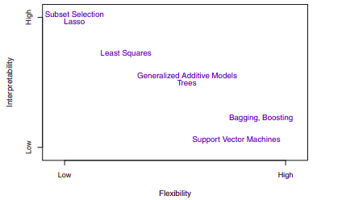
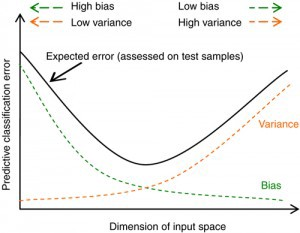
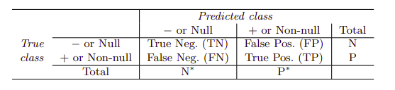

-   [Introduction](#introduction)
    -   [A Brief History of Statistical
        Learning](#a-brief-history-of-statistical-learning)
    -   [Misc Concepts](#misc-concepts)
        -   [Box-plots](#box-plots)
-   [Statistical Learning](#statistical-learning)
    -   [What is Statistical Learning](#what-is-statistical-learning)
        -   [Why Estimate $f$?](#why-estimate-f)
        -   [Prediction](#prediction)
        -   [Inference](#inference)
        -   [How Do We Estimate $f$?](#how-do-we-estimate-f)
        -   [Parametric Methods](#parametric-methods)
        -   [Non-parametric Methods](#non-parametric-methods)
        -   [The Trade-Off Between Prediction Accuracy and Model
            Interpretability](#the-trade-off-between-prediction-accuracy-and-model-interpretability)
        -   [Supervised Versus Unsupervised
            Learning](#supervised-versus-unsupervised-learning)
        -   [Regression Versus Classification
            Problems](#regression-versus-classification-problems)
    -   [Assessing Model Accuracy](#assessing-model-accuracy)
        -   [Measuring the Quality of
            Fit](#measuring-the-quality-of-fit)
        -   [The Bias-Variance Trade-Off](#the-bias-variance-trade-off)
        -   [The Classification Setting](#the-classification-setting)
        -   [The Bayes Classifier](#the-bayes-classifier)
        -   [K-Nearest Neighbors](#k-nearest-neighbors)
-   [Linear Regression](#linear-regression)
    -   [Simple Linear Regression](#simple-linear-regression)
        -   [Estimating the Coefficients](#estimating-the-coefficients)
        -   [Assessing the Accuracy of the Coefficient
            Estimates](#assessing-the-accuracy-of-the-coefficient-estimates)
        -   [Assessing the Accuracy of the
            Model](#assessing-the-accuracy-of-the-model)
        -   [Residual Error](#residual-error)
        -   [$R^2$ Statistic](#r2-statistic)
    -   [Multiple Linear Regression](#multiple-linear-regression)
        -   [Estimating the Regression
            Coefficients](#estimating-the-regression-coefficients)
        -   [Some Important Questions](#some-important-questions)
        -   [Is There a Relationship Between the Response and
            Predictors?](#is-there-a-relationship-between-the-response-and-predictors)
        -   [Deciding on Important
            Variables](#deciding-on-important-variables)
        -   [Model Fit](#model-fit)
        -   [Predictions](#predictions)
    -   [Other Considerations in the Regression
        Model](#other-considerations-in-the-regression-model)
        -   [Qualitative Predictors](#qualitative-predictors)
        -   [Predictors with Only Two
            Levels](#predictors-with-only-two-levels)
        -   [Qualitative Predictors with More than Two
            Levels](#qualitative-predictors-with-more-than-two-levels)
        -   [Extensions of the Linear
            Model](#extensions-of-the-linear-model)
        -   [Removing the Additive
            Assumption](#removing-the-additive-assumption)
        -   [Non-linear Relationships](#non-linear-relationships)
        -   [Potential Problems and
            Troubleshooting](#potential-problems-and-troubleshooting)

Introduction
============

A Brief History of Statistical Learning
---------------------------------------

1.  At the beginning of the nineteenth century, Legendre and Gauss
    published papers on the method of least squares, which implemented
    the earliest form of what is now known as linear regression.

2.  In 1936 Fisher proposed linear discriminant analysis.

3.  In the 1940s, various authors put forth an alternative approach,
    logistic regression.

4.  In the 1950's, Frank Rosenblatt introduced the Perceptron and Neural
    Networks.

5.  In the 1960's, various authors introduced Nearest Neighbor and
    K-means clustering.

6.  In the early 1970s, Nelder and Wedderburn coined the term
    generalized linear models for an entire class of statistical
    learning methods that include both linear and logistic regression as
    special cases.

7.  By the end of the 1970s, many more techniques for learning from data
    were available but all were almost all linear because of
    computational limitations.

8.  By the 1980s, computing technology had finally improved sufficiently
    that non-linear methods were no longer computationally prohibitive.

9.  In the mid 1980s, Breiman, Friedman, Olshen and Stone introduced
    classification and regression trees, including cross-validation for
    model selection.

10. In 1986, Hastie and Tibshirani introduced generalized additive
    models for a class of non-linear extensions to generalized linear
    models.

11. In the 1990's, Vapnik introduced Support Vector Machines.

12. In the 2000's, Brieman introduced Random Forest

13. In the 2000's, Hinton popularized Deep Learning and Artificial
    Neural Networks.

Misc Concepts
-------------

### Box-plots

One should also look at box-plots for each individual features. The box
plot displays the distribution of data based on the five number summary:
minimum, first quartile, median, third quartile, and maximum.

We can look for outliers beyond 3\*IQR (Inter Quartile Range).
Bootstrapping the data set also provides some insight on outliers.

{width="6cm"}

Statistical Learning
====================

What is Statistical Learning
----------------------------

$n$ -- number of observations or training data.

$p$ -- number of features or parameters.

$x_{ij}$ -- the value of the $j$th predictor, or input, for observation
$i$

$X = (x_1, \dots, x_p)$ -- input vector a.k.a features, predictors,
independent variables.

$\epsilon$ -- error term, independent of $X$ and has mean zero.

$Y = f(X) + \epsilon$ -- a model a.k.a. output or dependent variable.

$y_i$ -- the response variable for the $i$th observation

In essence, statistical learning refers to a set of approaches for
estimating $f$.

### Why Estimate $f$?

There are two main reasons for estimating $f$: prediction and inference.

### Prediction {#prediction .unnumbered}

We can predict $Y$ using $\hat Y = \hat f(X)$ where $\hat f$ represents
an estimate of $f$ and $\hat Y$ represents the resulting prediction for
$Y$. The accuracy of $\hat Y$ as a prediction for $Y$ depends on two
quantities, the reducible error and the irreducible error.

*Reducible error* is the result of an inaccurate statistical learning
technique.

*Irreducible error* occurs because $Y$ is a function of $\epsilon$ which
has variability that is dependent of $X$, so cannot be reduced via a
statistical learning technique. Irreducible error may be larger than
zero because of unmeasured variables or unmeasurable variation. The
irreducible error will always provide an upper bound on the accuracy of
our prediction for Y and is almost always unknown in practice.

$$E[(Y - \hat f (x))^2 | X = x] = \underbrace{[f(x) - \hat f(x)]^2}_{\text{Reducible}} + \underbrace{Var(\epsilon)}_{\text{Irreducible}}$$

Note,
$E(Y - \hat Y)^2 = E[(Y - \hat f (x))^2 | X = x] = E[f(X) + \epsilon - \hat f(X)]^2$
represents the average, or expected value, of the squared difference
between the predicted and actual value of $Y$ and $Var(\epsilon)$
represents the variance associated with the error term $\epsilon$. We
square the values in order to ignore the resulting sign when finding
averages.

### Inference {#inference .unnumbered}

Often, we are interested in understanding how $Y$ changes as a function
of $X_1,\dots,X_p$. That is, when we vary the value of a given feature,
what should the result look like. Now $\hat f$ cannot be treated as a
black box, because we need to know its exact form.

Common questions occurring in this setting include:

-   Which predictors are associated with the response?

-   What is the relationship between the response and each predictor?

-   Can the relationship between Y and each predictor be adequately
    summarized using a linear equation, or is the relationship more
    complicated?

Depending on whether our ultimate goal is prediction, inference, or a
combination of the two, different methods for estimating $f$ may be
appropriate. Linear models allow for relatively simple and interpretable
inference, but may not yield as accurate predictions as some other
approaches. In contrast, some highly non-linear approaches can
potentially provide quite accurate predictions for $Y$ at the expense of
a less interpretable model, which makes inference more challenging.

### How Do We Estimate $f$?

Our training data or observations can be represented as
${(x_1, y_1),(x_2, y_2),...,(x_n, y_n)}$ where
$x_i = (x_{i_1}, x_{i_2},...,x_{i_p})^T$ are vectors and $y_i$ are
typically scalars.

Then, we want to find a function $\hat f$ such that
$Y \approx \hat f(X)$ for any observation $(X, Y)$. Broadly speaking,
most statistical learning methods for this task can be characterized as
either *parametric* or *non-parametric*.

### Parametric Methods {#parametric-methods .unnumbered}

This approach reduces the problem of estimating $f$ down to one of
estimating a set of parameters.

1.  First, we make an assumption about the functional form, or shape, of
    $f$.

2.  After a model has been selected, we need a procedure that uses the
    training data to fit or train the model.

For example, if we assume $f$ is linear, then
$f(X) = \beta_0 + \beta_1X_1 + \beta_2X_2 + ... + \beta_p X_p$. To train
the linear model, we need to estimate the parameters
$\beta_0, \beta_1,..., \beta_p$, which is commonly done using (ordinary)
least squares.

In general, fitting a more flexible model requires estimating a greater
number of parameters. These more complex models can lead to a phenomenon
known as **overfitting** the data, which essentially means they follow
the errors, or noise, too closely.

### Non-parametric Methods {#non-parametric-methods .unnumbered}

Non-parametric methods do not make explicit assumptions about the
functional form of $f$ and instead seek an estimate of $f$ that gets as
close to the data points as possible while being reasonably smooth.

A very large number of observations (far more than is typically needed
for a parametric approach) is required in order to obtain an accurate
estimate for $f$. In order to fit a thin-plate spline, the data analyst
must select a level of smoothness.

### The Trade-Off Between Prediction Accuracy and Model Interpretability

{width="11cm"}

If we are mainly interested in inference, then restrictive models are
much more interpretable. In contrast, very flexible approaches, such as
the splines and the boosting methods can lead to such complicated
estimates of $f$ that it is difficult to understand how any individual
predictor is associated with the response. Though there are clear
advantages to using simple and relatively inflexible statistical
learning methods when inference is the goal, the converse is not
typically true. Instead we will often obtain more accurate predictions
using a less flexible method. This phenomenon has to do with the
potential for overfitting in highly flexible methods.

### Supervised Versus Unsupervised Learning

Most statistical learning problems fall into one of two categories:
supervised or unsupervised.

In *supervised learning*, for each observation of the predictor
measurement(s) $x_i$, for $i = 1,...,n$, there is an associated response
measurement $y_i$. We wish to fit a model that relates the response to
the predictors, with the aim of accurately predicting the response for
future observations (prediction) or better understanding the
relationship between the response and the predictors (inference).

In contrast, *unsupervised learning* describes the situation in which
for every observation $i = 1,...,n$, we observe a vector of measurements
$x_i$ but no associated response $y_i$. It is not possible to fit a
linear regression model, since there is no response variable to predict.
One statistical learning tool that we may use in this setting is cluster
analysis which aims to ascertain, on the basis of $x_1,..., x_n$,
whether the observations fall into relatively distinct groups.

In a semi-supervised learning problem, we wish to use a statistical
learning method that can incorporate the $m$ observations for which
response measurements are available as well as the $n - m$ observations
for which they are not.

### Regression Versus Classification Problems

Variables can be characterized as either quantitative (taking on
numerical values) or qualitative/categorical. We tend to refer to
problems with a quantitative response as regression problems, while
those involving a qualitative response are often referred to as
classification problems, but it's not always clear-cut and many problems
can use either responses. Whether the predictors are qualitative or
quantitative is generally considered less important provided that any
qualitative predictors are properly coded before the analysis is
performed.

Assessing Model Accuracy
------------------------

### Measuring the Quality of Fit

In order to evaluate the performance of a statistical learning method on
a given data set, we need to quantify the extent to which the predicted
response value for a given observation is close to the true response
value for that observation.

The most commonly-used measure is the *mean squared error* (MSE), given
by $$MSE = \frac{1}{n} \sum_{i=1}^n (y_i - \hat f(x_i))^2.$$

The MSE computed using the training data that was used to fit the model
can be referred to as the training MSE. We want to choose the method
that gives the lowest test MSE, i.e. we want $\hat f(x_0)$ to be
approximately equal to $y_0$, where $(x_0, y_0)$ is a previously unseen
test observation not used to train the statistical learning method.

As model flexibility increases, training MSE will decrease, but the test
MSE may not. When a given method yields a small training MSE but a large
test MSE, we are said to be overfitting the data. This is a fundamental
property of statistical learning that holds regardless of the particular
data set at hand and regardless of the statistical method being used.
When we overfit the training data, the test MSE will be very large
because the supposed patterns that the method found in the training data
simply don't exist in the test data. One important method for estimating
test MSE using the training data is cross-validation, examined later.

### The Bias-Variance Trade-Off

The expected test MSE, for a given value $x_0$, can always be decomposed
into the sum of three fundamental quantities: the variance of
$\hat f(x_0)$, the squared bias of $\hat f(x_0)$ and the variance of the
error terms. That is,

$$E \Big (y_0 - \hat f(x_0) \Big )^2 = Var( \hat f(x_0)) + [Bias( \hat f(x_0))]^2 + Var(\epsilon).$$

Here, $E \Big (y_0 - \hat f(x_0) \Big )^2$ defines the expected test
MSE, computed by averaging the term over all possible values of $x_0$ in
the test set. In order to minimize the expected test error, we need to
select a statistical learning method that simultaneously achieves low
variance and low bias.

*Variance* refers to the amount by which $\hat f$ would change if we
estimated it using a different training data set. In general, more
flexible statistical methods have higher variance. This is because
changing any one of the data points may cause the estimate $\hat f$ to
change considerably. A model with high variance does not generalize on
the data which it hasn't seen before and is said to be overfitting.

*Bias* refers to the error that is introduced by approximating a
real-life problem, which may be extremely complicated, by a much simpler
model. Generally, more flexible methods result in less bias. A model
with high bias will be making overly strong assumptions about the
training data and is said to be underfitting.

{width="13cm"}

{width="7cm"}

The relationship between bias, variance, and test set MSE is referred to
as the *bias-variance trade-off*.

As a general rule, as we use more flexible methods, the variance will
increase and the bias will decrease. The relative rate of change of
these two quantities determines whether the test MSE increases or
decreases. As we increase the flexibility of a class of methods, the
bias tends to initially decrease faster than the variance increases.
Consequently, the expected test MSE declines. However, at some point
increasing flexibility has little impact on the bias but starts to
significantly increase the variance. When this happens the test MSE
increases.

### The Classification Setting

Many of the previous concepts, including the bias-variance trade-off,
transfer over to the classification setting with only some modifications
due to the fact that $y_i$ is no longer numerical. Suppose that we seek
to estimate $f$ on the basis of training observations
$\{(x_1, y_1),...,(x_n, y_n)\}$, where now $y_1,...,y_n$ are
qualitative.

The most common approach for quantifying the accuracy of our estimate
$\hat f$ is the *training error rate*, the proportion of mistakes that
are made if we apply our estimated $\hat f$ to the training
observations:

$$\frac{1}{n} \sum_{i=1}^n I(y_i  \neq \hat y_i)$$

Here $\hat y_i$ is the predicted class label for the $i$th observation
using $\hat f$, and $I(y_i \neq \hat y_i)$ is an indicator variable that
equals 1 if the $i$th observation was misclassified, i.e.
$y_i \neq \hat y_i$, and equals zero if it was was classified correctly,
i.e. $y_i = \hat y_i$.

The *test error rate* associated with a set of test observations of the
form $(x_0, y_0)$ is given by, $$Ave(I(y_0 \neq \hat y_0)),$$ where
$\hat y_0$ is the predicted class label. A good classifier minimizes the
test error.

### The Bayes Classifier

To minimize the test error rate, on average, we should simply assign a
test observation with predictor vector $x_0$ to the class $j$ for which
the conditional probability $$\Pr(Y = j|X = x_0)$$ is largest. This very
simple classifier is called the *Bayes classifier*. In a two-class
problem the classification will be class one if
$Pr(Y = 1|X = x_0) > 0.5$, and class two otherwise. The line where the
probability is exactly 0.5 is called the *Bayes decision boundary*.

The Bayes classifier produces the lowest possible test error rate,
called *the Bayes error rate*, given by,
$$1 - E \Bigg( \max_j \Pr(Y = j|X) \Bigg ),$$ where the expectation
averages the probability over all possible values of $X$. The Bayes
error rate is analogous to the irreducible error.

In theory we would always like to predict qualitative responses using
the Bayes classifier. But for real data, we do not know the conditional
distribution of $Y$ given $X$, and so computing the Bayes classifier is
impossible. Therefore, the Bayes classifier serves as an unattainable
gold standard against which to compare other methods.

### K-Nearest Neighbors

Given a positive integer $K$ and a test observation $x_0$, the
*K-nearest neighbors* (KNN) classifier first identifies the $K$ points
in the training data that are closest to $x_0$, represented by
$\mathcal N_0$. It then estimates the conditional probability for class
$j$ as the fraction of points in $\mathcal N_0$ whose response values
equal $j$:

$$\Pr(Y = j|X = x_0) = \frac{1}{K} \sum_{i \in \mathcal N_0} I(y_i = j).$$

Finally, KNN applies Bayes rule and classifies the test observation
$x_0$ to the class with the largest probability.

The choice of $K$ has a drastic effect on the KNN classifier obtained.
As $K$ grows, the method becomes less flexible and produces a decision
boundary that is close to linear. This corresponds to a low-variance but
high-bias classifier. In general, as we use more flexible classification
methods, the training error rate will decline but the test error rate
may not. In both the regression and classification settings, choosing
the correct level of flexibility is critical to the success of any
statistical learning method. The bias-variance tradeoff, and the
resulting U-shape in the test error, can make this a difficult task.

Nearest Neighbors can be good when the number of variables, $p$, is
small, i.e. $p \leq 4$ and for a large number of sample points. It is
one of many techniques called smoothers, like kernel and spline
smoothing. Unfortunately this method is very poor when $p$ is large,
since possible nearby neighbors tend to be far away in high dimensions.
This is known as the *curse of dimensionality*. We need to get a
reasonable fraction of the $N$ values of $y_i$ to average in order to
bring the variance of our model down. However, as we increase the
dimensions, the radius we need to search increases and we lose the
efficacy of estimating using local averages.

Linear Regression
=================

*Linear regression* is a very simple approach for supervised learning
and is a useful tool for predicting a quantitative response.

Simple Linear Regression
------------------------

Simple linear regression is a very straightforward approach for
predicting a quantitative response $Y$ on the basis of a single
predictor variable $X$. It assumes that there is approximately a linear
relationship between $X$ and $Y$. We will sometimes describe this by
saying that we are regressing $Y$ on $X$.
$$Y \approx \beta_0 + \beta_1 X$$ $\beta_0$ and $\beta_1$ are two
unknown constants that represent the intercept and slope terms in the
linear model and are known as its coefficients or parameters. We may use
our training data to produce estimates $\hat \beta_0$ and $\hat \beta_1$
for prediction, $$\hat y  \approx \hat \beta_0 + \hat \beta_1 x,$$ where
$\hat y$ indicates a prediction of $Y$ on the basis of $X = x$.

### Estimating the Coefficients

Let $(x_1, y_1), (x_2, y_2),..., (x_n, y_n)$ represent $n$ observation
pairs, each of which consists of a measurement of $X$ and a measurement
of $Y$. We want to find an intercept $\hat \beta_0$ and a slope
$\hat \beta_1$ such that the resulting line is as close as possible to
the $n$ data points. The most common definition of closeness involves
minimizing the least squares criterion.

Let $\hat y_i = \hat \beta_0 + \hat \beta_1 x_i$ be the prediction for
$Y$ based on the $i$th value of $X$. Then $e_i = y_i - \hat y_i$
represents the $i$th residual -- this is the difference between $i$th
observed response and its prediction.

We define the *residual sum of squares (RSS)* as, $$\begin{aligned}
\label{eq:RSS}
\begin{split}
     RSS &= e_1^2 + e_2^2 + \dots + e_n^2\\
     &=  (y_1 - \hat \beta_0 - \hat \beta_1 x_1)^2 + \cdots + 
     (y_n - \hat \beta_0 - \hat \beta_1 x_n)^2
\end{split}\end{aligned}$$

The least squares approach chooses $\hat \beta_0$ and $\hat \beta_1$ to
minimize the RSS.

Let $\bar y \equiv \frac{1}{n} \sum^n_{i=1} y_i$ and
$\bar x \equiv \frac{1}{n} \sum_{i=1}^n x_i$ be the sample means. Then
the the *least squares coefficient estimates* are given by,

$$\begin{aligned}
    \hat \beta_0 &= \frac{\sum_{i=1}^n (x_i - \bar x) (y_i - \bar y)}{\sum_{i=1}^n (x_i - \bar x)^2}, \\ 
    \hat \beta_1 &= \bar y - \hat \beta_1 \bar x.\end{aligned}$$

### Assessing the Accuracy of the Coefficient Estimates

If $f$ is to be approximated by a linear function, then we can write
this relationship as a *population regression line*, $$\begin{aligned}
 Y &= f(X) +  \epsilon \\
 Y  &= \beta_0 +  \beta_1 X + \epsilon\end{aligned}$$ Where $\beta_0$ is
the intercept, i.e. the expected value of $Y$ when $X = 0$, $\beta_1$ is
the slope, i.e. the average increase in $Y$ in a unit of increase of
$X$, and $\epsilon$ is a catch-all error term.

The *least squares line* can always be computed using the coefficient
estimates, however, the population regression line is unobserved.
Fundamentally, the concept of these two lines is a natural extension of
the standard statistical approach of using information from a sample to
estimate characteristics of an unmeasured large population.

The analogy between linear regression and estimation of the mean of a
random variable is an apt one based on the concept of bias. if we could
average a huge number of estimates $\hat \mu$ of the true population
mean $\mu$ obtained from a huge number of sets of observations, then
this average would exactly equal $\mu$. Thus it is an unbiased
estimator, i.e. it does not systematically over- or under-estimate the
true parameter.

To determine the accuracy of a sample mean $\hat \mu$ as an estimate of
$\mu$, we can find the *standard error*, which roughly tells us the
average amount that this estimate differs from the actual value of
$\mu$,
$$\text{Var} (\hat \mu) = \text{SE} (\hat \mu ) ^2 = \frac{\sigma^2}{n},$$
where $\sigma$ is the standard deviation of each of the realizations
$y_i$ of $Y$.

To compute the standard errors associated with $\hat \beta_0$ and
$\hat \beta_1$,

$$\begin{aligned}
    \text{SE} ( \hat \beta_0 )^2 &= \sigma^2 \Bigg (  \frac{\bar x^2}{(x_i - \bar x)^2}  \Bigg )\\ 
    \text{SE} ( \hat \beta_1 )^2 &= \frac{\sigma^2}{\sum_{i=1}^n (x_i - \bar x)^2} \end{aligned}$$

where $\sigma^2 = \text{Var}(\epsilon)$. In general, $\sigma^2$ is not
known, but can be estimated from the data. The estimate of $\sigma$ is
known as the *residual standard error*, and is given by the formula,
$$\label{eq:RSE-1}
    RSE = \sqrt{RSS/(n - 2)}$$

Standard errors can be used to compute *confidence intervals*. For
example, a 95% confidence interval is defined as a range of values such
that with 95% probability, the range will contain the true unknown value
of the parameter.For linear regression the confidence interval of the
coefficients is given by, $$\begin{aligned}
    \hat \beta_1 &\pm 2 \cdot \text{SE}(\hat \beta_1)  \\
    \hat \beta_0 &\pm 2 \cdot \text{SE}(\hat \beta_0).\end{aligned}$$
Standard errors can also be used to perform hypothesis tests on the
coefficients. The null hypotheses -- $H_0$ : There is no relationship
between $X$ and $Y$, i.e. $\beta_1 = 0$. The alternative hypothesis --
$H_a$ : There is some relationship between $X$ and $Y$, i.e.
$\beta_1 \neq 0$.

Notice that setting $\beta_1 = 0$ removes the $X$ term in
$Y = \beta_0 + \beta_1 X + \epsilon$ and $X$ is not associated with $Y$.
So if $\hat \beta_1$ is sufficiently far from zero and
$\text{SE}(\hat \beta_1)$ is small, then our estimates of the parameter
our accurate and give strong evidence that the null hypotheses is true.
if $SE(\hat\beta_1)$ is large, then $SE(\hat\beta_1)$ must be large in
absolute value in order for us to reject the null hypothesis.

In practice, we compute the *t-statistic*, given by,
$$t = \frac{\hat \beta_1 - 0}{\text{SE}(\hat \beta_1)}$$ which measures
the number of standard deviations that $\hat \beta_1$ is away from 0. If
there is no relationship between $X$ and $Y$, the t-statistics will have
a distribution with $n - 2$ degrees of freedom.

The *p-value* corresponds to the probability of observing any number
equal to $|t|$ or larger in absolute value, assuming $\beta_1= 0$. A
small p-value indicates that it is unlikely to observe such a
substantial association between the predictor and the response due to
chance, in the absence of any real association, so we can infer that
there is an association between the predictor and the response. Then, we
can reject the null hypothesis and may declare a relationship between
$X$ and $Y$ if the p-value is small enough.

Simply put, a p-value is the probability that random chance generated
the data, or (plus) it was the result of another event that is of equal
or rarer probability. The traditional threshold for determining
significance of a p-value is $< 0.05$.

### Assessing the Accuracy of the Model

Given the alternative hypothesis holds, we likely want to quantify the
extent to which the model fits the data. A linear regression fit is
typically assessed using two related quantities: the residual standard
error (RSE) and the $R^2$ statistic.

### Residual Error {#residual-error .unnumbered}

The RSE is an estimate of the standard deviation of the irreducible
error term $\epsilon$. Roughly speaking, it is the average amount that
the response will deviate from the true regression line and is
considered a measure of the lack of fit of the model to the data.

Recall, RSS is the residual sum of squares
[\[eq:RSS\]](#eq:RSS){reference-type="eqref" reference="eq:RSS"} and the
RSE was previously used to estimate $\sigma$
[\[eq:RSE-1\]](#eq:RSE-1){reference-type="eqref" reference="eq:RSE-1"}.
Then, the RSE can be written as,
$$RSE = \sqrt{\frac{1}{(n-2)} \text{RSS} } 
    = \sqrt{\frac{1}{(n-2)} \sum_{i=1}^n (y_i - \hat y_i)^2 }.$$

### $R^2$ Statistic {#r2-statistic .unnumbered}

The $R^2$ statistic provides an alternative measure of fit in terms of
the proportion of explained variance, i.e. not residual, and so it
always takes on a value between 0 and 1. Moreover, it is independent of
the scale of $Y$, unlike the RSE. The $R^2$ statistic is a measure of
the linear relationship between $X$ and $Y$.

Let $\text{TSS} = (y_i - \hat y)^2$ be the *total sum of squares* and
RSS be the residual sum of squares
[\[eq:RSS\]](#eq:RSS){reference-type="eqref" reference="eq:RSS"}. Then
$R^2$ is given by,
$$R^2 =  \frac{\text{TSS} - \text{RSS}}{\text{TSS}} = 1 - \frac{RSS}{TSS}$$

TSS can be thought of as the amount of variability inherent in the
response before the regression is performed while RSS measures the
amount of variability that is left unexplained after performing the
regression. TSS - RSS measures the amount of variability in the response
that is explained (or removed) by performing the regression, and $R^2$
measures the proportion of variability in $Y$ that can be explained
using $X$.

An $R^2$ statistic that is close to 1 indicates that a large proportion
of the variability in the response has been explained by the regression,
while the converse holds for a value close to 0. The $R^2$ statistic is
similar to correlation, but holds for a between a larger number of
variables.

Multiple Linear Regression
--------------------------

We can handle multiple predictors by giving each predictor a separate
slope coefficient in a single model. In general, suppose that we have
$p$ distinct predictors. Then the multiple linear regression model takes
the form,
$$Y = \beta_0 + \beta_1 X_1 + \beta_2 X_2 + \dots + \beta_p X_p + \epsilon,$$
where $X_j$ represents the $j$th predictor and $\beta_j$ quantifies the
association between that variable and the response, namely the average
effect on $Y$ of a one unit increase in $X_j$ while holding all other
predictors fixed.

### Estimating the Regression Coefficients

Given estimates $\hat \beta_0, \hat \beta_1,..., \hat \beta_p$, we can
make predictions using the formula,
$$\hat y= \hat \beta_0, \hat \beta_1 x_1,..., \hat \beta_p x_p.$$ Again,
we choose $\beta_0, \beta_1,...,\beta_p$ to minimize the residual sum of
squared, $$\begin{aligned}
 \label{eq:RSS-sum}
    RSS &= \sum_{i=1}^{n} (y_i - \hat y_i)^2 \\
    &=  \sum_{i=1}^{n}(y_i - \hat \beta_0 - \hat \beta_1 x_1,..., \hat \beta_p x_p)^2 \\
    &= \sum_{i=1}^n \Bigg ( y_i - \beta_0 - \sum_{j=1}^p \beta_j x_{ij} \Bigg)^2\end{aligned}$$
The values $\hat \beta_0, \hat \beta_1 x_1,..., \hat \beta_p x_p$ that
minimize the above equation are the multiple least squares regression
coefficient estimates. These values are most easily represented using
matrix algebra and will be revisited later.

### Some Important Questions

1.  Is at least one of the predictors $X_1, X_2,...,X_p$ useful in
    predicting the response?

2.  Do all the predictors help to explain $Y$, or is only a subset of
    the predictors useful?

3.  How well does the model fit the data?

4.  Given a set of predictor values, what response value should we
    predict, and how accurate is our prediction?

### Is There a Relationship Between the Response and Predictors? {#is-there-a-relationship-between-the-response-and-predictors .unnumbered}

In the multiple regression setting with $p$ predictors, we need to ask
whether all of the regression coefficients are zero. The null hypothesis
becomes, $$H_0 : \beta_1 = \beta_2 = \dots = \beta_p = 0.$$

This hypothesis test is performed by computing the *F-statistic*.
$$F = \frac{(\text{TSS} - \text{RSS})/p }{\text{RSS}/ (n-p-1)}$$

When there is no relationship between the response and predictors, one
would expect the F-statistic to take on a value close to 1. On the other
hand, if $H_a$ is true (i.e. at least one $\beta_j$ is non-zero.), then
$E{(\text{TSS} - \text{RSS})/p} > \sigma^2$, so we expect $F$ to be
greater than $1$.

The approach of using an F-statistic to test for any association between
the predictors and the response works when $p$ is relatively small, and
certainly small compared to $n$. However, sometimes we have a very large
number of variables. If $p>n$ then there are more coefficients $\beta_j$
to estimate than observations from which to estimate them. In this case
we cannot even fit the multiple linear regression model using least
squares, so the F-statistic cannot be used. Approaches like *forward
selection* can be used instead.

### Deciding on Important Variables

The first step in a multiple regression analysis is to compute the
F-statistic and to examine the associated p-value. If we conclude on the
basis of the p-value that at least one of the predictors is related to
the response, then it is natural to wonder which are the relevant ones.
The task of determining which predictors are associated with the
response, in order to fit a single model involving only those
predictors, is referred to as *variable selection*, discussed more in
detail in chapter 6.

There are a total of $2^p$ models that contain subsets of $p$ variables.
In general, we cannot consider all $2^p$ models, and instead we need an
automated and efficient approach to choose a smaller set of models to
consider. There are three classical approaches for this task:

1.  *Forward selection* -- We begin with the null model, i.e. a model
    that contains an intercept (i.e $\beta_0$) but no predictors. We
    then fit $p$ simple linear regressions and add to the null model the
    variable that results in the lowest RSS. We then add to that model
    the variable that results in the lowest RSS for the new two-variable
    model. This approach is continued until some stopping rule is
    satisfied.

2.  *Backward selection* -- We start with all variables in the model,
    and remove the variable with the largest p-value---that is, the
    variable that is the least statistically significant. The new
    ($p - 1$)-variable model is fit, and the variable with the largest
    p-value is removed. This procedure continues until a stopping rule
    is reached, i.e. when all remaining variables have a p-value below
    some threshold.

3.  *Mixed selection* -- This is a combination of forward and backward
    selection. We start with no variables in the model, and as with
    forward selection, we add the variable that provides the best fit.
    Since the p-values for variables can become larger as new predictors
    are added to the model, if at any point the p-value for one of the
    variables in the model rises above a certain threshold, then we
    remove that variable from the model. We continue to perform these
    forward and backward steps until all variables in the model have a
    sufficiently low p-value.

Backward selection cannot be used if $p>n$, while forward selection can
always be used. Forward selection is a greedy approach, and might
include variables early that later become redundant. Mixed selection can
remedy this.

### Model Fit {#model-fit .unnumbered}

In multiple linear regression, $R^2 =  Cor(Y, \hat Y)^2$, the square of
the correlation between the response and the fitted linear model. $R^2$
will always increase when more variables are added to the model, even if
they are only weakly associated with the response. This is due to the
fact that adding another variable to the least squares equations must
allow us to fit the training data more accurately, so the $R^2$
statistic, which is also computed on the training data, must increase.

### Predictions {#predictions .unnumbered}

After fitting a regression model, there are three sorts of uncertainty
associated with a prediction.

1.  There will be some inaccuracy in the coefficient estimates related
    to the reducible error of using the least squares plane. We can
    compute a *confidence interval* in order to determine how close
    $\hat Y$ will be to $f(X)$.

2.  There is potentially an additional source of reducible error, called
    *model bias*, from using a linear model to represent complex
    non-linear data.

3.  There will be some amount of irreducible or random error in the
    model. *Prediction intervals* are used to incorporate both the error
    in the estimate for $f(X)$ (the reducible error) as is done in a
    confidence interval, as well as the uncertainty as to how much an
    individual point will differ from the population regression plane
    (the irreducible error).

Other Considerations in the Regression Model
--------------------------------------------

### Qualitative Predictors

### Predictors with Only Two Levels {#predictors-with-only-two-levels .unnumbered}

If a qualitative predictor (also known as a factor) only has two levels,
or possible values, then incorporating it into a regression model is
very simple. We simply create an indicator or dummy variable that takes
on two possible numerical values, i.e. (0 or 1) and use this variable as
a predictor in the regression equation.

### Qualitative Predictors with More than Two Levels {#qualitative-predictors-with-more-than-two-levels .unnumbered}

In this situation, we can create additional dummy variables. There will
always be one fewer dummy variable than the number of levels. The level
with no dummy variable is known as the *baseline*.

### Extensions of the Linear Model

Two of the most impactful assumptions in the standard linear regression
model state that the relationship between the predictors and response
are additive and linear. The *additive* assumption means that the effect
of changes in a predictor $X_j$ on the response Y is independent of the
values of the other predictors. The *linear* assumption states that the
change in the response $Y$ due to a one-unit change in $X_j$ is
constant, regardless of the value of $X_j$.

### Removing the Additive Assumption {#removing-the-additive-assumption .unnumbered}

One way of extending this model to allow for interaction effects is to
include a third predictor, called an *interaction term*
$\Tilde \beta_1$, which is constructed by computing the product of X1
and X2. $$\begin{aligned}
    Y &= \beta_0 + \beta_1 X_ 1 + \beta_2 X_2 + \beta_3 X_1 X_2 + \epsilon \\
    &= \beta_0 + (\beta_1 + \beta_3 X_2)X_1 + \beta_2 X_2 + \epsilon \\
    &= \beta_0 + \Tilde \beta_1 X_1 + \beta_2 X_2 + \epsilon\end{aligned}$$
Then, adjusting $X_2$ will change the impact of $X_1$ on $Y$.

The *hierarchical principle* states that if we include an interaction in
a model, we should also include the main effects, even if the p-values
associated with their coefficients are not significant.

### Non-linear Relationships {#non-linear-relationships .unnumbered}

In some cases, the true relationship between the response and the
predictors may be nonlinear. A simple way to directly extend the linear
model to accommodate non-linear relationships is to use *polynomial
regression*, in which we include polynomial functions of the predictors
in the regression model.

### Potential Problems and Troubleshooting

1.  Non-linearity of the response-predictor relationships.

    Residual plots are useful graphical tool for identifying
    non-linearity. If there is a strong pattern in the plot of the
    residuals, $e_i = y_i - \hat y_i$, versus the predictor $x_i$, there
    may be a problem with some aspect of the linear model.

2.  Correlation of error terms.

    In general, the assumption of uncorrelated errors is extremely
    important for linear regression as well as for other statistical
    methods.

    If there is correlation among the error terms, then the estimated
    standard errors will tend to underestimate the true standard errors,
    confidence and prediction intervals will be narrower than they
    should be, and p-values associated with the model will be lower than
    they should be. Such correlations frequently occur in the context of
    time series data.

    We can plot the residuals from our model as a function of time and
    if the errors are uncorrelated, then there should be no discernible
    pattern. Otherwise we may find that *tracking* exists, i.e. adjacent
    residuals often have similar values.

3.  Non-constant variance of error terms.

    An important assumption is that error terms have constant variance,
    i.e. $\text{Var}(\epsilon_i) = \sigma^2$. One can identify
    non-constant variance, a.k.a. *heteroscedasticity*, from the
    presence of a funnel shape in the residual plot.

    A simple remedy may be to fit our model by *weighted least squares*,
    with weights proportional to the inverse weighted variances.

4.  Outliers.

    A point for which $y_i$ is far from the value predicted by the model
    can occur for many reasons, possibly as a result of incorrect
    recording of an observation. It is typical for an outlier that does
    not have an unusual predictor value to have little effect on the
    least squares fit, but may have an effect on the RSE, used to
    compute all confidence intervals or p-values, as well as $R^2$.

    Residual plots can be used to identify outliers, but in practice, it
    can be difficult to decide how large a residual needs to be before
    we consider the point to be an outlier. Instead, we can plot the
    *studentized residuals*, computed by dividing each residual $e_i$ by
    its estimated standard error. Observations whose studentized
    residuals are greater than 3 in absolute value are possible outliers
    and can be removed or examined to determine a deficiency with the
    model, such as a missing predictor.

5.  High-leverage points.

    In contrast to outliers, observations with *high leverage* have an
    unusual value for $x_i$. Removing a high leverage observation has a
    much more substantial impact on the least squares line than removing
    the outlier.

    To quantify an observation's leverage, we compute the *leverage
    statistic*. The leverage statistic $h_i$ is always between $1/n$ and
    $1$, and the average leverage for all the observations is always
    equal to $(p + 1)/n$. For a simple linear regression,
    $$\label{eq:leverage}
            h_i =  \frac{1}{n} \frac{(x_i - \bar x)^2}{\sum_{i' = 1}^n (x_i - \bar x)^2}$$

6.  Collinearity.

    *Collinearity* refers to the situation in which two or more
    predictor variables are closely related to one another. In the
    regression context, it can be difficult to separate out the
    individual effects of collinear variables on the response and
    reduces the accuracy of the estimates of the regression
    coefficients. This causes the standard error for $\hat \beta_j$ to
    grow and the t-statistic to decline which in turn means the power of
    the hypothesis test - the probability of correctly detecting a
    non-zero coefficient - is reduced by collinearity.

    A simple way to detect collinearity is to look at the correlation
    matrix of the predictors, though this may not always work. In
    particular, it is possible for collinearity to exist between three
    or more variables in what's called *multicollinearity*. In this
    situation it's better to compute the *variance inflation factor*
    (VIF), the ratio of the variance of $\hat \beta_j$ when fitting the
    full model divided by the variance of $\hat \beta_j$ if fit on its
    own. A VIF value of 1 indicates the complete absence of
    collinearity, a VIF value that exceeds 5 or 10 indicates a
    problematic amount of collinearity.

    $$VIF(\hat \beta_j ) = \frac{1}{1-R^2_{X_j|X_{-j}}}$$ where
    $R^2_{X_j|X_{-j}}$ is the $R^2$ from a regression of $X_j$ onto all
    of the other predictors.

    To mitigate collinerarity, we may drop one of the problematic
    variables from the regression, which will also reduce redundancy.
    Alternatively, we may combine the collinear variables together into
    a single predictor.

    Comparison of Linear Regression with K-Nearest Neighbors
    --------------------------------------------------------

    Linear regression is an example of a parametric approach and has
    many advantages: they are often easy to fit, the coefficients have
    simple interpretations, and tests of statistical significance can be
    easily performed. But parametric methods do have a disadvantage: by
    construction, they make strong assumptions about the form of $f(X)$.

    In contrast, non-parametric methods do not explicitly assume a
    parametric form for $f(X)$, and thereby provide an alternative and
    more flexible approach for performing regression.

    One of the simplest and best-known non-parametric methods is
    *K-nearest neighbors regression* (KNN regression), which is closely
    related to the KNN classifier.

    Given a value for $K$ and a prediction point $x_0$, KNN regression
    first identifies the $K$ training observations that are closest to
    $x_0$, represented by $\mathcal N_0$. It then estimates $f(x_0)$
    using the average of all the training responses in $\mathcal N_0$.
    In general, the optimal value for K will depend on the bias-variance
    tradeoff.

    $$\hat f (x_0) = \frac{1}{K} \sum_{x_i \in \mathcal N_0} y_i.$$

    The parametric approach will outperform the nonparametric approach
    if the parametric form that has been selected is close to the true
    form of $f$. Even when the true relationship is highly non-linear,
    KNN may still provide inferior results to linear regression. A
    decrease in performance as the dimension increases is a common
    problem for KNN, and results from the fact that in higher dimensions
    there is effectively a reduction in sample size. As a general rule,
    parametric methods will tend to outperform non-parametric approaches
    when there is a small number of observations per predictor.

    Classification
    ==============

    An Overview of Classification
    -----------------------------

    The linear regression model assumes that the response variable $Y$
    is quantitative. But in many situations, the response variable is
    instead qualitative. Though just as in the regression setting, in
    the classification setting we have a set of training observations
    $(x_1, y_1),\dots,(x_n, y_n)$.

    Why Not Linear Regression
    -------------------------

    Linear regression is not appropriate in the case of a qualitative
    response since codings of qualtative states into numeric values may
    produce unwarranted implicit relations with each of the codings
    depending on their orderings. This can produce fundamentally
    different linear models that would ultimately lead to different sets
    of predictions on test observations.

    For a binary (two level) qualitative response we could potentially
    use the dummy variable approach to code the response and could then
    fit a linear regression to it. However, if we use linear regression,
    some of our estimates might beoutside the \[0, 1\] interval, making
    them hard to interpret as probabilities. Nevertheless, the
    predictions provide an ordering and can be interpreted as crude
    probability estimates. It turns out that the classifications that we
    get if we use linear regression to predict a binary response will be
    the same as for the linear discriminant analysis (LDA) procedure
    discussed later.

    Logistic Regression
    -------------------

    ### The Logistic Model

    Any time a straight line is fit to a binary response that is coded
    as $0$ or $1$, in principle we can always predict $p(X) < 0$ for
    some values of $X$ and $p(X) > 1$ for others (unless the range of
    $X$ is limited). Instead, we must model $p(X)$ using a function that
    gives outputs between $0$ and $1$ for all values of $X$. Many
    functions meet this description. In logistic regression, we use the
    logistic function,
    $$p(X) = \frac{e^{\beta_0 + \beta_1 X}}{1 + e^{\beta_0 + \beta_1 X}}$$
    To fit the model, we use a method called *maximum likelihood*,
    discussed in the next section. The logistic function will always
    produce an S-shaped curve, and so regardless of the value of $X$, we
    will obtain a sensible prediction. After a bit of manipulation, we
    find that, $$\frac{p(X)}{1-p(X)} = e^{\beta_0+\beta_1 X}$$ The
    quantity on the left-hand side is called the *odds* and can take on
    any value between 0 and $\infty$, indicating very low and high
    probabilities. Odds are traditionally used instead of probabilities
    in horse-racing, since they relate more naturally to the correct
    betting strategy.

    By taking the logarithm of both sides,
    $$\log \Bigg ( \frac{p(X)}{1-p(X)} \Bigg ) = \beta_0+\beta_1 X$$

    The left-hand side is called the *log-odds* or *logit*. We see that
    the logistic regression model has a logit that is linear in $X$.

    Recall that in a linear regression model, $\beta_1$ gives the
    average change in $Y$ associated with a one-unit increase in $X$. In
    contrast, in a logistic regression model, increasing $X$ by one unit
    changes the log odds by $\beta_1$, or equivalently it multiplies the
    odds by $e^{\beta_1}$. The amount that $p(X)$ changes due to a
    one-unit change in $X$ will depend on the current value of $X$,
    though if $\beta_1$ is positive then increasing $X$ will be
    associated with increasing $p(X)$, and if $\beta_1$ is negative then
    increasing $X$ will be associated with decreasing $p(X)$.

    ### Estimating the Regression Coefficients

    The coefficients $\beta_0$ and $\beta_1$ are unknown, and must be
    estimated based on the available training data. *Maximum likelihood*
    is used to fit a logistic regression model instead of least squares.
    The estimates $\hat \beta_0$ and $\hat\beta_1$ are chosen to
    maximize what's called the *likelihood function*:
    $$l(\beta_0,\beta_1) = \prod_{i:y_i = 1} p(x_i) \prod_{i':y_{i' = 1}} (1-p(x_{i'}))$$
    Maximum likelihood is a very general approach that is used to fit
    many non-linear models. In the linear regression setting, the least
    squares approach is in fact a special case of maximum likelihood.

    Many aspects of the logistic regression are similar to the linear
    regression output. For example, we can measure the accuracy of the
    coefficient estimates by computing their standard errors. The
    *$z$-statistic* plays the same role as the $t$-statistic in the
    linear regression output. the $z$-statistic associated with
    $\beta_1$ is equal to $\hat \beta_1/SE(\hat\beta_1)$, and so a large
    (absolute) value of the $z$-statistic indicates evidence against the
    null hypothesis $H_0 : \beta_1 = 0$. This null hypothesis implies
    that $p(X) = \frac{e^{\beta_0}}{1+e^{\beta_0}}$.

    ### Making Predictions

    Once the coefficients have been estimated, it is a simple matter to
    compute the probability. We can then use qualitative predictors with
    the logistic regression model to fit the model by using the dummy
    variable approach mentioned previously, i.e. the variable takes on a
    value of 1 or 0. If the coefficient associated with the dummy
    variable is positive and the associated p-value is statistically
    significant, this will validate that there is a higher probability
    associated with the encoded qualitative state.

    ### Multiple Logistic Regression

    By analogy with the extension from simple to multiple linear
    regression, we can generalize the logistic model as follows,
    $$\log \Bigg ( \frac{p(X)}{1-p(X)} \Bigg ) = \beta_0+\beta_1 X_1 + \dots + \beta_pX_p,$$
    where $X = (X_1,...,X_p)$ are $p$ predictors. This can be rewritten
    as,
    $$p(X) = \frac{e^{\beta_0+\beta_1 X_1 + \dots + \beta_pX_p}}{1+e^{\beta_0+\beta_1 X_1 + \dots + \beta_pX_p}}$$
    Just as before, we use the maximum likelihood method to estimate
    $\beta_0, \beta_1,\dots,\beta_p$.

    ### Logistic Regression for $>2$ Response Classes

    Suppose we want to classify a response variable that has more than
    two classes. The two-class logistic regression models discussed in
    the previous sections have multiple-class extensions, but in
    practice they tend not to be used all that often. Instead, a more
    popular multiple-class classification method known as, *discriminant
    analysis*, is used.

    Linear Discriminant Analysis
    ----------------------------

    Logistic regression involves directly modeling $Pr(Y = k|X = x)$
    using the logistic function to model the conditional distribution of
    the response $Y$, given the predictor(s) $X$. In an alternative and
    less direct approach to estimating these probabilities, we model the
    distribution of the predictors $X$ separately in each of the
    response classes (i.e. given $Y$), and then use Bayes' theorem
    [\[eq:bayes\]](#eq:bayes){reference-type="eqref"
    reference="eq:bayes"} to flip these around into estimates for
    $Pr(Y = k|X = x)$. When these distributions are assumed to be normal
    the model is very similar in form to logistic regression.

    Linear discriminant analysis is a useful alternative to logistic
    regression because:

    -   When the classes are well-separated, the parameter estimates for
        the logistic regression model are surprisingly unstable. Linear
        discriminant analysis does not suffer from this problem.

    -   If $n$ is small and the distribution of the predictors $X$ is
        approximately normal in each of the classes, the linear
        discriminant model is again more stable than the logistic
        regression model.

    -   As mentioned, linear discriminant analysis is popular when we
        have more than two response classes.

    ### Using Bayes' Theorem for Classification

    Suppose the qualitative response variable $Y$ can take on $K>2$
    possible distinct and unordered values. Let $\pi_k$ represent the
    overall or *prior* probability that a randomly chosen observation
    comes from the $k$th class or category of the response variable $Y$.

    If $X$ is a discrete random variable, Let
    $f_k(X) = \Pr(X = x|Y = k)$ denote the *density function* of $X$ for
    an observation that comes from the $k$th class. The densiity
    function is relatively large if there is a high probability that an
    observation in the kth class has $X \approx x$ and small otherwise.
    Then *Bayes' theorem* states that,

    $$\label{eq:bayes}
        \Pr(Y = k| X = x) = \frac{\pi_k f_k (x) }{ \sum_{l=1}^{K} \pi_l f_l(x)}.$$

    Recall, $p_k(X) = \Pr(Y = k|X)$. We refer to $p_k(x)$ as the
    *posterior* probability that an observation belongs to the kth
    class, given the predictor value for that observation, i.e. $X = x$.
    This suggests that instead of directly computing $p_k(X)$ as was
    done in previous methods, we can plug in estimates of $\pi_k$ and
    $f_k(X)$ into the above formula. Estimating the pripor probabilities
    $\pi_k$ is easy if we have a random sample of $Y$s from the
    population: we simply compute the fraction of the training
    observations that belong to the $k$th class. However, estimating
    $f_k(X)$ tends to be more challenging, unless we assume some simple
    forms for these densities.

    Recall the Bayes classifier, which classifies an observation to the
    class for which $p_k(X)$ is largest, has the lowest possible error
    rate out of all classifiers. Therefore, if we can find a way to
    estimate $f_k(X)$, then we can develop a classifier that
    approximates the Bayes classifier.

    ### Linear Discriminant Analysis for $p=1$

    Assume that we only have one predictor, i.e. $p=1$. To obtain an
    estimate for $f_k(x)$ to plug into the Linear Discriminant Analysis
    formula we will first make some assumptions about its form.

    Suppose we assume that $f_k(x)$ is *normal* or *Gaussian*. In the
    one-dimensional setting, the normal density takes the form,
    $$\label{eq:gaussian}
        f_k(x) = \frac{1}{\sqrt{2\pi} \sigma_k} \exp \Bigg ( -\frac{1}{2\sigma^2_k} (x-\mu_k)^2 \Bigg)$$

    where $\mu_k$ and $\sigma^2_k$ are the mean and variance parameters
    for the $k$th class. We may assume there is a shared variance term
    across all $K$ classes, i.e. $\sigma^2_1 = \dots = \sigma^2_K$,
    which for simplicity we can denote by $\sigma^2$.

    We can then plug this into Bayes' theorem
    [\[eq:bayes\]](#eq:bayes){reference-type="eqref"
    reference="eq:bayes"}, $$p_k(x) = \frac{
            \pi_k \frac{1}{\sqrt(2\pi) \sigma_k} \exp \Big ( -\frac{1}{2\sigma^2_k} (x-\mu_k)^2 \Big)  
        }{
             \sum_{l=1}^{K} \pi_l \frac{1}{\sqrt(2\pi) \sigma_k} \exp \Big ( -\frac{1}{2\sigma^2_k} (x-\mu_k)^2 \Big) 
        }.$$

    Taking the log and rearranging the terms shows us that assigning an
    observation in a Bayes' classifier is equivalent to assigning the
    observation to the class for which the following equation is the
    largest:

    $$\label{eq:lda-delta}
        \delta_k(x) = x \cdot \frac{\mu_k}{\sigma^2} -\frac{\mu_k^2}{2\sigma^2} + \log(\pi_k)$$

    In practice, even if we are quite certain of our assumption that $X$
    is drawn from a Gaussian distribution within each class, we still
    have to estimate the parameters $\mu_1,...,\mu_K$,
    $\pi_1,..., \pi_K$, and $\sigma^2$. The *linear discriminant
    analysis* (LDA) method approximates the Bayes classifier by plugging
    estimates for $\pi_k, \mu_k$, and $\sigma^2$ into the above
    [\[eq:lda-delta\]](#eq:lda-delta){reference-type="eqref"
    reference="eq:lda-delta"}. In particular, the following estimates
    are used: $$\begin{aligned}
    \begin{split}
        \hat \mu &=  \frac{1}{n^k} \sum_{i:y_i = k} x_i \\
        \hat \sigma^2 &= \frac{1}{n-K} \sum_{k=1}^K \sum_{i:y_i = k} (x_i - \hat \mu_k)^2 
    \end{split}\end{aligned}$$ where $n$ is the total number of training
    observations and $n_k$ is the number of training observations in the
    $k$th class. The estimate for $\mu_k$ is simply the average of all
    the training observations from the $k$th class, while $\hat\sigma^2$
    can be seen as a weighted average of the sample variances for each
    of the $K$ classes.

    Sometimes we have knowledge of the class membership probabilities
    $\pi_1,...,\pi_K$, otherwise LDA estimates $\pi_k$ using the
    proportion of the training observations that belong to the $k$th
    class, i.e, $$\hat \pi_k = \frac{n_k}{n}.$$

    When plugging the above estimates into $\delta_k$
    [\[eq:lda-delta\]](#eq:lda-delta){reference-type="eqref"
    reference="eq:lda-delta"}, they become the *discriminant functions*,
    $\hat \delta_k(x)$. The word linear in the classifier's name stems
    from the fact that the discriminant functions $\hat \delta_k$ are
    linear functions of $x$. Again, we assign an observation $X = x$ to
    the class for which $\hat \delta_k$ is largest:
    $$\hat \delta_k(x) = x \cdot \frac{\hat \mu_k}{\hat \sigma^2} -\frac{\hat \mu_k^2}{2 \hat \sigma^2} + \log(\hat \pi_k).$$

    To reiterate, the LDA classifier results from assuming that the
    observations within each class come from a normal distribution with
    a class-specific mean vector and a common variance $\sigma^2$, then
    plugging estimates for these parameters into the Bayes classifier.

    ### Linear Discriminant Analysis for $p>1$

    To extend the LDA classifier to the case of multiple predictors we
    will assume that $X = (X_1, X_2,...,X_p)$ is drawn from a
    *multivariate Gaussian* (or *multivariate normal*) distribution,
    with a class-specific mean vector and a common covariance matrix.

    The multivariate Gaussian distribution assumes that each individual
    predictor follows a one-dimensional normal distribution with some
    correlation between each pair of predictors. To indicate that a
    p-dimensional random variable $X$ has a multivariate Gaussian
    distribution, we write $X \sim N(\mu, \Sigma)$. Here $E(X) = \mu$ is
    the mean of $X$ (a vector with $p$ components), and
    $Cov(X) = \Sigma$ is the $p \times p$ covariance matrix of $X$.

    The Gaussian density is defined as,
    $$f(x) = \frac{1}{(2\pi)^{p/2} |\Sigma|^{1/2}} \exp \Bigg( -\frac{1}{2} (x-\mu)^T \Sigma^{-1} (x-\mu) \Bigg)$$

    Then, in the case of $p > 1$ predictors, the LDA classifier assumes
    observations in the $k$th class are drawn from a multivariate
    Gaussian distribution $N(\mu_k, \Sigma)$, where $\mu_k$ is a
    class-specific mean vector, and $\Sigma$ is a covariance matrix that
    is common to all $K$ classes.

    Using this density function we see the Bayes classifier now assigns
    an observation $X = x$ to the class for which $\delta_k(x)$ is the
    largest. This is essentially the vector/matrix version of the
    discriminant functions,
    $$\delta_k(x) = x^T \Sigma^{-1}\mu_k - \frac{1}{2} \mu_k^T \Sigma^{-1}\mu_k + \log \pi_k.$$

    The formulas for estimating the unknown parameters
    $\mu_1,\dots,\mu_K$, $\pi_1,...,\pi_K$, and $\Sigma$ are similar to
    those used in the one-dimensional case. To assign a new observation
    X = x, LDA plugs these estimates into the multi-dimensional
    discriminant functions and classifies to the class for which
    $\hat \delta_k(x)$ is largest. Note, the LDA decision rule still
    only depends on $x$ only through a linear combination of its
    elements.

    Class-specific performance is also important in medicine and
    biology, where the terms *sensitivity*, corresponding to true
    positive classifications, and *specificity*, corresponding to true
    negative classifications, characterize the performance of a model or
    screening test.

    The Bayes classifier works by assigning an observation to the class
    for which the posterior probability $p_k(X)$ is greatest. Thus, the
    Bayes classifier, and by extension LDA, uses a threshold of 50% for
    the posterior probability in order to assign an observation to a
    class. However, if we are more concerned about incorrectly
    predicting the class status, then we can consider lowering this
    threshold. This may increase the overall error but may make for more
    accurate identification of a certain class.

    {width="10cm"}

    Using a threshold of 0.5 minimizes the overall error rate, shown as
    a black solid line. This is to be expected, since the Bayes
    classifier uses a threshold of 0.5 and is known to have the lowest
    overall error rate. As the threshold is reduced, the error rate
    among a specific classification decreases steadily (orange dotted
    line), but the error rate among the observations who do not belong
    to the class increases (blue dotted line).

    Varying the classifier threshold changes its true positive and false
    positive rate. These are also called the sensitivity and one minus
    the specificity of our classifier. Below are tables of classifier
    names and measures.

    {width="10cm"}

    {width="10cm"}

    The denominators for the false positive and true positive rates are
    the actual population counts in each class. In contrast, the
    denominators for the positive predictive value and the negative
    predictive value are the total predicted counts for each class.

    {width="8cm"}

    The *ROC curve* (receiver operating characteristics) above is a
    popular graphic for simultaneously displaying the two types of
    errors for all possible thresholds. The overall performance of a
    classifier, summarized over all possible thresholds, is given by the
    *area under the curve* (AUC). An ideal ROC curve will hug the top
    left corner, so the larger the AUC the better the classifier.

    {width="8cm"}

    A *confusion matrix* is a way of visualizing predictions made by a
    classifier and is just a table showing the distribution of
    predictions for a specific class. The x-axis indicates the true
    class of each observation while the y-axis corresponds to the class
    predicted by the model.

    ### Quadratic Discriminant Analysis

    Similarly to LDA, the *quadratic discriminant analysis* (QDA)
    classifier results from assuming that the observations from each
    class are drawn from a Gaussian distribution, and from plugging
    estimates for the parameters into Bayes' theorem in order to perform
    prediction. However, unlike LDA, QDA assumes that each class has its
    own covariance matrix, i.e. $X \sim N(\mu_k, \Sigma_k)$ where
    $\Sigma_k$ is a covariance matrix for the $k$th class.

    Now, the Bayes classifier assigns an observation $X = x$ to the
    class for which $\delta_k$ is largest. $$\begin{aligned}
    \begin{split}
        \delta_k &= - \frac{1}{2}(x-\mu_k)^T \Sigma_k^{-1} (x-\mu_k) - \frac{1}{2}\log|\Sigma_k | + \log \pi_k \\
        &= - \frac{1}{2} x^T \Sigma^{-1}_k x + x^T \Sigma^{-1}_k \mu_k - \frac{1}{2} \mu_k^T \Sigma^{-1}_k  \mu_k - \frac{1}{2} \log |\Sigma_k| + \log \pi_k
    \end{split}\end{aligned}$$

    The QDA classifier involves plugging estimates for
    $\Sigma_k, \mu_k$, and $\pi_k$ into the above equation and then
    assigning an observation $X = x$ to the class for which this
    quantity is largest. Though unlike in the LDA, the quantity $x$
    appears as a quadratic function.

    The reason for using QDA over LDA involves the bias-variance
    tradeoff. When there are $p$ predictors, QDA must estimate $K$
    covariance matrices which requires estimating $K \frac{p(p+1)}{2}$
    quadratic parameters. Alternatively, LDA only estimates $Kp$ linear
    parameters.

    This means that LDA is a much less flexible classifier than QDA, and
    so has substantially lower variance, i.e. it's less prone to
    overfitting. This can potentially lead to improved prediction
    performance, but there is a trade-off: if LDA's assumption that the
    $K$ classes share a common covariance matrix is badly off, then LDA
    can suffer from high bias. Roughly speaking, LDA tends to be a
    better bet than QDA if there are relatively few training
    observations and so reducing variance is crucial. In contrast, QDA
    is recommended if the training set is very large, so that the
    variance of the classifier is not a major concern, or if the
    assumption of a common covariance matrix for the $K$ classes is
    clearly untenable.

    A Comparison of Classification Methods
    --------------------------------------

    So far we have covered 4 classification methods: K-nearest neighbors
    (KNN) logistic regression, linear discriminant analysis (LDA), and
    quadratic discriminant analysis QDA. To describe a simple playbook:
    when the true decision boundaries are linear, then the LDA and
    logistic regression approaches will tend to perform well. When the
    boundaries are moderately non-linear, QDA may give better results.
    Finally, for much more complicated decision boundaries, a
    non-parametric approach such as KNN can be superior. But the level
    of smoothness for a non-parametric approach must be chosen
    carefully.

    The logistic regression and LDA methods are closely connected in
    their linearity but differ in fitting procedures and their
    assumptions about the distributions in the data. To understand how,
    consider the two-class setting with $p = 1$ predictor, and let
    $p_1(x)$ and $p_2(x)=1-p1(x)$ be the probabilities that the
    observation $X = x$ belongs to class 1 and class 2 respectively. In
    the LDA framework, the log odds is given by,
    $$\log \Bigg( \frac{p_1(x)}{1 -p_1(x)}\Bigg) = \log \Bigg( \frac{p_1(x)}{p_2(x)}\Bigg) = c_0 + c_1 x,$$
    where $c_0$ and $c_1$ are functions of $\mu_1, \mu_2$, and
    $\sigma2$. In logistic regression we have,
    $$\log \Bigg( \frac{p_1(x)}{1 -p_1(x)}\Bigg) = \beta_0 + \beta_1 x.$$
    Both of these equations are linear functions of x so both logistic
    regression and LDA produce linear decision boundaries. The only
    difference is the fact that $\beta_0$ and $\beta_1$ are estimated
    using maximum likelihood, whereas $c_0$ and $c_1$ are computed using
    the estimated mean and variance from a normal distribution. This
    connection also holds for multidimensional data with $p > 1$.

    Though logistic regression and LDA differ only in their fitting
    procedures, one may outperform the other depending on whether the
    LDA distribution assumptions are met, i.e. that observations are
    drawn from a Gaussian distribution with a common covariance matrix.

    Recall that KNN is non-parametric approach: no assumptions are made
    about the shape of the decision boundary. Therefore, we can expect
    this approach to dominate LDA and logistic regression when the
    decision boundary is highly non-linear. On the other hand, KNN does
    not tell us which predictors are important; we don't get a table of
    coefficients.

    Finally, QDA serves as a compromise between the non-parametric KNN
    method and the linear LDA and logistic regression approaches. QDA
    can accurately model a wider range of problems than the linear
    methods, and though it's not as flexible as KNN, it can perform
    better in the presence of a limited number of training observations
    because it does make some assumptions about the form of the decision
    boundary.

    Resampling Methods
    ==================

    Resampling methods involve repeatedly drawing samples from a
    training set and refitting a model of interest on each sample in
    order to obtain additional information about the fitted model.
    Resampling approaches can be computationally expensive, because they
    involve fitting the same statistical method multiple times using
    different subsets of the training data. However, due to recent
    advances in computing power, the computational requirements of
    resampling methods generally are not prohibitive. Two of the most
    commonly used resampling methods are *cross-validation* and the
    *bootstrap*.

    Cross-validation can be used to estimate the test error associated
    with a given statistical learning method, or to select the
    appropriate level of flexibility. The process of evaluating a
    model's performance is known as *model assessment*, whereas the
    process of selecting the proper level of flexibility for a model is
    known as *model selection*. The bootstrap is most commonly used to
    provide a measure of accuracy of a parameter estimate or of a given
    statistical learning method.

    Cross-Validation
    ----------------

    In the absence of a very large designated test set that can be used
    to directly estimate the test error rate some methods make a
    mathematical adjustment to the training error rate in order to
    estimate the test error rate, examined later. Alternatively, we now
    consider a class of methods that estimate the test error rate by
    holding out a subset of the training observations from the fitting
    process, and then applying the statistical learning method to those
    held out observations.

    ### The Validation Set Approach

    The *validation set approach* is a very simple strategy that
    involves randomly dividing the available set of observations into
    two parts, a *training set* and a *validation set* or hold-out set.
    The model is fit on the training set, and the fitted model is used
    to predict the responses for the observations in the validation set
    which provides an estimate of the test error rate.

    The validation set approach has two potential drawbacks which will
    be addressed in cross-validation:

    1.  The validation estimate of the test error rate can be highly
        variable, depending on precisely which observations are included
        in the training set and which observations are included in the
        validation set.

    2.  In the validation approach, only a subset of the observations
        that are included in the training set are used to fit the model.
        This suggests that the validation set error rate may tend to
        overestimate the test error rate.

    ### Leave-One-Out Cross-Validation

    *Leave-one-out cross-validation* (LOOCV) also involves splitting the
    set of observations into two parts but instead of creating two
    subsets of comparable size, a single observation $(x_1, y_1)$ is
    used for the validation set, and the remaining observations
    $\{(x_2, y_2),...,(x_n, y_n)\}$ make up the training set.

    Although $MSE_1 = (y_1 - \hat y_1)^2$ provides an approximately
    unbiased estimate for the test error, it is a poor estimate because
    it is highly variable since it is based upon a single observation.
    We can repeat the procedure by selecting $(x_2, y_2)$ for the
    validation data, training the statistical learning procedure on the
    other $n - 1$ observations, repeating this approach $n$ times. The
    LOOCV estimate for the test MSE is the average of these $n$ test
    error estimates: $$CV_{(n)} = \frac{1}{n} \sum_{i=1}^n MSE_i.$$
    Using all but one of the observations for training results in less
    bias and tends not to overestimate the test error rate as much as
    the validation set approach does. in contrast to the validation
    approach, performing LOOCV multiple times will always yield the same
    results: there is no randomness in the training/validation set
    splits.

    LOOCV can be expensive and time consuming if $n$ is large or the
    model is slow to fit since the model has to be fit $n$ times. With
    least squares linear or polynomial regression, an amazing shortcut
    makes the cost of LOOCV the same as that of a single model fit.
    $$CV_{(n)} = \frac{1}{n} \sum_{i=1}^n \Bigg ( \frac{y_i-\hat y_i}{1-h_i} \Bigg )^2.$$
    where $\hat y_i$ is the $i$th fitted value from the original least
    squares fit, and $h_i$ is the leverage defined previously
    [\[eq:leverage\]](#eq:leverage){reference-type="eqref"
    reference="eq:leverage"}. This is like the ordinary MSE, except the
    ith residual is divided by $1 - h_i$ The leverage lies between $1/n$
    and $1$, and reflects the amount that an observation influences its
    own fit. Hence the residuals for high-leverage points are inflated
    in this formula by exactly the right amount for this equality to
    hold. LOOCV is a very general method, and can be used with any kind
    of predictive modeling.

    ### k-Fold Cross-Validation

    *k-fold CV* involves randomly dividing the set of observations into
    k groups, or folds, of approximately equal size. The first fold is
    treated as a validation set, and the method is fit on the remaining
    $k - 1$ folds, then the mean squared error is computed on the
    held-out fold. This is repeated $k$ times on different groups of
    observations. $$CV_{(k)} = \frac{1}{k} \sum_{i=1}^k MSE_i.$$ LOOCV
    is a special case of k-fold CV in which $k$ equals $n$. In practice,
    one typically performs k-fold CV using k = 5 or k = 10 depending on
    computational costs and the bias-variance trade-off. The actual
    estimate of the test MSE is may not be of interest, and we're
    instead interested in only in the location of the minimum point in
    the estimated test MSE curve corresponding to the correct
    flexibility level.

    ### Bias-Variance Trade-Off for k-Fold Cross-Validation

    A more important advantage of k-fold CV is that it often gives more
    accurate estimates of the test error rate than does LOOCV. This has
    to do with a bias-variance trade-off. Since LOOCV trains on $n-1$
    observations, it seems preferable to k-fold CV from the perspective
    of bias reduction. However, we must also consider the procedure's
    variance. It turns out that LOOCV has higher variance than does
    k-fold CV with $k<n$.

    When we perform LOOCV, we are in effect averaging the outputs of $n$
    fitted models, each of which is trained on an almost identical set
    of observations; therefore, these outputs are highly (positively)
    correlated with each other. In contrast, with k-fold CV we are
    averaging the outputs of k fitted models that are somewhat less
    correlated with each other, since the overlap between the training
    sets in each model is smaller. Since the mean of many highly
    correlated quantities has higher variance than does the mean of many
    quantities that are not as highly correlated, the test error
    estimate resulting from LOOCV tends to have higher variance.

    ### Cross-Validation on Classification Problems

    Cross-validation can also be a very useful approach in the
    classification setting when $Y$ is qualitative. Rather than using
    MSE to quantify test error, we instead use the number of
    misclassified observations. The LOOCV error rate becomes,
    $$CV_{(n)} = \frac{1}{n}\sum_{i=1}^n Err_i,$$ where
    $Err_i = I(y_i \neq \hat y_i)$. The k-fold CV error rate and
    validation set error rates are defined analogously.

     The Bootstrap
    -------------

    The *bootstrap* can be used to quantify the uncertainty associated
    with a given estimator or statistical learning method, some for
    which a measure of variability is otherwise difficult to obtain and
    is not automatically output by statistical software.

    the bootstrap approach allows us to use a computer to emulate the
    process of obtaining new sample sets. s. Rather than repeatedly
    obtaining independent data sets from the population, we instead
    obtain distinct data sets by repeatedly sampling observations from
    the original data set.

    Given a simple data set $Z$ that contains $n$ observations, We
    randomly select $n$ observations from the data set in order to
    produce a bootstrap data set, $Z^{*1}$. The sampling is performed
    with *replacement*, which means that the same observation can occur
    more than once. This procedure is repeated $B$ times for some large
    value of $B$, in order to produce $B$ different bootstrap data sets,
    $Z^{*1}, Z^{*2},\dots,Z^{*B}$ and $B$ corresponding $\alpha$
    estimates, $\hat \alpha^{*1},\dots, \hat \alpha^{*B}$. We can
    compute the standard error of these bootstrap estimates using the
    formula,
    $$\text{SE}_B(\hat \alpha) = \sqrt{\frac{1}{B-1} \sum_{r=1}^{B} \Bigg ( \hat \alpha ^{*r} - \frac{1}{B} \sum_{r'=1}^{B} \hat \alpha^{*r'} \Bigg )^2 } .$$

    Linear Model Selection and Regularization
    =========================================

    Alternative fitting procedures to least squares can yield better
    prediction accuracy and model interpretability.

    Prediction Accuracy -- If $n$, the number of observations, is much
    larger than $p$, the number of variables, i.e. $n >>p$, then the
    least squares estimates tend to have low variance and will perform
    well on test observations. If $n$ is not much larger than $p$, then
    there can be a lot of variability in the least squares fit,
    resulting in overfitting and poor predictions on unseen future
    observations. If $p>n$, then there is no longer a unique least
    squares coefficient estimate: the variance is infinite so the method
    cannot be used at all.

    Model Interpretability -- Often some or many of the variables used
    in a multiple regression model are not associated with the response
    and their inclusion leads to unnecessary complexity in the resulting
    model. By setting the corresponding coefficient estimates to zero,
    we can obtain a model that is more easily interpreted. However,
    least squares is extremely unlikely to yield any coefficient
    estimates that are exactly zero. There exist alternative approaches
    for automatically performing *feature selection* or *variable
    selection*.

    1.  Subset Selection -- This approach involves identifying a subset
        of the p predictors that we believe to be related to the
        response. We then fit a model using least squares on the reduced
        set of variables.

    2.  Shrinkage -- This approach involves fitting a model involving
        all p predictors. However, the estimated coefficients are
        shrunken towards zero relative to the least squares estimates
        which has the effect of reducing variance. Some coefficients may
        be estimated to be exactly zero, resulting in variable
        selection.

    3.  Dimension Reduction -- This approach involves projecting the $p$
        predictors into a M-dimensional subspace, where $M<p$. This is
        achieved by computing $M$ different linear combinations, or
        projections, of the variables. Then these $M$ projections are
        used as predictors to fit a linear regression model by least
        squares.

    Subset Selection
    ----------------

    ### Best Subset Selection

    To perform *best subset selection*, we fit a separate least squares
    regression for each possible combination of the $p$ predictors. That
    is, we fit all $p$ models that contain exactly one predictor, then
    all $\binom{p}{2}= p(p-1)/2$ models that contain exactly two
    predictors, and so forth up to $\binom{p}{2}$ . We then try to
    identify the one that is best model out of the $2^p$ possibilities.
    Here best is defined as having the smallest RSS, or equivalently
    largest $R^2$.

    The algorithm is as follows:

    1.  Let $M_0$ denote the null model, which contains no predictors.
        This model simply predicts the sample mean for each observation.

    2.  For $k = 1, 2,...p$:

        1.  Fit all $\binom{p}{k}$ models that contain exactly $k$
            predictors.

        2.  Pick the best among these $\binom{p}{k}$ models, and call it
            $M_k$. Here best is defined as having the smallest RSS, or
            equivalently largest $R^2$.

    3.  Select a single best model from among $M_0,\dots,M_p$ using
        cross-validated prediction error, $C_p$ (AIC), BIC, or adjusted
        $R^2$.

    As the number of features included in the models increases, the RSS
    of these $p + 1$ models decreases monotonically, and the $R^2$
    increases monotonically which indicates a model with a low training
    error, whereas we wish to choose a model that has a low test error.
    So if we use these statistics to select the best model, then we will
    always end up with a model involving all of the variables. This is
    why in in Step 3, we use cross-validated prediction error in order
    to select among the models.

    The same ideas used with least squares applies to other types of
    models, such as logistic regression, where instead of ordering
    models by RSS in Step 2, we use the *deviance*, a measure that plays
    the role of RSS for a broader class of models. The deviance is
    negative two times the maximized log-likelihood; the smaller the
    deviance, the better the fit.

    Best subset selection becomes computationally infeasible for values
    of $p$ greater than around 40.

    ### Stepwise Selection

    An enormous search space can lead to overfitting and high variance
    of the coefficient estimates which makes *stepwise* methods, which
    explore a far more restricted set of models, an attractive
    alternative to best subset selection.

    ### Forward Stepwise Selection {#forward-stepwise-selection .unnumbered}

    Forward stepwise selection considers a much smaller set of models.
    begins with a model containing no predictors, and then adds
    predictors to the model, one-at-a-time, until all of the predictors
    are in the model. In particular, at each step the variable that
    gives the greatest additional improvement to the fit is added to the
    model.

    1.  Let $M_0$ denote the null model, which contains no predictors.

    2.  For $k = 1, 2,...p$:

        1.  Consider all $p - k$ models that augment the predictors in
            $M_k$ with one additional predictor.

        2.  Choose the best among these $p - k$ models, and call it
            $M_{k+1}$. Here best is defined as having smallest RSS or
            highest $R^2$.

    3.  Select a single best model from among $M_0,\dots,M_p$ using
        cross-validated prediction error, $C_p$ (AIC), BIC, or adjusted
        $R^2$.

    This amounts to a total of
    $1 +\sum_{k=0}^{p-1} (p-k) = 1 + p(p-1)/2$ models, though it is not
    guaranteed to find the best possible model out of all $2^p$ models
    containing subsets of the $p$ predictors. In Step 3, we must
    identify the best model among a set of models with different numbers
    of variables, presenting some challenges.

    Forward stepwise selection can be applied even in the
    high-dimensional setting where $n<p$; however, in this case, it is
    possible to construct submodels $M_0,\dots,M_{n-1}$ only, since each
    submodel is fit using least squares, which will not yield a unique
    solution if $p \geq n$.

    ### Backward Stepwise Selection {#backward-stepwise-selection .unnumbered}

    Unlike forward stepwise selection, *backward stepwise selection*
    begins with the full least squares model containing all $p$
    predictors, and then iteratively removes the least useful predictor,
    one-at-a-time.

    1.  Let $M_0$ denote the null model, which contains no predictors.

    2.  For $k = p, p-1,...1$:

        1.  Consider all $k$ models that contain all but one of the
            predictors in $M_k$, for a total of $k-1$ predictors.

        2.  Choose the best among these $k$ models, and call it
            $M_{k+1}$. Here best is defined as having smallest RSS or
            highest $R^2$.

    3.  Select a single best model from among $M_0,\dots,M_p$ using
        cross-validated prediction error, $C_p$ (AIC), BIC, or adjusted
        $R^2$.

    This produces the same number of models as forward selection, i.e.
    $1 +\sum_{k=0}^{p-1} (p-k)$, and is also not guaranteed to yield the
    best model containing a subset of the $p$ predictors.

    ### Hybrid Approaches {#hybrid-approaches .unnumbered}

    Hybrid versions of forward and backward stepwise selection are
    available, in which variables are added to the model sequentially,
    as in forward selection, and after adding each new variable, the
    method may also remove any variables that no longer provide an
    improvement in the model fit, as in backward selection.

    ### Choosing the Optimal Model

    If we wish to choose a model with a low test error, the training
    error can be a poor estimate of the test error. Therefore, RSS and
    $R^2$ are not suitable for selecting the best mode among a
    collection of models with different numbers of predictors. There are
    two common approaches to estimate this test error:

    1.  We can indirectly estimate test error by making an adjustment to
        the training error to account for the bias due to overfitting.

    2.  We can directly estimate the test error, using either a
        validation set approach or a cross-validation approach.

    ### $C_p$, AIC, BIC, and Adjusted $R^2$ {#c_p-aic-bic-and-adjusted-r2 .unnumbered}

    Using least squares, we estimate the regression coefficients such
    that the training RSS (but not the test RSS) is as small as
    possible. So the training error will decrease as more variables are
    included in the model, but the test error may not. We now consider
    four alternative approaches: $C_p$, *Akaike information criterion*
    (AIC), *Bayesian information criterion* (BIC), and *adjusted $R^2$*.

    For a fitted least squares model containing d predictors, the $C_p$
    estimate of test MSE is computed using the equation,
    $$C_p = \frac{1}{n}(RSS + 2d\hat\sigma^2)$$ where $\hat\sigma2$ is
    an unbiased estimate of the variance of the error $\epsilon$
    associated with each response measurement in the standard linear
    model. Essentially, the $C_p$ statistic adds a penalty of
    $2d\hat\sigma^2$ to the training RSS in order to adjust for the fact
    that the training error tends to underestimate the test error, where
    the penalty increases as the number of predictors in the model
    increases. When determining which of a set of models is best, we
    choose the model with the lowest $C_p$ value.

    The AIC criterion is defined for a large class of models fit by
    maximum likelihood In the case of the model with Gaussian errors,
    maximum likelihood and least squares are the same thing. In this
    case AIC is given by

    $$AIC = \frac{1}{n\hat\sigma^2} (RSS + 2d\hat\sigma^2)$$

    BIC is derived from a Bayesian point of view, but ends up looking
    similar to $C_p$ (and AIC) as well. For the least squares model with
    $d$ predictors, the BIC is, up to irrelevant constants, given by
    $$BIC = \frac{1}{n \hat\sigma^2} (RSS  + \log(n)d\hat\sigma^2)$$
    Like $C_p$, we select the model that has the lowest BIC value. Since
    $\log n > 2$ for any $n > 7$, the BIC statistic generally places a
    heavier penalty on models with many variables.

    The adjusted $R^2$ statistic is another popular approach for
    selecting among a set of models that contain different numbers of
    variables. Recall the usual $R^2$ is defined as $1 - RSS/TSS$, which
    always decreases as more variables are added to the mode. For a
    least squares model with $d$ variables, the adjusted $R^2$ statistic
    is calculated as,
    $$\text{Adjusted }R^2 = 1 - \frac{RSS/(n-d-1)}{TSS/(n-1)}$$ Here, a
    large value of adjusted $R^2$ indicates a model with a small test
    error. The intuition behind the adjusted R2 is that once all of the
    correct variables have been included in the model, adding additional
    noise variables will increase d and increase the denominater while
    only leading to only a very small decrease in RSS.

    ### Validation and Cross-Validation {#validation-and-cross-validation .unnumbered}

    AIC, BIC, and $C_p$ can also be defined for more general types of
    models. As an alternative to the approaches just discussed, We can
    compute the validation set error or the cross-validation error for
    each model under consideration, and then select the model for which
    the resulting estimated test error is smallest. This has the
    advantage of providing a direct estimate of the test error, and
    makes fewer assumptions about the true underlying model. It can also
    be used in a wider range of model selection tasks where it is hard
    to pinpoint the model degrees of freedom i.e. predictors, or to
    estimate the error variance $\sigma^2$.

    In the *one-standard-error rule*, we first calculate the standard
    error of the estimated test MSE for each model size, and then select
    the smallest model for which the estimated test error is within one
    standard error of the lowest point on the curve. The rationale here
    is that if a set of models appear to be more or less equally good,
    then we might as well choose the simplest model---that is, the model
    with the smallest number of predictors.

    Shrinkage Methods
    -----------------

    As an alternative, we can fit a model containing all $p$ predictors
    using a technique that constrains or regularizes the coefficient
    estimates, or equivalently, that shrinks the coefficient estimates
    towards zero, which can significantly reduce their variance. The two
    best-known techniques for shrinking the regression coefficients
    towards zero are ridge regression and the lasso

    ### Ridge Regression

    Recall the least squares fitting procedure estimates coefficients
    $\beta_j$ that minimize the RSS
    [\[eq:RSS\]](#eq:RSS){reference-type="eqref" reference="eq:RSS"}.
    Similarly, *Ride Regression* estimates the coefficients $B^R$ that
    minimize, $$RSS + \lambda + \lambda \sum_{j=1}^{p} \beta_j^2  
        = \sum_{i=1}^{n} \Bigg( y_i - \beta_0 - \sum_{j=1}^{p} \beta_j x_{ij} \Bigg )^2  
        + \lambda \sum_{j=1}^{p} \beta_j^2,$$ where $\lambda \geq 0$ is
    a *tuning parameter*, to be determined separately. the second term
    $\lambda \sum \beta_j^2$, called a *shrinkage penalty*, is small
    when $\beta_1,\dots,\beta_p$ are close to zero, and so it has the
    effect of shrinking the estimates of $\beta_j$ towards zero. The
    tuning parameter $\lambda$ serves to control the relative impact of
    these two terms on the regression coefficient estimates excluding
    the intercept coefficient $\beta_0$. Ridge regression will produce a
    different set of coefficient estimates, $\beta^R_\lambda$, for each
    value of $\lambda$, so selecting a good value tuning parameter via
    cross validation is critical.

    The value $X_j\beta^R_{j,\lambda}$ will not only depend on the value
    of $\lambda$, but also on the scaling of the $j$th predictor. In
    fact, the value of $X_j\beta^R_{j,\lambda}$ may even depend on the
    scaling of the other predictors. Therefore, it is best to apply
    ridge regression after standardizing the predictors by applying the
    estimated standard deviation of the $j$th predictor with the
    formula,
    $$\Tilde{x_{ij}} = \frac{x_{ij}}{\sqrt{\frac{1}{n} \sum{i=1}^{n} (x_{ij} - \bar x_j)^2}}.$$
    Ridge regression's advantage over least squares is rooted in the
    bias-variance trade-of. As $\lambda$ increases, the flexibility of
    the ridge regression fit decreases, leading to decreased variance
    but increased bias. This leads to a decrease in the mean squared
    error (MSE), which is a function of the variance plus the squared
    bias.

    When the number of variables $p$ is almost as large as the number of
    observations $n$, the least squares estimates will be extremely
    variable. And if $p>n$, then the least squares estimates do not even
    have a unique solution, whereas ridge regression can still perform
    well by trading off a small increase in bias for a large decrease in
    variance. Hence, ridge regression works best in situations where the
    least squares estimates have high variance.

    Though the penalty can shrink some of the coefficients towards zero,
    ridge regression will include all $p$ predictors in the final model.
    This can create a challenge in model interpretation

    ### The Lasso

    The *lasso* is a relatively recent alternative to ridge regression
    that overcomes the disadvantage of uninterpretable models with a
    large number of predictors. The lasso coefficients,
    $\Tilde{\beta^L_\lambda}$, minimize the quantity
    $$RSS + \lambda \sum_{j=1}^{p} |\beta_j| 
        = \sum_{i=1}^{n} \Bigg( y_i - \beta_0 - \sum_{j=1}^{p} \beta_j x_{ij} \Bigg )^2 +  \lambda \sum_{j=1}^{p} |\beta_j| .$$
    The difference between ridge regression and lasso is the penalty
    $\beta_j^2$ has been replaced with $|\beta_j|$. The lasso uses an
    $\ell_1$ (pronounced "ell 1\") penalty instead of an $\ell_2$
    penalty. The $\ell_1$ norm of a coefficient vector $\beta$ is given
    by $||\beta||_1 = \sum |\beta_j|$. This has the effect of forcing
    some of the coefficient estimates to be exactly equal to zero when
    the tuning parameter $\lambda$ is sufficiently large. Thus, the
    lasso performs variable selection, resulting in more interpretable
    and *sparse* models, involving only a subset of the variables.

    ### The Variable Selection Property of the Lasso {#the-variable-selection-property-of-the-lasso .unnumbered}

    When we perform the lasso we are trying to find the set of
    coefficient estimates that lead to the smallest RSS, subject to the
    constraint that there is a budget $s$ for how large
    $\sum_{j=1}^p |\beta_j |$ can be. Ridge regression more or less
    shrinks every dimension of the data by the same proportion, whereas
    the lasso more or less shrinks all coefficients toward zero by a
    similar amount, and sufficiently small coefficients are shrunken all
    the way to zero, known as *soft thresholding*.

    ### Comparing the Lasso and Ridge Regression {#comparing-the-lasso-and-ridge-regression .unnumbered}

    Neither ridge regression nor the lasso will universally dominate the
    other. In general, one might expect the lasso to perform better in a
    setting where a relatively small number of predictors have
    substantial coefficients, and the remaining predictors have
    coefficients that are very small or that equal zero. Ridge
    regression will perform better when the response is a function of
    many predictors, all with coefficients of roughly equal size.
    However, the number of predictors that is related to the response is
    never known a priori for real data sets. A technique such as
    cross-validation can be used in order to determine which approach is
    better on a particular data set.

    ### Bayesian Interpretation for Ridge Regression and the Lasso {#bayesian-interpretation-for-ridge-regression-and-the-lasso .unnumbered}

    A Bayesian viewpoint for regression assumes that the coefficient
    vector $\beta$ has some prior distribution, say $p(\beta)$, where
    $\beta = (\beta_0, \dots, \beta_p )^T$. The likelihood of the data
    is $f(Y |X, \beta)$ where $X= (X_1, \dots, X_p)^T$. Multiplying the
    prior distribution by the likelihood gives us the *posterior
    distribution*,
    $$p(\beta|X, Y ) \propto f(Y |X, \beta) p(\beta|X) = f(Y |X, \beta)p(\beta),$$
    which follows from Bayes' theorem. We assume the usual linear model,
    and suppose that the errors are independent and drawn from a normal
    distribution. We also assume
    $p(\beta) = \prod^{p}+{j=1} g(\beta_j)$, for some density function
    $g$. Then, ridge regression and the lasso follow from two special
    cases of $g$:

    1.  If $g$ is a Gaussian distribution with mean zero and standard
        deviation a function of $\lambda$, then it follows that the
        posterior mode for $\beta$, i.e. the most likely value for
        $\beta$, given the data, is given by the ridge regression
        solution.

    2.  If $g$ is a double-exponential (Laplace) distribution with mean
        zero and scale parameter a function of $\lambda$, then it
        follows that the posterior mode for $\beta$ is the lasso
        solution.

    ### Selecting the Tuning Parameter

    Implementing ridge regression and the lasso requires a method for
    selecting a value for the tuning parameter $\lambda$.
    Cross-validation provides a simple way to tackle this problem. We
    choose a grid of $\lambda$ values, and compute the cross-validation
    error for each value of $\lambda$. We then select the tuning
    parameter value for which the cross-validation error is smallest.
    Finally, the model is re-fit using all of the available observations
    and the selected value of the tuning parameter.

    Dimension Reduction Methods
    ---------------------------

    *Dimension reduction methods* transform the predictors and then fit
    a least squares model using the transformed variables. Let
    $Z_1, Z_2,\dots, Z_M$ represent $M<p$ linear combinations of our
    original $p$ predictors. That is,
    $$Z_m = \sum_{j=0}^p \phi_{jm}X_j$$ for some constants
    $\phi_{1m}, \phi_{2m},\dots,\phi_{pm}, m = 1,...,M$. We can then fit
    the linear regression model,
    $$y_i = \theta_0 + \sum_{m=1}^M \theta_m z_{im} + \epsilon_i, \ \ i = 1,\dots, n$$
    using least squares, which can possibly outperform the standard
    linear model with wisely chosen coefficients. The term dimension
    reduction comes from the fact that this approach reduces the problem
    of estimating the $p+1$ to $M+1$ coefficients, where $M < p$. The
    model can be thought of as a special case of the linear model, with
    coeffecients $\theta_m$ being related by
    $\beta_j = \sum_{m=1}^M \theta_m \phi_{jm}$. Methods for obtaining
    the tranformed predictors are examined next.

    ### Principal Component Regression

    *Principal components analysis* (PCA) is a popular approach for
    deriving a low-dimensional set of features from a large set of
    variables and is examined in more detail later. PCA is a technique
    for reducing the dimension of a $n \times n$ data matrix $X$.

    The first principal component, $Z_1$, moves along the data in the
    direction which the observations vary the most, where directions
    corresponds to linear combinations. Alternatively, we can think of
    the first principal component as a vector that defines the line that
    is as close as possible to the data. The first principal component
    score measures this distance by selecting linear combinations of
    $X_i, X_j$ predictors with $\sigma_{11}^2 + \sigma_{21}^2 = 1$ that
    yield the highest variance. With two-dimensional data and two
    predictors $X_1, X_2$, this looks like,
    $$Z_1 = Var(\sigma_{11} \times (X_1 - \bar X )  + \sigma_{21} \times (X_2  - \bar X)).$$
    The second principal component $Z^2$ is a linear combination of the
    variables that are uncorrelated with $Z^1$, and has largest variance
    subject to this constraint, i.e. the direction must be
    perpendicular, or perpendicular orthogonal, to the first principal
    component direction.
    $$Z_2 = Var(\sigma_{21} \times (X_1 - \bar X )  + \sigma_{11} \times (X_2  - \bar X))$$
    With more predictors, additional components could be constructed.
    They would successively maximize variance, subject to the constraint
    of being uncorrelated with the preceding components.

    ### The Principal Components Regression Approach {#the-principal-components-regression-approach .unnumbered}

    The *principal components regression* (PCR) approach involves
    constructing the first $M$ principal components, $Z_1,\dots,Z_M$,
    and then using these components as the predictors in a linear
    regression model that is fit using least squares. Often a small
    number of principal components suffice to explain most of the
    variability in the data, as well as the relationship with the
    response, i.e. the directions in which $X_1,...,X_p$ show the most
    variation are the directions that are associated with $Y$. If this
    assumption holds, our PCR model will lead to better results since
    using less coefficients will mitigate overfitting. PCR will tend to
    do well in cases when the first few principal components are
    sufficient to capture most of the variation in the predictors as
    well as the relationship with the response.

    Yet PCR is not considered a feature selection method, since the $M$
    principal components used in the regression is a linear combination
    of all $p$ of the original features. In this sense, PCR is more
    closely related to ridge regression than to the lasso, where ridge
    regression can be thought of as a continuous version of PCR. It's
    recommended to standardize each predictor prior to generating the
    principal components with PCR because high-variance variables will
    tend to play a larger role in the principal components obtained

    The directions or linear combinations are identified in an
    unsupervised way, since the response $Y$ is not used to help
    determine or supervise the indentification of the principal
    component directions. Consequently, PCR suffers from the drawback
    that there is no guarantee that the directions that best explain the
    predictors will also be the best directions to use for predicting
    the response.

    ### Partial Least Squares

    *Partial least squares* (PLS) is a supervised alternative to PCR.
    That is, PLS is also a dimension reduction method which identifies a
    set of features that are linear combinations of the original
    features and then fits a linear model via least squares. But unlike
    PCR, PLS uses a supervised method to identifiy features that not
    only approximate the old features well, but also that are related to
    the response by attempting to find directions that help explain both
    the response and the predictors.

    After standardizing the p predictors, PLS computes the first
    direction $Z_1$ by setting each $\phi_{j1}$ in the dimension
    reduction features equal to the coefficient from the simple linear
    regression of $Y$ onto $X_j$. One can show that this coefficient is
    proportional to the correlation between $Y$ and $X_j$. Hence, in
    computing $Z_1 = \sum_{j=1}^{p} \phi_{j1}X_j$, PLS places the
    highest weight on the variables that are most strongly related to
    the response.

    To identify the second PLS direction we first adjust each of the
    variables for $Z_1$, by regressing each variable on $Z_1$ and taking
    residuals. These residuals can be interpreted as the remaining
    information that has not been explained by the first PLS direction.
    We then compute $Z_2$ using this orthogonalized data in exactly the
    same fashion as $Z_1$ was computed based on the original data. This
    iterative approach can be repeated $M$ times to identify multiple
    PLS components $Z_1,\dots,Z_M$. Finally, at the end of this
    procedure, we use least squares to fit a linear model to predict $Y$
    using $Z_1,\dots,Z_M$ in exactly the same fashion as for PCR. As
    with PCR, the number $M$ of partial least squares directions used in
    PLS is a tuning parameter that is typically chosen by
    cross-validation.

    In practice PLS often performs no better than ridge regression or
    PCR. While the supervised dimension reduction of PLS can reduce
    bias, it also has the potential to increase variance.

    Considerations in High Dimensions
    ---------------------------------

    ### High-Dimensional Data

    A *low-dimensional* setting is one in which $n$, the number of
    observations, is much greater than $p$, the number of features, i.e.
    $n>>p$.

    Data sets containing more features than observations are often
    referred to as *high-dimensional*. Classical approaches such as
    least squares linear regression are not appropriate in this setting.
    Challenges like the bias-variance trade-off and the danger of
    overfitting are still relevant and can become particularly important
    in this setting.

    ### What Goes Wrong in High Dimensions?

    When the number of features $p$ is as large as, or larger than, the
    number of observations n, least squares should not be performed.
    Regardless of whether or not there truly is a relationship between
    the features and the response, least squares will yield a set of
    coefficient estimates that result in a perfect fit to the data, such
    that the residuals are zero. When $p>n$ or $p \approx n$, a simple
    least squares regression line is too flexible and hence overfits the
    data.

    Care must be taken when analyzing data sets with a large number of
    variables, accurate evaluations of models performance must be done
    on an independent test set, otherwise the training set MSE can
    create false confidence.

    Additionally, techniques visited earlier, like $C_p$, AIC, and BIC,
    which were useful for adjusting the training set RSS or $R^2$ in
    order to account for the number of variables used to fit a least
    squares model are also not appropriate in the high-dimensional
    setting. This is because estimating $\hat\sigma^2$ can be
    problematic and one can easily obtain a model with an adjusted $R^2$
    value of 1.

    ### Regression in High Dimensions

    We can avoid overfitting by using a less flexible fitting approach
    than least squares. Forward stepwise selection, ridge regression,
    the lasso, and principal components regression, are particularly
    useful for performing regression in the high-dimensional setting

    We find that (1) regularization or shrinkage plays a key role in
    high-dimensional problems, (2) appropriate tuning parameter
    selection is crucial for good predictive performance, and (3) the
    test error tends to increase as the dimensionality of the problem
    (i.e. the number of features or predictors) increases, unless the
    additional features are truly associated with the response) this is
    also known as the curse of dimensionality. noise features increase
    the dimensionality of the problem, exacerbating the risk of
    overfitting. Even if excess features are relevant, the variance
    incurred in fitting their coefficients may outweigh the reduction in
    bias that they bring.

    ### Interpreting Results in High Dimensions

    In the high-dimensional setting, the multicollinearity problem is
    extreme: any variable in the model can be written as a linear
    combination of all of the other variables in the model. This means
    that we can never know exactly which variables truly are predictive
    of the outcome, and we can never identify the best coefficients for
    use in the regression and can only hope to assign appropriate
    regression coefficients to correlated variables.

    As mentioned before, one should never use sum of squared errors,
    p-values, $R^2$ statistics or other traditional measures of model
    fit on the training data as evidence of a good model fit in the
    high-dimensional setting. It is important to instead report results
    on an independent test set, or cross-validation errors. For
    instance, the MSE or $R^2$ on an independent test set is a valid
    measure of model fit, but the MSE on the training set is not.

    Moving Beyond Linearity
    =======================

    Although However, standard linear regression can have have
    advantages over other approaches in terms of interpretation and
    inference, it has significant limitations in terms of predictive
    power because the linearity assumption is almost always an
    approximation, and sometimes a poor one.

    -   *Polynomial regression* extends the linear model by adding extra
        predictors, obtained by raising each of the original predictors
        to a power. This approach provides a simple way to provide a
        nonlinear fit to data.

    -   *Step functions* cut the range of a variable into $K$ distinct
        regions in order to produce a qualitative variable. This has the
        effect of fitting a piecewise constant function.

    -   *Regression splines* are more flexible than polynomials and step
        functions, and in fact are an extension of the two. They involve
        dividing the range of X into K distinct regions. Within each
        region, a polynomial function is fit to the data. However, these
        polynomials are constrained so that they join smoothly at the
        region boundaries, or knots. Provided that the interval is
        divided into enough regions, this can produce an extremely
        flexible fit.

    -   Smoothing splines are similar to regression splines, but arise
        in a slightly different situation. Smoothing splines result from
        minimizing a residual sum of squares criterion subject to a
        smoothness penalty.

    -   Local regression is similar to splines, but differs in an
        important way. The regions are allowed to overlap, and indeed
        they do so in a very smooth way.

    -   Generalized additive models allow us to extend the methods above
        to deal with multiple predictors.

    Polynomial Regression
    ---------------------

    Historically, the way to extend linear regression was to replace the
    standard linear model, $$y_i = \beta_0 + \beta_1 x_i + \epsilon_i$$
    with with a polynomial function,
    $$y_i = \beta_0 + \beta_1 x_i + \beta_2 x_i^2 + \dots + \beta_d x_i^d + \epsilon_i$$
    in an approach known as *polynomial regression*. Using a large
    enough degree $d$, a polynomial regression allows us to produce an
    extremely non-linear curve but in General, it is unusual to use $d$
    greater than 3 or 4 because for large values of d, the polynomial
    curve can become overly flexible and can take on some very strange
    shapes. This is especially true near the boundary of the $X$
    variable.

    Step Functions
    --------------

    Using polynomial functions of the features as predictors in a linear
    model imposes a global structure on the non-linear function of X. We
    can instead use *step functions* in order to avoid imposing such a
    global structure. We break the range of $X$ into bins, and fit a
    different constant in each bin. This amounts to converting a
    continuous variable into an *ordered categorical variable*.

    We create cutpoints $c_1, c_2,\dots,c_K$ in the range of $X$, and
    then construct $K + 1$ new variables, sometimes called *dummy
    variables*, $$\begin{aligned}
    \begin{split}
        C_0(X) &= I(X<c_1), \\
        C_1(X) &= I(c_1 \leq X < c_2),\\
        C_2(X) &= I(c_2 \leq X<c_3),\\
        &\vdots \\
        C_{K-1}(X) &= I(c_{K-1} \leq X < c_K),\\
        C_K(X) &= I(c_K \leq X),
    \end{split}\end{aligned}$$ where $I()$ is an *indicator function*
    that returns a 1 if the condition is true, and 0 otherwise. Notice
    that for any value of $X$, $C_0(X) + C_1(X) + \dots + C_K(X) = 1$,
    since $X$ must be in exactly one of the $K + 1$ intervals. We then
    use least squares to fit a linear model using
    $C_1(X), C_2(X),\dots,C_K(X)$ as predictors:
    $$y_i = \beta_0 + \beta_1C_1(x_i) + \beta_2C_2(x_i) + \dots + \beta_KC_K(x_i) + i.$$
    Note that when $X<c_1$, all of the predictors in the above equation
    are zero, so $\beta_0$ can be interpreted as the mean value of $Y$
    for $X<c_1$. Then the model predicts a response of $\beta_0+\beta_j$
    for $c_j \leq X<c_j+1$. So $\beta_j$ represents the average increase
    in the response for $X$ in $c_j \leq X<c_j+1$ relative to $X<c_1$.

    Unfortunately, unless there are natural breakpoints in the
    predictors, piecewise-constant functions can miss the action.
    Nevertheless, step function approaches are very popular in
    biostatistics and epidemiology, among other disciplines. For
    example, 5-year age groups are often used to define the bins.

    Basis Functions
    ---------------

    Polynomial and piecewise-constant regression models are in fact
    special cases of a *basis function* approach. The idea is to have at
    hand a family of functions or transformations that can be applied to
    a variable $X$: $b_1(X), b_2(X),\dots, b_K(X)$. Instead of fitting a
    linear model in $X$, we fit the model
    $$y_i = \beta_0 + \beta_1b_1(x_i) + \beta_2b_2(x_i) + \dots + \beta_Kb_K(x_i) + \epsilon_i.$$
    Note that the basis functions $b_1(), b_2(),\dots,b_K()$ are fixed
    and known ahead of time. We can think of the model as a standard
    linear model with predictors $b_1(x_i), b_2(x_i),\dots, b_K(x_i)$.
    Hence, we can use least squares to estimate the unknown regression
    coefficients in the model. Importantly, this means that all of the
    inference tools for linear models, such as standard errors for the
    coefficient estimates and F-statistics for the model's overall
    significance, are also available in this setting.

    For polynomial regression, the basis functions are
    $b_j(x_i) = x_i^j$, and for piecewise constant functions they are
    $b_j (x_i) = I(c_j \leq x_i < c_{j+1})$. Many alternatives for our
    basis functions are possible like wavelets or Fourier series or the
    very common choice of regression splines.

    Regression Splines
    ------------------

    *Regression splines* are a flexible class of basis functions that
    extends upon the polynomial regression and piecewise constant
    regression approaches.

    ### Piecewise Polynomials

    ### Constraints and Splines

    ### The Spline Basis Representation

    ### Choosing the Number and Locations of the Knots

    ### Comparison to Polynomial Regression

    Smoothing Splines
    -----------------

    ### An Overview of Smoothing Splines

    ### Choosing the Smoothing Parameter $\lambda$

    Local Regression
    ----------------

    Generalized Additive Models
    ---------------------------

    ### GAMs for Regression Problems

    ### GAMs for Classification Problems

    Tree-based Methods
    ==================

    Support Vector Machines
    =======================

    Unsupervised Learning
    =====================

Gareth James, Daniela Witten, Trevor Hastie, Robert Tibshirani. An
Introduction to Statistical Learning : with Applications in R. New York
:Springer, 2013.

http://faculty.marshall.usc.edu/gareth-james/ISL/ISLR%20Seventh%20Printing.pdf

https://arxiv.org/pdf/1010.3162.pdf

http://bactra.org/notebooks/learning-theory.html
